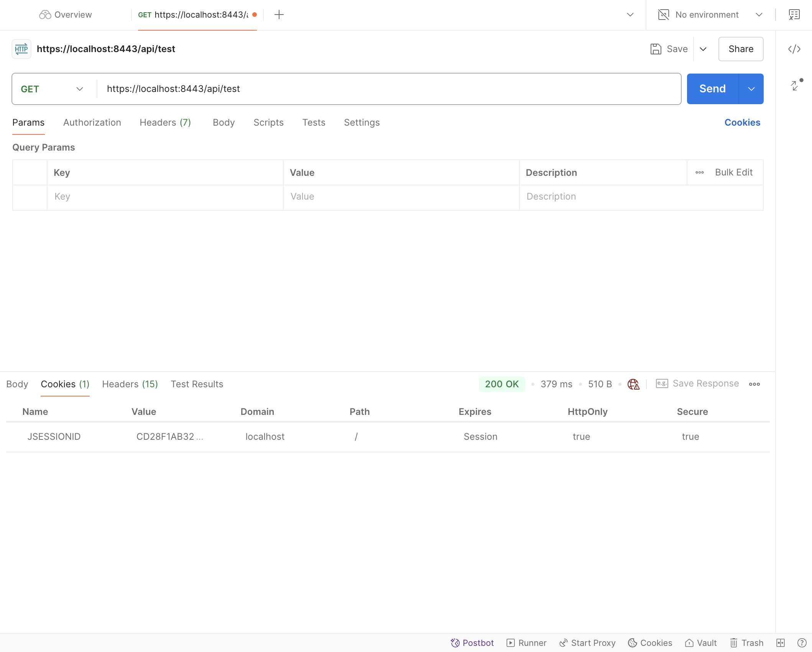
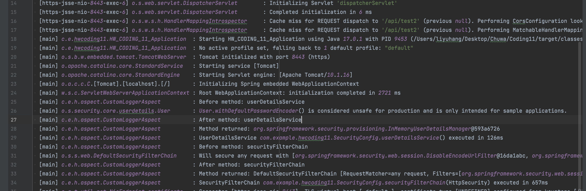

# HW12

Yuhang Li

# 1. Please refer annotations.md

## 2. Read this link:

1. https://www.techgeeknext.com/spring-boot/spring-aop-interview-questions

## 3. What is the Aspect Oriented Programming, explain it with detailed use cases?

Aspect-Oriented Programming (AOP) is a programming paradigm that aims to separate cross-cutting concerns from the main logic of the program. Cross-cutting concerns are aspects of a program that affect multiple parts of the application, such as logging, security, transaction management, or error handling. These concerns tend to be scattered across various parts of an application, leading to code duplication and decreased maintainability. AOP provides a way to modularize these concerns so that they can be applied across the system without tangling them with the core business logic.

### Key Concepts of AOP

1. **Aspect**: A module that encapsulates a cross-cutting concern. It defines where and how this concern should be applied.
   
2. **Join Points**: Specific points in the program where an aspect can be applied, such as method calls or exceptions thrown.

3. **Pointcut**: A set of criteria to match join points. It defines where the advice (code logic of an aspect) should be applied.

4. **Advice**: Code that is executed when a join point is reached. It can run before, after, or around a method execution.
   
   - **Before Advice**: Runs before the join point is executed.
   - **After Advice**: Runs after the join point is executed.
   - **Around Advice**: Wraps the join point, providing complete control before and after its execution.

5. **Weaving**: The process of applying aspects to target objects. This can happen at compile-time, load-time, or runtime.

---

### Detailed Use Cases

1. **Logging**
   
   **Problem**: In a typical application, logging is required at multiple places such as method entry and exit, and error points. Embedding logging logic within every method increases code clutter and reduces maintainability.

   **AOP Solution**: Using AOP, a logging aspect can be created and applied across the entire application, wherever needed.
   
   ```java
   @Aspect
   public class LoggingAspect {
   
       @Before("execution(* com.example.service.*.*(..))")
       public void logBeforeMethod(JoinPoint joinPoint) {
           System.out.println("Method called: " + joinPoint.getSignature().getName());
       }
   
       @AfterReturning("execution(* com.example.service.*.*(..))")
       public void logAfterMethod(JoinPoint joinPoint) {
           System.out.println("Method exited: " + joinPoint.getSignature().getName());
       }
   }
   ```
   - **Explanation**: The `logBeforeMethod` method logs before any method in the `com.example.service` package is called, while `logAfterMethod` logs after the method returns. Without AOP, this logging would have to be manually added to every method.

2. **Security (Authorization)**
   
   **Problem**: Checking user authorization to ensure the user has the correct permissions is critical for many applications. Placing authorization logic in every method would lead to code repetition.

   **AOP Solution**: An authorization aspect can be written to handle security checks before executing methods.
   
   ```java
   @Aspect
   public class SecurityAspect {
   
       @Before("execution(* com.example.controller.*.*(..)) && @annotation(com.example.security.Secured)")
       public void checkUserAuthorization(JoinPoint joinPoint) {
           // Logic to check if user has appropriate permissions
           User user = getCurrentUser();
           if (!user.hasPermission(joinPoint.getSignature().getName())) {
               throw new SecurityException("User not authorized");
           }
       }
   }
   ```
   - **Explanation**: This `SecurityAspect` ensures that methods annotated with `@Secured` are executed only if the current user has the necessary permissions. This decouples authorization logic from the core business logic, making the application more maintainable and secure.

3. **Transaction Management**
   
   **Problem**: Transaction management ensures that a series of actions either completely succeed or fail as a whole. Handling transactions manually in every service method increases the complexity of the code.

   **AOP Solution**: A transaction management aspect can handle this concern at a global level.
   
   ```java
   @Aspect
   public class TransactionAspect {
   
       @Around("execution(* com.example.service.*.*(..))")
       public Object manageTransaction(ProceedingJoinPoint pjp) throws Throwable {
           Transaction tx = beginTransaction();
           try {
               Object result = pjp.proceed(); // Proceed with the method execution
               tx.commit();
               return result;
           } catch (Exception e) {
               tx.rollback();
               throw e;
           }
       }
   }
   ```
   - **Explanation**: This aspect ensures that any method inside `com.example.service` package is wrapped inside a transaction. If the method throws an exception, the transaction is rolled back; otherwise, it is committed. This approach abstracts away transaction logic from individual service methods.

4. **Caching**
   
   **Problem**: Adding caching functionality to various methods can lead to duplicated caching logic and tightly coupled code. Every method that requires caching would have to manage the cache individually.

   **AOP Solution**: Using AOP, a caching aspect can be created that caches the result of expensive methods and retrieves it on subsequent calls.
   
   ```java
   @Aspect
   public class CachingAspect {
   
       private Map<String, Object> cache = new HashMap<>();
   
       @Around("execution(* com.example.service.*.*(..))")
       public Object cacheResult(ProceedingJoinPoint pjp) throws Throwable {
           String key = generateCacheKey(pjp);
           if (cache.containsKey(key)) {
               return cache.get(key);
           }
   
           Object result = pjp.proceed(); // Call the actual method
           cache.put(key, result);
           return result;
       }
   }
   ```
   - **Explanation**: This aspect caches the result of any method call in the `com.example.service` package. If the method is called again with the same parameters, the cached result is returned instead of re-executing the method. The business logic remains clean, with caching handled separately.

---

### Benefits of AOP

- **Modularization**: AOP enables the separation of cross-cutting concerns, leading to cleaner and more modular code.
- **Reusability**: Aspects are reusable components that can be applied across different parts of an application.
- **Maintainability**: Since cross-cutting logic is separated from the business logic, the codebase becomes easier to maintain and update.
- **Reduced Code Duplication**: AOP eliminates the need for duplicating code to handle common concerns like logging, security, or transactions.

In summary, AOP helps simplify complex systems by keeping the business logic focused on its core functionality, while cross-cutting concerns are managed separately. This leads to cleaner, more maintainable code, making it a useful paradigm in enterprise software development.

## 4. What are the advantages and disadvantages of Spring AOP?

### Advantages of Spring AOP

1. **Separation of Concerns (SoC)**: 
   - Spring AOP allows you to cleanly separate cross-cutting concerns like logging, security, transaction management, and performance monitoring from your business logic. This results in more modular, cleaner, and easier-to-maintain code.

2. **Reduced Code Duplication**: 
   - By centralizing the handling of cross-cutting concerns, Spring AOP eliminates the need to duplicate the same code (e.g., logging) in multiple places across the application. This reduces boilerplate and keeps the codebase cleaner.

3. **Enhanced Code Maintainability**: 
   - Since cross-cutting concerns are handled in a separate aspect, any change to those concerns (e.g., updating a logging format or security policy) can be done in a single place, improving maintainability and reducing the chance of bugs.

4. **Declarative Transaction Management**:
   - Spring AOP is commonly used for declarative transaction management, allowing you to apply transactions without cluttering your business logic with transaction-handling code.

5. **Flexible Weaving**: 
   - Spring AOP supports runtime (proxy-based) weaving, which allows you to dynamically apply aspects during runtime without needing to modify the compiled code. This adds flexibility to how aspects are applied in various environments.

6. **Integration with Spring**: 
   - Spring AOP integrates seamlessly with the rest of the Spring ecosystem, allowing you to easily apply AOP features such as method interception using Spring configuration. It's particularly helpful for enterprise applications built using Spring.

---

### Disadvantages of Spring AOP

1. **Limited to Method-Level Proxies**: 
   - Spring AOP only supports method-level proxies and is limited to weaving around method invocations. This is different from full-fledged AspectJ AOP, which supports more powerful weaving such as field interception and constructor interception.

2. **Performance Overhead**:
   - As Spring AOP uses dynamic proxies to apply aspects at runtime, this may add a slight performance overhead, especially when applied to many frequently executed methods. For large-scale systems, this could impact performance, though the overhead is usually minimal in most applications.

3. **Complex Debugging**: 
   - Debugging code that uses AOP can sometimes be more difficult because the behavior is modified at runtime. When problems arise, it might not be immediately clear which aspect is responsible, and understanding the flow of execution might require additional effort.

4. **Increased Learning Curve**:
   - For developers unfamiliar with AOP, the paradigm shift can introduce additional complexity to the application, making it harder to understand at first. This could result in a steeper learning curve, especially when dealing with advanced AOP concepts like `join points`, `advices`, and `pointcuts`.

5. **Potential Overuse**: 
   - AOP can be overused, leading to an overly complex system where logic becomes scattered across multiple aspects, making it harder to understand the application's flow. Developers should be cautious about where to apply AOP to avoid unnecessarily complicating the design.

6. **Proxy-Based Limitations**:
   - Since Spring AOP uses proxy objects, it cannot intercept calls made within the same object (i.e., internal method calls are not intercepted). This is a limitation when comparing it to more powerful frameworks like AspectJ, which can intercept such calls.

---

In summary, Spring AOP is a powerful tool for handling cross-cutting concerns in a modular way but comes with some limitations, particularly in terms of weaving flexibility and potential performance overhead. Proper usage of Spring AOP can lead to more maintainable and cleaner code, but overuse or misuse can lead to complexity.

## 5. Explain following concept in your own words, you may include code snippet as part of your answer.

### 1. **Aspect**
An **Aspect** is a module in Aspect-Oriented Programming (AOP) that encapsulates the cross-cutting concern, such as logging, security, or transaction management. It defines ***what*** needs to be done (the advice) and ***where*** it should be applied (the pointcut). Aspects are the core components of AOP and are used to implement behaviors that affect multiple parts of an application, keeping them separate from the core business logic.

**Example**: Creating a logging aspect in Spring AOP:

```java
@Aspect
public class LoggingAspect {
    
    @Before("execution(* com.example.service.*.*(..))")
    public void logBeforeMethod(JoinPoint joinPoint) {
        System.out.println("Method called: " + joinPoint.getSignature().getName());
    }
}
```
In this example, `LoggingAspect` is an aspect that handles logging before method execution.

---

### 2. **PointCut**
A **PointCut** is an expression that defines ***where*** in the application the advice should be applied. It acts as a filter to select join points (places in the code where cross-cutting behavior should be injected). A pointcut uses expressions to specify method signatures or types of execution points where advice should run, like all methods in a specific package, or methods with a certain annotation.

**Example**: A pointcut that matches all methods in the `service` package:

```java
@Pointcut("execution(* com.example.service.*.*(..))")
public void serviceMethods() {
    // PointCut to capture all methods in the service layer
}
```
In this example, the pointcut matches any method inside the `com.example.service` package.

---

### 3. **JoinPoint**
A **JoinPoint** is a specific point in the execution of a program, such as a method call or an exception being thrown. It represents a **moment** where an aspect can be applied. Join points are the actual execution points that match the criteria specified by the pointcut, and the advice can be executed at these points.

**Example**: A join point in method execution:

```java
@Aspect
public class LoggingAspect {
    
    @Before("execution(* com.example.service.*.*(..))")
    public void logBeforeMethod(JoinPoint joinPoint) {
        System.out.println("Method called: " + joinPoint.getSignature().getName());
    }
}
```
In this example, `joinPoint` provides information about the specific method that was called, such as its name or the arguments passed to it.

---

### 4. **Advice**
**Advice** is the action taken by an aspect at a particular join point. It's the code that is executed before, after, or around the join point. Different types of advice include:
   - **Before Advice**: Runs before the method execution.
   - **After Advice**: Runs after the method execution, regardless of its outcome.
   - **After Returning Advice**: Runs after a method returns a result.
   - **Around Advice**: Wraps the method execution, allowing you to control whether and how it is invoked.

**Example**: A before advice to log method details:

```java
@Aspect
public class LoggingAspect {
    
    @Before("execution(* com.example.service.*.*(..))")
    public void logBeforeMethod(JoinPoint joinPoint) {
        System.out.println("Before method: " + joinPoint.getSignature().getName());
    }
}
```
Here, the `logBeforeMethod` advice runs before any method in the `service` package, logging the method name.

---

### Summary:
- **Aspect**: Encapsulates cross-cutting concerns like logging.
- **PointCut**: Defines where the aspect should be applied in the code.
- **JoinPoint**: Represents a point in the code where the aspect can be applied.
- **Advice**: Defines what action should be taken at the join point, like logging or authorization.

## 6. How do we declare a point cut, can we declare it without annotating an empty method? Name some expressions to do it.

In Spring AOP, **PointCut** expressions can be declared using either an **annotation** or by directly specifying the pointcut expression in the advice annotation (e.g., `@Before`, `@After`, `@Around`).

Yes, you can declare a pointcut **without using an empty method**. Although defining pointcuts with empty methods annotated with `@Pointcut` is common for reusability, you can directly declare the pointcut expressions within advice annotations.

### Declaring PointCuts Without an Empty Method

You can directly place the pointcut expression inside the advice annotation. For instance:

```java
@Aspect
public class LoggingAspect {
    
    @Before("execution(* com.example.service.*.*(..))")
    public void logBeforeMethod(JoinPoint joinPoint) {
        System.out.println("Method called: " + joinPoint.getSignature().getName());
    }
}
```
Here, the pointcut `"execution(* com.example.service.*.*(..))"` is directly declared inside the `@Before` annotation, which specifies that the advice will run before the execution of any method in the `com.example.service` package.

### Common PointCut Expressions

1. **execution()**: 
   - Used to match method executions based on method signature (return type, name, and parameters).
   - **Syntax**: `execution(modifier-pattern? return-type-pattern declaring-type-pattern? method-name-pattern(param-pattern) throws-pattern?)`
   
   **Example**:
   ```java
   @Before("execution(* com.example.service.*.*(..))")
   public void logBefore(JoinPoint joinPoint) { }
   ```
   This matches any method in the `com.example.service` package with any return type and any parameters.

2. **within()**: 
   - Matches all join points within certain types (classes or packages).
   - **Syntax**: `within(type-pattern)`
   
   **Example**:
   ```java
   @Before("within(com.example.service.*)")
   public void logWithin(JoinPoint joinPoint) { }
   ```
   This matches all methods within the `com.example.service` package.

3. **this()**: 
   - Matches join points where the bean reference is an instance of the given type.
   
   **Example**:
   ```java
   @Before("this(com.example.service.MyService)")
   public void logThis(JoinPoint joinPoint) { }
   ```
   This matches methods where the current object is an instance of `MyService`.

4. **target()**: 
   - Matches join points where the target object (the object being advised) is an instance of the given type.
   
   **Example**:
   ```java
   @Before("target(com.example.service.MyService)")
   public void logTarget(JoinPoint joinPoint) { }
   ```
   This matches methods where the target object is an instance of `MyService`.

5. **args()**: 
   - Matches join points based on the runtime arguments passed to the method.
   
   **Example**:
   ```java
   @Before("args(java.lang.String)")
   public void logArgs(JoinPoint joinPoint) { }
   ```
   This matches methods that take a `String` argument.

6. **@annotation()**: 
   - Matches join points where the method is annotated with a specific annotation.
   
   **Example**:
   ```java
   @Before("@annotation(com.example.annotations.Loggable)")
   public void logAnnotatedMethods(JoinPoint joinPoint) { }
   ```
   This matches methods annotated with `@Loggable`.

---

### Summary:
- **PointCut expressions can be declared directly in the advice annotation** like `@Before` or `@After`, without using an empty method with `@Pointcut`.
- Common expressions include `execution()`, `within()`, `this()`, `target()`, `args()`, and `@annotation()` for matching various method signatures, classes, or method arguments.

## 7. Compare different types of advices in SpringAOP.

In Spring AOP, there are five types of **advice** that specify *when* the aspect's logic should be executed in relation to a join point (typically a method execution). Each advice type has its specific use case and behavior. Here's a comparison of the different types of advice:

### 1. **Before Advice**

- **Description**: Runs *before* the method execution.
- **Use Case**: Useful when you want to perform tasks such as logging, security checks, or validation before the actual business logic is executed.
- **Limitations**: Cannot stop the method from executing; it only runs before the method is invoked.
  

**Example**:
```java
@Aspect
public class LoggingAspect {
    
    @Before("execution(* com.example.service.*.*(..))")
    public void logBeforeMethod(JoinPoint joinPoint) {
        System.out.println("Before method: " + joinPoint.getSignature().getName());
    }
}
```

### 2. **After Returning Advice**

- **Description**: Runs *after* a method successfully completes, i.e., when the method returns without throwing an exception.
- **Use Case**: Suitable for post-processing based on the method's returned value, such as updating cache or logging the method's result.
- **Limitations**: Won't be invoked if an exception occurs.

**Example**:
```java
@Aspect
public class LoggingAspect {
    
    @AfterReturning(pointcut = "execution(* com.example.service.*.*(..))", returning = "result")
    public void logAfterReturning(JoinPoint joinPoint, Object result) {
        System.out.println("Method returned: " + result);
    }
}
```

### 3. **After (Finally) Advice**

- **Description**: Runs *after* a method finishes execution, regardless of whether it returned successfully or threw an exception (i.e., always executes).
- **Use Case**: Typically used for cleanup activities like closing resources, logging method completion, or releasing locks.
- **Behavior**: Runs even if an exception is thrown.

**Example**:
```java
@Aspect
public class LoggingAspect {
    
    @After("execution(* com.example.service.*.*(..))")
    public void logAfterMethod(JoinPoint joinPoint) {
        System.out.println("Method completed: " + joinPoint.getSignature().getName());
    }
}
```

### 4. **After Throwing Advice**

- **Description**: Runs *only if* the method throws an exception.
- **Use Case**: Ideal for error handling, logging exceptions, sending alerts, or performing rollback actions in case of failure.
- **Limitations**: Won't be invoked if the method completes successfully.

**Example**:
```java
@Aspect
public class LoggingAspect {
    
    @AfterThrowing(pointcut = "execution(* com.example.service.*.*(..))", throwing = "exception")
    public void logAfterThrowing(JoinPoint joinPoint, Throwable exception) {
        System.out.println("Exception in method: " + joinPoint.getSignature().getName());
        System.out.println("Exception: " + exception.getMessage());
    }
}
```

### 5. **Around Advice**

- **Description**: Wraps the method execution, allowing control over when and whether the method is invoked. You can execute code *before* and *after* the method execution, or even *prevent* its execution altogether.
- **Use Case**: The most powerful type of advice. It can be used for advanced scenarios like transaction management, performance monitoring, or conditionally proceeding with the method execution.
- **Behavior**: Can control the flow of the method execution by calling `proceed()` to execute the target method or blocking it.

**Example**:
```java
@Aspect
public class LoggingAspect {
    
    @Around("execution(* com.example.service.*.*(..))")
    public Object logAroundMethod(ProceedingJoinPoint joinPoint) throws Throwable {
        System.out.println("Before method: " + joinPoint.getSignature().getName());
        Object result = joinPoint.proceed();  // Proceed with the actual method execution
        System.out.println("After method: " + joinPoint.getSignature().getName());
        return result;
    }
}
```

---

### **Comparison of Advice Types**

| **Type of Advice**  | **When It Executes**                           | **Control Over Method Execution**          | **Use Case**                                                 |
| ------------------- | ---------------------------------------------- | ------------------------------------------ | ------------------------------------------------------------ |
| **Before**          | Before the method is invoked                   | No                                         | Logging, security, validation checks before the method       |
| **After Returning** | After successful method completion             | No                                         | Logging or processing the result                             |
| **After (Finally)** | After method completes (success or failure)    | No                                         | Cleanup tasks (like closing resources)                       |
| **After Throwing**  | After the method throws an exception           | No                                         | Error logging, exception handling                            |
| **Around**          | Before, during, and after the method execution | Yes (can skip or control method execution) | Transaction management, performance monitoring, conditional execution |

---

### Key Points:
- **Before advice**: Runs before the target method is invoked, and cannot prevent the execution of the method.
- **After Returning advice**: Executes after the method returns normally.
- **After (Finally) advice**: Executes after the method finishes, regardless of its outcome.
- **After Throwing advice**: Executes if the method throws an exception.
- **Around advice**: Can fully control the method execution, executing logic before and after the method, or even skipping it entirely.


# 8. On top of your Spring application which you did in Assignment#11,

## 1. Implement acustomized logger using SpringAOP, your logger should be able to log your code and also external code.

## 2. Your AOP logger should log method execution time,RestAPI request details and response details.

## 3. Your AOP logger should log with all possible joint points(before method execution,after method execution etc...)

## 4. Your should bind jointPoint swith your AOP code **directly**, instead of binding it with an empty method.

## 5. Be ready to demo your implementation and prove it works in class.

Here’s how I implement the customized logger with **Spring AOP** and test it step by step in the existing **Spring Boot application (`HW_CODING_11`)**:

### 1. **Create the Aspect Class for Logging** (`CustomLoggerAspect.java`)
This class will handle logging using AOP.

- **Location**: Inside the `com.example.hwcoding11.aspect` package.

#### Code for `CustomLoggerAspect.java`:
```java
package com.example.hwcoding11.aspect;

import org.aspectj.lang.JoinPoint;
import org.aspectj.lang.annotation.*;
import org.springframework.stereotype.Component;
import org.slf4j.Logger;
import org.slf4j.LoggerFactory;

@Aspect
@Component
public class CustomLoggerAspect {
    private static final Logger logger = LoggerFactory.getLogger(CustomLoggerAspect.class);

    @Before("execution(* com.example.hwcoding11..*(..))")
    public void logBeforeMethodExecution(JoinPoint joinPoint) {
        logger.info("Before method: " + joinPoint.getSignature().getName());
    }

    @AfterReturning(value = "execution(* com.example.hwcoding11..*(..))", returning = "result")
    public void logAfterReturning(JoinPoint joinPoint, Object result) {
        logger.info("After method: " + joinPoint.getSignature().getName());
        logger.info("Method returned: " + result);
    }

    @AfterThrowing(value = "execution(* com.example.hwcoding11..*(..))", throwing = "exception")
    public void logAfterException(JoinPoint joinPoint, Throwable exception) {
        logger.error("Method threw exception: " + joinPoint.getSignature().getName());
        logger.error("Exception: " + exception.getMessage());
    }

    @Around("execution(* com.example.hwcoding11..*(..))")
    public Object logExecutionTime(ProceedingJoinPoint joinPoint) throws Throwable {
        long start = System.currentTimeMillis();
        Object result = joinPoint.proceed();
        long executionTime = System.currentTimeMillis() - start;
        logger.info(joinPoint.getSignature() + " executed in " + executionTime + "ms");
        return result;
    }
}
```

### 2. **Modify the Main Application Class (`HW_CODING_11_Application.java`)**
Add `@EnableAspectJAutoProxy` to enable AOP support.

- **Location**: In your main application file `HW_CODING_11_Application.java`.

#### Code for `HW_CODING_11_Application.java`:
```java
package com.example.hwcoding11;

import org.springframework.boot.SpringApplication;
import org.springframework.boot.autoconfigure.SpringBootApplication;
import org.springframework.context.annotation.EnableAspectJAutoProxy;

@SpringBootApplication
@EnableAspectJAutoProxy
public class HW_CODING_11_Application {

    public static void main(String[] args) {
        SpringApplication.run(HW_CODING_11_Application.class, args);
    }
}
```

### 3. **Create a Controller for Testing** (`TestController.java`)
This will be a REST API endpoint where the AOP will log request and response details.

- **Location**: Inside `com.example.hwcoding11.controller`.

#### Code for `TestController.java`:
```java
package com.example.hwcoding11.controller;

import org.springframework.web.bind.annotation.GetMapping;
import org.springframework.web.bind.annotation.RestController;

@RestController
public class TestController {

    @GetMapping("/api/test")
    public String testEndpoint() {
        return "Test endpoint response";
    }
}
```

Also don't forget to configure the project (`SecurityConfig.java`), I ensured that the `/api/test` endpoint is allowed access.

If not, I will encounter **403 Forbidden** instead of **200 OK**

```java
package com.example.hwcoding11;

import org.springframework.context.annotation.Bean;
import org.springframework.context.annotation.Configuration;
import org.springframework.security.config.annotation.web.builders.HttpSecurity;
import org.springframework.security.web.SecurityFilterChain;

@Configuration
public class SecurityConfig {

    @Bean
    public SecurityFilterChain securityFilterChain(HttpSecurity http) throws Exception {
        http
            .authorizeHttpRequests((requests) -> requests
                .antMatchers("/test").permitAll() // Allow access to /test without authentication
                .anyRequest().authenticated()
            )
            .formLogin((form) -> form
                .loginPage("/login")
                .permitAll()
            )
            .logout((logout) -> logout.permitAll());

        return http.build();
    }
}
```

### 4. **Run the Application**

Run your Spring Boot application from IntelliJ by clicking the green run button next to the `HW_CODING_11_Application.java` class.

### 5. **Test the Application with Postman**
- Open Postman.
- Send a **GET** request to your **HTTPS** API, for example: `https://localhost:8443/test`.
- The AOP will log details like:
  - Method execution time
  - Request and response details
  - Any exceptions thrown during execution

### 6. **Check the Logs**
Check your console or logs for the output. You should see the logs that indicate:
- Method entry (`Before` advice).
- Method exit with return value (`AfterReturning` advice).
- Execution time (`Around` advice).
- Exception logs if any (`AfterThrowing` advice).

#### Log File (Optional)

I prefer logging to a file, configure logging in `application.properties` to enable file-based logging:

- **application.properties**:

```properties
# Enable file logging
logging.file.name=app-log.log
logging.level.com.example=INFO
```

After running the app, the logs will be written to `app-log.log` file in your project directory.

#### What Should Be Logged

- **Method Execution Time**: Time taken to execute the `/test` controller method.
- **Request Details**: Details about the request such as URL, HTTP method, and request parameters.
- **Response Details**: HTTP response status and response body.

Now we could check the logs for these AOP-based log messages. 

---

### Steps Recap:
1. **Create the aspect class** in the `aspect` package for logging.
2. **Enable AOP** in the `HW_CODING_11_Application` class with `@EnableAspectJAutoProxy`.
3. **Create a test controller** in the `controller` package for testing your AOP functionality.
4. **Run the application** and test the `/test` endpoint using Postman.
5. **Check the logs** to verify if the logging works correctly for the REST API requests.

 ### Results screenshots

#### 1. Postman got 200 OK



#### 2. Loggers:

Examples:

userDetailsService: Line 25, 27, 28, 29

securityFilterChain: Line 30, 32, 33, 34


