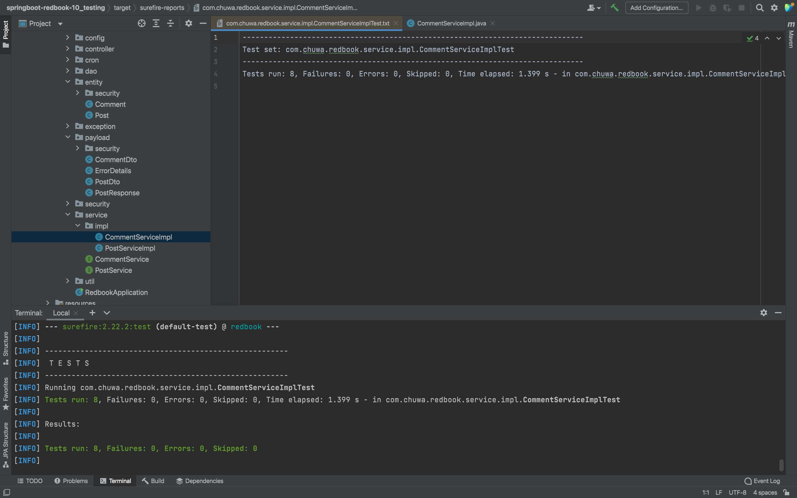

# HW13

Yuhang Li

## 1. List and explain all of the new learned annotations to your annotations.md

Please refer to the annotations.md


## 2. What is the life circle of Junit?

In JUnit, the **test life cycle** refers to the series of steps that are executed before and after each test or test class. These steps help manage resources, set up necessary conditions for tests, and clean up afterward. Understanding the life cycle is important for writing effective and efficient unit tests.

### JUnit 5 Life Cycle Annotations

JUnit provides several annotations that control the life cycle of test methods, enabling specific actions to be performed at key points during the execution of tests.


#### Key Life Cycle Annotations:

1. **@BeforeEach**:

   - This annotation is used to specify a method that should be run **before each individual test**.
   - Commonly used for setting up resources or initializing objects that each test will use.
   - Example use: initializing a mock object before each test case.

   ```java
   @BeforeEach
   public void setUp() {
       // Code to set up before each test
   }
   ```

2. **@AfterEach**:

   - This annotation is used to define a method that should be executed **after each test**.
   - Typically used for cleaning up resources or resetting states.

   ```java
   @AfterEach
   public void tearDown() {
       // Code to clean up after each test
   }
   ```

3. **@BeforeAll**:

   - This annotation is used to specify a method that should run **once before all tests** in a test class.
   - The method annotated with `@BeforeAll` must be `static`, as it is called before any test instance is created.
   - Example use: establishing a database connection.

   ```java
   @BeforeAll
   public static void setUpClass() {
       // Code that runs once before all tests
   }
   ```

4. **@AfterAll**:

   - Similar to `@BeforeAll`, this annotation is used to specify a method that runs **once after all tests** in the class.
   - It must also be a `static` method.
   - Example use: closing a database connection or releasing shared resources.

   ```java
   @AfterAll
   public static void tearDownClass() {
       // Code that runs once after all tests
   }
   ```

### Detailed Life Cycle Flow:

1. **@BeforeAll**: 
   - Called once before any of the test methods in the current class.

2. **@BeforeEach**: 
   - Called before each test method.

3. **@Test**:
   - The actual test method where test logic is written and assertions are made.

4. **@AfterEach**: 
   - Called after each test method.

5. **@AfterAll**: 
   - Called once after all the test methods in the current class.

### Example of a Full JUnit Life Cycle:

Here’s an example that demonstrates the entire life cycle of JUnit test execution:

```java
import org.junit.jupiter.api.*;

class ExampleTest {

    @BeforeAll
    static void initAll() {
        System.out.println("Before All - Runs once before all tests");
    }

    @BeforeEach
    void init() {
        System.out.println("Before Each - Runs before each test");
    }

    @Test
    void test1() {
        System.out.println("Test 1 - Runs the test logic");
        Assertions.assertTrue(true);
    }

    @Test
    void test2() {
        System.out.println("Test 2 - Runs another test");
        Assertions.assertTrue(true);
    }

    @AfterEach
    void tearDown() {
        System.out.println("After Each - Runs after each test");
    }

    @AfterAll
    static void tearDownAll() {
        System.out.println("After All - Runs once after all tests");
    }
}
```

### Output of the Example:

```
Before All - Runs once before all tests
Before Each - Runs before each test
Test 1 - Runs the test logic
After Each - Runs after each test
Before Each - Runs before each test
Test 2 - Runs another test
After Each - Runs after each test
After All - Runs once after all tests
```

### Common Uses:

- **@BeforeEach/@AfterEach**: Used to **set up and tear down resources**, such as creating mock objects, resetting values, or initializing test data before and after each test.
- **@BeforeAll/@AfterAll**: Often used for more expensive setup/cleanup tasks, like establishing and closing database connections, or starting and stopping a service that will be shared by all test cases.

The life cycle management in JUnit helps avoid code duplication and ensures that resources are handled efficiently across tests.


## 3. Explain parameterized testing?

**Parameterized testing** is a testing technique in which a test method is executed multiple times with different sets of input values (parameters). This approach allows you to test the same logic or functionality with various inputs without writing multiple test cases for each input scenario. It helps in reducing code duplication and improving test coverage by ensuring that the tested functionality works for a variety of inputs.

### Key Benefits of Parameterized Testing:
1. **Increased Coverage**: You can test multiple inputs, edge cases, and variations with a single test method.
2. **Code Reusability**: Rather than duplicating test methods for different inputs, a single test can handle multiple sets of data.
3. **Simpler Maintenance**: If the logic changes, you only need to modify one test method, not multiple individual test cases.
4. **Improved Readability**: By focusing on the test logic once, and defining inputs and expected outputs separately, the test code becomes cleaner and more understandable.

### How Parameterized Testing Works:
In parameterized tests, the test framework automatically runs the test method multiple times, once for each combination of parameter values. Each test run uses a different set of input values provided through a data source (such as an array, a collection, or external sources like files or databases).

### Parameterized Testing in JUnit (JUnit 5)
JUnit 5 provides support for parameterized tests through the `@ParameterizedTest` annotation. Various annotations and methods are used to specify the sources of parameters (e.g., `@ValueSource`, `@CsvSource`, `@MethodSource`, etc.).

#### Example: Simple Parameterized Test with `@ValueSource`

```java
import org.junit.jupiter.params.ParameterizedTest;
import org.junit.jupiter.params.provider.ValueSource;
import static org.junit.jupiter.api.Assertions.assertTrue;

class ParameterizedTestExample {

    @ParameterizedTest
    @ValueSource(strings = {"racecar", "radar", "level"})
    void testIsPalindrome(String word) {
        assertTrue(isPalindrome(word));
    }

    // A simple method to check if a word is a palindrome
    private boolean isPalindrome(String word) {
        return word.equals(new StringBuilder(word).reverse().toString());
    }
}
```

In this example:
- The test method `testIsPalindrome` is executed three times with different strings: `"racecar"`, `"radar"`, and `"level"`.
- The test checks if each string is a palindrome.

#### Using `@CsvSource` for Multiple Parameters
You can pass multiple sets of parameters using the `@CsvSource` annotation:

```java
import org.junit.jupiter.params.ParameterizedTest;
import org.junit.jupiter.params.provider.CsvSource;
import static org.junit.jupiter.api.Assertions.assertEquals;

class AdditionTest {

    @ParameterizedTest
    @CsvSource({
        "1, 2, 3",
        "4, 5, 9",
        "10, 20, 30"
    })
    void testAddition(int a, int b, int expectedSum) {
        assertEquals(expectedSum, a + b);
    }
}
```

In this case, the test method `testAddition` is executed three times, with different combinations of integers `a`, `b`, and `expectedSum`. Each test checks if the addition operation gives the expected result.

#### `@MethodSource` for More Complex Parameter Generation
If you want to provide more complex parameter sets (e.g., from external sources or dynamically generated data), you can use the `@MethodSource` annotation to supply parameters from a separate method.

```java
import org.junit.jupiter.params.ParameterizedTest;
import org.junit.jupiter.params.provider.MethodSource;
import java.util.stream.Stream;
import static org.junit.jupiter.api.Assertions.assertTrue;

class PrimeNumberTest {

    @ParameterizedTest
    @MethodSource("primeNumbers")
    void testIsPrime(int number) {
        assertTrue(isPrime(number));
    }

    // This method provides the parameters (prime numbers) to the test
    static Stream<Integer> primeNumbers() {
        return Stream.of(2, 3, 5, 7, 11, 13, 17, 19, 23);
    }

    // A method to check if a number is prime
    private boolean isPrime(int number) {
        if (number < 2) return false;
        for (int i = 2; i <= Math.sqrt(number); i++) {
            if (number % i == 0) return false;
        }
        return true;
    }
}
```

In this example, the `primeNumbers` method provides a stream of integers, which are used as input parameters for the test.

### Parameterized Testing in Other Frameworks:
- **TestNG**: TestNG provides parameterized testing using annotations like `@Parameters` and `@DataProvider`, where data providers supply a list of parameters to a test.
- **JUnit 4**: JUnit 4 supports parameterized testing using the `@RunWith(Parameterized.class)` annotation along with constructors or data methods.
- **Mockito**: You can also use parameterized testing with Mockito to verify different input-output combinations.

### Advantages of Parameterized Testing:
- **Efficiency**: It significantly reduces the number of test cases you need to write.
- **Consistency**: Since the same logic is applied to multiple test cases, any changes in the test logic are consistently applied across all tests.
- **Flexibility**: It allows you to test edge cases, large inputs, or combinations of parameters that might be impractical to handle manually.

Parameterized testing is particularly useful for testing business logic, mathematical calculations, string manipulations, and other scenarios where a wide range of inputs needs to be validated.


## 4. Explain Mockito and PowerMock .

### **Mockito**

**Mockito** is a popular Java-based framework used for writing unit tests by creating mock objects. It enables developers to isolate the behavior of a specific class under test by mocking the dependencies of that class. With Mockito, you can mimic the behavior of external dependencies (like services, databases, or other classes) to test the functionality of the code independently without relying on the actual implementations of those dependencies.

#### **Key Features of Mockito**:
1. **Mocking Objects**: Mockito allows you to create mock objects of dependencies and control their behavior.
2. **Stubbing**: You can define what the mock object should return when specific methods are called.
3. **Verifying Interactions**: You can verify how a mocked object interacts with your code, like checking if a method was called with specific arguments.
4. **Argument Capturing**: Mockito can capture arguments passed to mocked methods for validation.
5. **Spying**: You can create a spy of a real object to call real methods while still being able to stub specific ones.
6. **Annotations**: It provides useful annotations like `@Mock`, `@Spy`, and `@InjectMocks` to simplify mock creation and injection in unit tests.

#### **Example of Mockito**:
```java
import static org.mockito.Mockito.*;
import org.junit.jupiter.api.Test;

class MyServiceTest {
    
    @Test
    void testService() {
        // Create a mock object of a dependency
        MyDependency dependency = mock(MyDependency.class);
        
        // Stub a method to return a specific value when called
        when(dependency.someMethod()).thenReturn("Mocked Value");
        
        // Use the mock in your service class
        MyService service = new MyService(dependency);
        String result = service.process();
        
        // Verify the interaction with the mock object
        verify(dependency).someMethod();
        
        // Assert the behavior
        assertEquals("Processed Mocked Value", result);
    }
}
```

In this example:
- The `MyDependency` class is mocked.
- The `someMethod()` of `MyDependency` is stubbed to return "Mocked Value".
- `verify()` is used to ensure the method was called during the test.

### **PowerMock**

**PowerMock** is an extension of Mockito that provides advanced capabilities to mock static methods, constructors, final classes, private methods, and other difficult-to-mock scenarios that Mockito cannot handle on its own.

Mockito by default cannot mock:
1. **Static methods**: Methods that belong to the class rather than an instance.
2. **Final methods and final classes**: Methods or classes that cannot be overridden.
3. **Private methods**: Methods that are not accessible from outside their class.

PowerMock works in conjunction with Mockito (or EasyMock) and extends its functionality to overcome these limitations.

#### **Key Features of PowerMock**:
1. **Mocking Static Methods**: PowerMock allows mocking static methods that cannot be handled by Mockito.
2. **Mocking Final Classes/Methods**: PowerMock can mock final classes and methods.
3. **Mocking Private Methods**: PowerMock can invoke and mock private methods via reflection.
4. **Mocking Constructors**: PowerMock allows mocking object creation by overriding constructors.
5. **Mocking Static Initializers**: It can also mock static initialization blocks that run when the class is loaded.

#### **How PowerMock Works**:
PowerMock uses a custom class loader to enable mocking these difficult constructs (like static methods or final classes) by using bytecode manipulation.

#### **Example of PowerMock**:
```java
import static org.mockito.Mockito.*;
import org.powermock.api.mockito.PowerMockito;
import org.junit.jupiter.api.Test;
import org.powermock.core.classloader.annotations.PrepareForTest;

@PrepareForTest(StaticClass.class)
class PowerMockTest {

    @Test
    void testStaticMethod() {
        // Mock a static method
        PowerMockito.mockStatic(StaticClass.class);

        // Stub the static method
        when(StaticClass.someStaticMethod()).thenReturn("Mocked Static Value");

        // Call the method and assert the result
        String result = StaticClass.someStaticMethod();
        assertEquals("Mocked Static Value", result);

        // Verify the static method call
        PowerMockito.verifyStatic(StaticClass.class);
        StaticClass.someStaticMethod();
    }
}
```

In this example:
- **PowerMockito.mockStatic()** is used to mock the static method of a class.
- The static method `someStaticMethod()` is stubbed.
- PowerMock’s `verifyStatic()` is used to verify that the method was called.

### **Mockito vs. PowerMock**

| **Feature**                       | **Mockito**                              | **PowerMock**                                    |
| --------------------------------- | ---------------------------------------- | ------------------------------------------------ |
| **Mocking Static Methods**        | Not Supported                            | Supported                                        |
| **Mocking Final Classes/Methods** | Not Supported                            | Supported                                        |
| **Mocking Private Methods**       | Not Supported                            | Supported                                        |
| **Mocking Constructors**          | Not Supported                            | Supported                                        |
| **Class Loaders**                 | No Custom Class Loader                   | Uses Custom Class Loader (Bytecode Manipulation) |
| **Use Case**                      | Regular unit tests, mocking dependencies | Mocking static, final, or private methods        |

### **When to Use Mockito vs. PowerMock**:
- **Mockito**: Use it for standard unit testing when you need to mock or stub dependencies like services, DAOs, or repositories.
- **PowerMock**: Use it when you need to mock static methods, final methods, constructors, or private methods, which are otherwise impossible to mock using just Mockito.

### **Drawbacks of PowerMock**:
- It adds complexity to the testing environment because of the custom class loader.
- Mocking static and private methods can sometimes indicate that the code under test may need refactoring (e.g., static methods can be harder to test and less flexible).

### Conclusion:
- **Mockito** is a simple and powerful framework for mocking dependencies in unit tests, ideal for testing with regular object-oriented code.
- **PowerMock** extends Mockito’s capabilities to handle static methods, final classes, and other complex constructs but should be used sparingly to avoid overcomplicating tests.


## 5. Compare @Mockand @InjectMock

`@Mock` and `@InjectMocks` are two annotations provided by **Mockito** that help in simplifying the creation and injection of mock objects in unit tests. While both are used in conjunction with dependency injection, they serve different purposes.

### 1. **@Mock**:
- **Purpose**: The `@Mock` annotation is used to create and inject a mock object of a class or interface. This mock object is a "dummy" version of the actual object, which can be used to control the behavior of dependencies in tests.
- **Usage**: It is primarily used to mock dependencies that your class under test relies on.

#### **Example Usage of @Mock**:
```java
import static org.mockito.Mockito.*;
import org.junit.jupiter.api.Test;
import org.mockito.Mock;
import org.mockito.MockitoAnnotations;

class ServiceTest {

    @Mock
    private DependencyClass dependency;  // Mocked dependency

    @Test
    void testServiceMethod() {
        MockitoAnnotations.openMocks(this);  // Initialize the mocks

        // Stubbing the behavior of the mock object
        when(dependency.someMethod()).thenReturn("Mocked Value");

        // Test the class using the mocked dependency
        assertEquals("Mocked Value", dependency.someMethod());
    }
}
```
- In this example, `DependencyClass` is a mock object that has no real functionality but can be controlled by the test through stubbing.
- `MockitoAnnotations.openMocks(this)` initializes the mock objects annotated with `@Mock`.

### 2. **@InjectMocks**:
- **Purpose**: The `@InjectMocks` annotation is used to inject mock dependencies into the class under test. It tells Mockito to automatically inject the mock objects (created by `@Mock`) into the class that is being tested.
- **Usage**: It creates an instance of the class under test and automatically injects the mocks (or spies) that are marked with `@Mock` or `@Spy` into the class's fields.
  
#### **Example Usage of @InjectMocks**:
```java
import static org.mockito.Mockito.*;
import org.junit.jupiter.api.Test;
import org.mockito.InjectMocks;
import org.mockito.Mock;
import org.mockito.MockitoAnnotations;

class ServiceTest {

    @Mock
    private DependencyClass dependency;  // Mocked dependency

    @InjectMocks
    private ServiceClass service;  // Class under test

    @Test
    void testServiceMethod() {
        MockitoAnnotations.openMocks(this);  // Initialize the mocks and inject them

        // Stubbing the behavior of the mock object
        when(dependency.someMethod()).thenReturn("Mocked Value");

        // Test the service class (which has the mock injected)
        assertEquals("Processed Mocked Value", service.process());
    }
}
```
- In this case, `ServiceClass` is the class under test, and the mock `dependency` is automatically injected into the `ServiceClass` by Mockito.

### **Key Differences Between @Mock and @InjectMocks**:

| **Feature**        | **@Mock**                                                    | **@InjectMocks**                                             |
| ------------------ | ------------------------------------------------------------ | ------------------------------------------------------------ |
| **Purpose**        | Creates a mock instance of the dependency.                   | Injects mock dependencies into the class under test.         |
| **Usage**          | Used to mock dependencies that the class under test relies on. | Used on the class under test to inject mocked dependencies.  |
| **Injection**      | No injection is done; the mock is used directly in test.     | Automatically injects mock objects into the class under test. |
| **Initialization** | Requires explicit use or initialization with `MockitoAnnotations`. | Creates and injects mocks into the target class, often along with `@Mock`. |
| **Test Focus**     | Used for mocking individual dependencies of the class.       | Focuses on testing the actual class by injecting the necessary mock dependencies. |

### **When to Use @Mock and @InjectMocks**:

- **@Mock**: Use when you need to mock a dependency or an external component. It allows you to simulate how an external service or a dependency behaves, without relying on actual implementations.

- **@InjectMocks**: Use when you want to inject the mocked dependencies (annotated with `@Mock`) into the class under test. This helps to automatically wire the mock objects into the fields of the class, reducing boilerplate code.

### Conclusion:
- **@Mock**: Creates a mock object of a class or interface.
- **@InjectMocks**: Injects those mock objects into the class under test, allowing you to test the class as a whole, while isolating its dependencies. Both annotations are often used together for unit testing when you need to mock dependencies and test the class under test.


## 6. Explain stubbing .

**Stubbing** is a key concept in unit testing, especially when using mocking frameworks like **Mockito**. It refers to the process of pre-defining the behavior of mock objects for specific method calls. When a method is invoked on a stubbed object during a test, it returns a preset value or performs a predefined action, allowing you to simulate how a dependency behaves without relying on the actual implementation.

### **Key Concepts of Stubbing:**
1. **Mock Object**: A dummy version of an object created using a mocking framework (like Mockito) to mimic the behavior of a real object.
2. **Stubbing**: The act of specifying what the mock object should return or do when a particular method is called with certain arguments.
3. **Return Values or Exceptions**: You can define whether a stubbed method should return a particular value, throw an exception, or do nothing.

### **How Stubbing Works in Mockito:**
In Mockito, stubbing is typically done using the `when(...).thenReturn(...)` or `when(...).thenThrow(...)` syntax.

#### **Basic Stubbing Example**:
```java
import static org.mockito.Mockito.*;
import org.junit.jupiter.api.Test;

class MyServiceTest {

    @Test
    void testStubbing() {
        // Create a mock object
        MyDependency mockDependency = mock(MyDependency.class);

        // Stub the method call to return a specific value
        when(mockDependency.someMethod()).thenReturn("Mocked Value");

        // Now the mocked method will return the stubbed value
        String result = mockDependency.someMethod();
        
        // Assert that the stubbed method returns the expected value
        assertEquals("Mocked Value", result);
    }
}
```
In this example:
- The method `someMethod()` on `mockDependency` is stubbed to return `"Mocked Value"`.
- Whenever `someMethod()` is called during the test, it will return the stubbed value rather than executing any actual logic from the original class.

#### **Stubbing with Specific Arguments**:
You can also stub methods to behave differently depending on the arguments passed in.

```java
@Test
void testStubbingWithArguments() {
    // Create a mock object
    MyDependency mockDependency = mock(MyDependency.class);

    // Stub the method call to return different values based on input
    when(mockDependency.someMethod("A")).thenReturn("Value for A");
    when(mockDependency.someMethod("B")).thenReturn("Value for B");

    // Call the stubbed methods
    assertEquals("Value for A", mockDependency.someMethod("A"));
    assertEquals("Value for B", mockDependency.someMethod("B"));
}
```
Here, the behavior of `someMethod()` is stubbed to return different values depending on whether the argument is `"A"` or `"B"`.

### **Stubbing Exceptions**:
You can also stub methods to throw exceptions when certain conditions are met.

```java
@Test
void testStubbingException() {
    // Create a mock object
    MyDependency mockDependency = mock(MyDependency.class);

    // Stub the method to throw an exception
    when(mockDependency.someMethod()).thenThrow(new RuntimeException("Exception Occurred"));

    // Verify that calling the method throws the exception
    assertThrows(RuntimeException.class, () -> {
        mockDependency.someMethod();
    });
}
```
In this case, calling `someMethod()` will throw a `RuntimeException` as defined by the stubbing.

### **Important Points About Stubbing**:
1. **Multiple Stubbings**: You can stub multiple behaviors for the same method. For example, you can return different values when the method is called multiple times.
   ```java
   when(mockDependency.someMethod())
       .thenReturn("First Call")
       .thenReturn("Second Call");
   ```

2. **Void Methods**: For methods that return `void`, you can stub them using `doNothing()` or `doThrow()`:
   ```java
   doNothing().when(mockDependency).someVoidMethod();
   doThrow(new RuntimeException("Error")).when(mockDependency).someVoidMethod();
   ```

3. **Verifying After Stubbing**: You can verify that the stubbed method was called with specific arguments.
   ```java
   verify(mockDependency).someMethod("A");
   ```

4. **Unstubbed Methods**: If you call a method on a mock object that hasn't been stubbed, Mockito will return:
   - `null` for objects
   - `0` for numeric values
   - `false` for boolean values

### **Stubbing vs. Spying**:
- **Stubbing**: Focuses on mocking external dependencies and simulating their behavior by defining preset outcomes for method calls.
- **Spying**: When you use a real object but can stub specific methods to alter behavior.

### **When to Use Stubbing**:
- When you want to isolate the behavior of the class under test by controlling how its dependencies respond.
- When you need to simulate various scenarios (like success, failure, or exceptions) without calling the real implementation.

### **Advantages of Stubbing**:
- **Isolation**: You can test the class under test without relying on actual implementations of dependencies.
- **Predictable Behavior**: You can control exactly what the mock returns, making your tests more predictable.
- **No External Dependencies**: You avoid relying on slow or unreliable external systems, like databases or web services, during tests.

### **Conclusion**:
Stubbing in Mockito allows you to define how mocked objects behave under certain conditions. This is useful in unit tests where you want to focus on the behavior of the class under test while controlling the interactions with its dependencies.

## 7. What is Mockito ArgumentMatchers

**Mockito ArgumentMatchers** is a set of utility methods provided by the Mockito framework that allows you to specify flexible argument matching in your stubs and verifications. This is particularly useful when you want to verify or stub methods without being too strict about the exact argument values passed in, enabling more flexible and robust tests.

### **Key Features of ArgumentMatchers**:
1. **Flexible Matching**: You can match arguments based on types, specific values, or more complex conditions, allowing for a broader range of acceptable inputs.
2. **Combining Matchers**: You can use multiple matchers in a single verification or stubbing, making it easier to handle cases where you don't want to rely on exact values.
3. **Improved Readability**: Using matchers can make your tests easier to read and understand, as you can express your expectations more clearly.

### **Commonly Used ArgumentMatchers**:

1. **any()**: Matches any value of a specified type.
   ```java
   when(mock.someMethod(anyString())).thenReturn("Matched Any String");
   ```

2. **eq()**: Matches an argument that is equal to the specified value.
   ```java
   when(mock.someMethod(eq("expectedValue"))).thenReturn("Matched Expected Value");
   ```

3. **isA()**: Matches any argument that is an instance of the specified class.
   ```java
   when(mock.someMethod(isA(MyClass.class))).thenReturn("Matched MyClass");
   ```

4. **anyInt(), anyDouble(), anyList(), etc.**: These are type-specific matchers for matching arguments of specific types.
   ```java
   when(mock.someMethod(anyInt())).thenReturn("Matched Any Integer");
   ```

5. **isNull() and isNotNull()**: Match null or non-null values.
   ```java
   when(mock.someMethod(isNull())).thenReturn("Matched Null Value");
   ```

6. **argument that satisfies a condition**: Using a lambda expression to match complex conditions.
   ```java
   when(mock.someMethod(argThat(arg -> arg.startsWith("prefix")))).thenReturn("Matched with Condition");
   ```

### **Example of Using ArgumentMatchers**:
Here’s an example to illustrate how to use ArgumentMatchers in a Mockito test.

```java
import static org.mockito.ArgumentMatchers.*;
import static org.mockito.Mockito.*;
import org.junit.jupiter.api.Test;

class MyServiceTest {

    @Test
    void testArgumentMatchers() {
        MyDependency mockDependency = mock(MyDependency.class);

        // Stubbing with ArgumentMatchers
        when(mockDependency.process(anyString(), anyInt())).thenReturn("Processed");

        // Test the mocked method
        String result1 = mockDependency.process("test", 5);
        String result2 = mockDependency.process("anotherTest", 10);

        assertEquals("Processed", result1);
        assertEquals("Processed", result2);

        // Verification with ArgumentMatchers
        verify(mockDependency).process(anyString(), anyInt());
    }
}
```
### **Benefits of Using ArgumentMatchers**:
- **Less Boilerplate Code**: You avoid writing numerous overloaded method calls to match different input scenarios.
- **Greater Flexibility**: You can easily change your expectations without modifying the test logic.
- **Improved Test Maintainability**: Tests remain cleaner and easier to read when you use matchers instead of specific argument values.

### **Limitations**:
- When using ArgumentMatchers, ensure that you do not mix them with concrete values. For example, you cannot use a matcher (like `any()`) alongside a specific value in the same argument list.

```java
// This will cause an error
when(mock.someMethod(anyString(), "specificValue")).thenReturn("Error"); 
```

### **Conclusion**:
Mockito ArgumentMatchers provide powerful and flexible tools for creating stubs and verifications in unit tests. They enhance the readability and maintainability of tests by allowing you to define expectations based on types or conditions rather than exact values, making them a valuable feature for any Mockito-based testing strategy.


## 8. What is Hamcrest Matchers?

**Hamcrest Matchers** is a library used in Java for writing expressive and flexible assertions in unit tests. It provides a set of matcher classes that help in building more readable and maintainable tests by allowing developers to describe expected outcomes in a natural language style. Although it can be used independently, it is often integrated with testing frameworks like **JUnit** and **Mockito** to enhance assertion capabilities.

### **Key Features of Hamcrest Matchers**:
1. **Readable Assertions**: Hamcrest Matchers allow for more human-readable assertions, making tests easier to understand.
2. **Composability**: Matchers can be combined to create complex assertions, enabling the validation of multiple conditions in a single assertion statement.
3. **Custom Matchers**: You can create custom matchers to encapsulate specific conditions unique to your application.

### **Commonly Used Hamcrest Matchers**:
Here are some of the commonly used Hamcrest Matchers:

1. **is()**: Used to wrap other matchers to make assertions clearer.
   ```java
   assertThat(result, is("expectedValue"));
   ```

2. **equalTo()**: Asserts that two values are equal.
   ```java
   assertThat(value, equalTo(expectedValue));
   ```

3. **not()**: Asserts that a value does not match the specified matcher.
   ```java
   assertThat(value, not(equalTo(unexpectedValue)));
   ```

4. **hasItems()**: Asserts that a collection contains specific items.
   ```java
   assertThat(list, hasItems("item1", "item2"));
   ```

5. **hasSize()**: Asserts that a collection has a specific size.
   ```java
   assertThat(list, hasSize(3));
   ```

6. **instanceOf()**: Asserts that an object is an instance of a specified class.
   ```java
   assertThat(object, instanceOf(MyClass.class));
   ```

7. **startsWith()** and **endsWith()**: Assert that a string starts or ends with a specified substring.
   ```java
   assertThat(string, startsWith("prefix"));
   assertThat(string, endsWith("suffix"));
   ```

8. **containsString()**: Asserts that a string contains a specified substring.
   ```java
   assertThat(string, containsString("substring"));
   ```

### **Example of Using Hamcrest Matchers**:
Here’s an example to illustrate how to use Hamcrest Matchers in a JUnit test.

```java
import static org.hamcrest.MatcherAssert.assertThat;
import static org.hamcrest.Matchers.*;

import org.junit.jupiter.api.Test;
import java.util.List;

class ExampleTest {

    @Test
    void testUsingHamcrestMatchers() {
        String str = "Hello, World!";
        List<String> list = List.of("apple", "banana", "orange");

        // Using Hamcrest matchers for assertions
        assertThat(str, startsWith("Hello"));
        assertThat(str, containsString("World"));
        assertThat(list, hasSize(3));
        assertThat(list, hasItems("apple", "banana"));
    }
}
```

### **Integration with Mockito**:
Hamcrest Matchers can also be used with Mockito for more expressive verifications.

```java
import static org.mockito.Mockito.*;
import static org.hamcrest.MatcherAssert.assertThat;
import static org.hamcrest.Matchers.*;

class MyServiceTest {

    @Test
    void testMockitoWithHamcrest() {
        MyDependency mockDependency = mock(MyDependency.class);

        when(mockDependency.process(anyString())).thenReturn("Processed");

        String result = mockDependency.process("input");

        // Using Hamcrest matchers in assertions
        assertThat(result, is("Processed"));
        verify(mockDependency).process("input");
    }
}
```

### **Benefits of Using Hamcrest Matchers**:
1. **Improved Readability**: Assertions written with Hamcrest are often clearer and more descriptive, making tests easier to understand at a glance.
2. **Expressive DSL**: The syntax of Hamcrest allows you to express complex assertions concisely and in a way that closely resembles natural language.
3. **Flexibility**: The ability to create custom matchers allows you to encapsulate specific business logic or validation rules, leading to more reusable and maintainable tests.

### **Custom Matchers**:
You can create custom matchers to handle unique assertion scenarios specific to your application.

```java
import org.hamcrest.Description;
import org.hamcrest.Matcher;
import org.hamcrest.TypeSafeMatcher;

public class IsEvenMatcher extends TypeSafeMatcher<Integer> {

    @Override
    protected boolean matchesSafely(Integer item) {
        return item % 2 == 0;
    }

    @Override
    public void describeTo(Description description) {
        description.appendText("an even number");
    }
}

// Usage
assertThat(4, new IsEvenMatcher());
```

### **Conclusion**:
Hamcrest Matchers are a powerful tool for writing expressive and maintainable unit tests in Java. They enhance the readability of assertions, making tests easier to understand and maintain. By integrating Hamcrest with JUnit and Mockito, you can create more effective tests that clearly communicate your expectations and validation logic.


## 9. Compare @spy and @Mock?

In the context of the Mockito framework, `@Mock` and `@Spy` are both annotations used for creating mock objects, but they serve different purposes and have distinct behaviors. Here’s a comparison of the two:

### **@Mock**
- **Purpose**: The `@Mock` annotation is used to create a mock instance of a class or interface. Mocks are fully controlled, meaning you can define specific behaviors and return values for their methods.
  
- **Behavior**: 
  - **No Real Logic**: When you create a mock object, all methods return default values (e.g., `null`, `0`, `false`) unless explicitly stubbed.
  - **Isolation**: Mocks are primarily used for unit testing, allowing you to isolate the class under test by replacing its dependencies with controlled behavior.

- **Usage Example**:
  ```java
  import static org.mockito.Mockito.*;
  
  public class MyServiceTest {
  
      @Mock
      private MyDependency myDependency; // Mocking the dependency
  
      @Before
      public void setUp() {
          MockitoAnnotations.openMocks(this); // Initialize mocks
      }
  
      @Test
      public void testMethod() {
          when(myDependency.someMethod()).thenReturn("Mocked Value");
          String result = myDependency.someMethod();
          assertEquals("Mocked Value", result);
      }
  }
  ```

### **@Spy**
- **Purpose**: The `@Spy` annotation is used to create a spy instance of a class. A spy wraps an actual instance of a class, allowing you to call real methods while still being able to stub specific method calls.

- **Behavior**:
  - **Partial Mocking**: Spies allow you to partially mock a class. You can invoke real methods on the spy object unless you explicitly stub a method.
  - **Real Logic with Overrides**: By default, when you call a method on a spy that is not stubbed, the real method is executed. You can still define behaviors for specific methods that you want to override.

- **Usage Example**:
  ```java
  import static org.mockito.Mockito.*;
  
  public class MyServiceTest {
  
      @Spy
      private MyDependency myDependency = new MyDependency(); // Creating a spy of a real object
  
      @Before
      public void setUp() {
          MockitoAnnotations.openMocks(this); // Initialize spies
      }
  
      @Test
      public void testMethod() {
          doReturn("Mocked Value").when(myDependency).someMethod(); // Stubbing the method
          String result = myDependency.someMethod(); // Calls the stubbed method
          assertEquals("Mocked Value", result);
  
          // You can still call real methods
          String realResult = myDependency.realMethod(); // Calls the real method
      }
  }
  ```

### **Comparison Summary**:

| Feature             | `@Mock`                                                      | `@Spy`                                                       |
| ------------------- | ------------------------------------------------------------ | ------------------------------------------------------------ |
| **Creation**        | Creates a mock object                                        | Creates a spy (partial mock)                                 |
| **Method Behavior** | Returns default values unless stubbed                        | Calls real methods unless stubbed                            |
| **Use Case**        | Use when you want complete control over the behavior of a dependency | Use when you want to test a class with real behavior but override specific methods |
| **Initialization**  | Requires no real instance                                    | Requires a real instance to be created                       |

### **When to Use Which**:
- Use `@Mock` when you want to fully control the behavior of the dependency and don't care about the real implementation.
- Use `@Spy` when you need to test a class that has real logic but want to override specific method calls for the purpose of the test. This is particularly useful for testing classes with complex internal logic while still maintaining some real functionality.

By understanding the differences between `@Mock` and `@Spy`, you can choose the appropriate approach based on your testing needs and the specific behavior you want to achieve in your tests.


## 10. Explain Assertion.

**Assertions** are statements in a program that check whether a condition is true. They are primarily used in testing to validate that a program behaves as expected. If an assertion fails (i.e., the condition evaluates to false), it typically indicates a bug in the code, and the program may throw an error or terminate, depending on how assertions are handled in that specific context.

### **Key Aspects of Assertions**:

1. **Purpose**: Assertions are used to confirm that certain conditions hold true during the execution of a program. They serve as a form of internal documentation and help developers identify logical errors.

2. **Testing**: In the context of unit testing, assertions are used to verify that the output of a method or a function matches the expected result. Assertions help ensure that code behaves correctly under various conditions.

3. **Performance**: Assertions are usually stripped out or disabled in production environments to avoid performance overhead. They are mainly meant for testing and debugging.

4. **Error Handling**: If an assertion fails, it typically throws an `AssertionError`, which can be caught and handled, but in general practice, it's expected that assertions indicate critical issues that should be fixed.

### **Common Assertion Types**:

In Java, especially when using testing frameworks like JUnit or AssertJ, assertions can be categorized as follows:

1. **Equality Assertions**: Check if two values are equal.
   - Example in JUnit:
     ```java
     assertEquals(expectedValue, actualValue);
     ```

2. **Boolean Assertions**: Check if a boolean condition is true or false.
   - Example:
     ```java
     assertTrue(condition);
     assertFalse(condition);
     ```

3. **Null Assertions**: Check if an object is null or not.
   - Example:
     ```java
     assertNull(object);
     assertNotNull(object);
     ```

4. **Collection Assertions**: Check properties of collections, such as size or contents.
   - Example:
     ```java
     assertThat(list, hasSize(3));
     assertThat(list, contains("item1", "item2"));
     ```

5. **Exception Assertions**: Check if a specific exception is thrown.
   - Example in JUnit:
     ```java
     assertThrows(ExpectedException.class, () -> {
         methodThatShouldThrow();
     });
     ```

### **Using Assertions in JUnit**:

Here's a simple example of how assertions are used in a JUnit test case:

```java
import static org.junit.jupiter.api.Assertions.*;

import org.junit.jupiter.api.Test;

class CalculatorTest {

    @Test
    void testAddition() {
        Calculator calculator = new Calculator();
        int result = calculator.add(2, 3);
        
        // Assertion to check if the result is as expected
        assertEquals(5, result, "The addition result should be 5");
    }

    @Test
    void testDivisionByZero() {
        Calculator calculator = new Calculator();
        
        // Assertion to check if an exception is thrown
        assertThrows(ArithmeticException.class, () -> {
            calculator.divide(1, 0);
        });
    }
}
```

### **Benefits of Using Assertions**:
- **Early Bug Detection**: Assertions help in identifying logical errors early in the development cycle.
- **Documentation**: They serve as documentation for what the code is expected to do, making it easier for other developers to understand the intent behind the code.
- **Automated Testing**: Assertions enable automated testing, allowing developers to run tests frequently to ensure code quality and correctness.

### **Best Practices**:
1. **Use Meaningful Messages**: When assertions fail, having descriptive messages helps understand what went wrong.
2. **Assert Conditions Early**: Place assertions as early as possible in your code to catch errors sooner.
3. **Avoid Side Effects**: Ensure that assertions do not cause side effects in your tests; they should only validate conditions.

### **Conclusion**:
Assertions are a fundamental part of software testing, providing a mechanism to verify that code behaves as expected. They help catch errors early, serve as documentation, and are crucial for maintaining code quality. By using assertions effectively in unit tests, developers can build more reliable and robust software systems.


## 11. Add unit tests for **CommentServiceImpl** under Redbook->branch 10_testing

(fork or copy the project https://github.com/CTYue/springboot-redbook),

1. Enrich logics inside **CommentServiceImpl** methods, add if-else conditions in each methods.

2. In **CommentServiceImpl**, add following method, remove model Mapperdependency, and replace all

   modelMapper.map() with this method, write unit test for commentServiceMapperUtil

3. method coverage and branch coverage for **CommentServiceImpl** should be **100%**(as much as you can), .


Please check codes for details.


