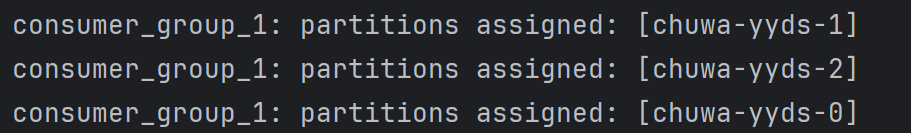

# HW15 Kafka

## Explain following concepts, and how they coordinate with each other:

### Here is a concise explanation of each Kafka concept and how they coordinate:

**Topic**: A category or feed name to which messages are published by producers. Each topic is divided into multiple partitions for scalability.

**Partition**: A subset of a topic, allowing parallel processing. Each partition stores messages in the order they arrive and is distributed across Kafka brokers.

**Broker**: A Kafka server that hosts partitions and handles message storage, retrieval, and replication.

**Producer**: An application that writes (publishes) messages to Kafka topics. Producers decide which partition within a topic the message should go to.

**Consumer Group**: A group of consumers working together to consume messages from partitions. Each partition in a topic is consumed by only one consumer in the group to ensure load balancing.

**Offset**: A unique identifier for each message within a partition, used to track which messages have been read.

**Zookeeper**: A distributed coordination service that Kafka uses (in older versions) for managing metadata, such as broker information, partition leader election, and topic configurations.

### Coordination:

**Producer** sends messages to a specific **topic**, and the messages are distributed across **partitions**.  
Each **partition** is managed by one or more **brokers**.  
Consumers within a **consumer group** read messages from partitions, ensuring each partition is processed by only one consumer in the group.  
**Offsets** are used to track where a consumer left off in a partition.
**Zookeeper** helps manage brokers and coordinate distributed tasks like leader election.

These components together ensure reliable, scalable, and fault-tolerant message streaming and processing in Kafka.

## 1. Given N (number of partitions) and M (number of consumers,) what will happen when N>=M and N<M respectively?

Here’s what happens in each case when dealing with Kafka partitions and consumers:

1. **N (Partitions) ≥ M (Consumers):**  
   Each consumer in the consumer group will read from one or more partitions.  
   Partitions are evenly distributed across consumers, but some consumers may handle multiple partitions.  
   All partitions will be consumed, and the workload may be unbalanced (some consumers handle more partitions than others).

2. **N (Partitions) < M (Consumers):**  
   Some consumers will be idle because Kafka assigns one partition to only one consumer in a consumer group.  
   Consumers that are assigned to partitions will be reading messages, but the remaining consumers won't have any partitions to read from.

In summary:

- N ≥ M: All consumers are active; some may handle multiple partitions.
- N < M: Some consumers will be idle, as there are not enough partitions for every consumer.

## 2. Explain how brokers work with topics?

In Kafka, **brokers** are servers that store and manage **partitions** of **topics**. Each topic is split into multiple **partitions**, and these partitions are distributed across different brokers for scalability and fault tolerance. Brokers handle incoming **producer** requests to write data to specific topic partitions and serve **consumer** requests to read data from those partitions. Kafka automatically balances the partitions across the available brokers and replicates partitions for durability.

## 3. Are messages pushed to consumers or consumers pull messages from topics?

In Kafka, **consumers pull messages** from topics. Consumers request (poll) messages from Kafka brokers at their own pace, allowing them to control the rate at which they consume data. Kafka does not push messages to consumers.

## 4. How to avoid duplicate consumption of messages?

To avoid duplicate consumption of messages in Kafka:

1. Track Offsets: Kafka assigns an offset to each message in a partition. Consumers should commit offsets after successfully processing messages, ensuring they don’t reprocess already-consumed messages.

2. Enable enable.auto.commit: This automatically commits offsets after polling, though manual offset management gives finer control.

3. Idempotent Consumers: Design consumers to be idempotent, meaning reprocessing the same message won’t have undesired effects.

4. Use Exactly-Once Semantics (EOS): Kafka provides exactly-once semantics for certain use cases, ensuring that messages are neither duplicated nor lost.

## 5. What will happen if some consumers are down in a consumer group? Will data loss occur? Why?

If some consumers in a **consumer group** go down, **data loss will not occur** because Kafka ensures fault tolerance through **partition reassignment**. The partitions previously assigned to the down consumers will be automatically reassigned to the remaining active consumers in the group. Since Kafka tracks message offsets, consumers can continue processing from the last committed offset, preventing data loss.

## 6. What will happen if an entire consumer group is down? Will data loss occur? Why?

If an **entire consumer group** is down, **no data loss will occur** because Kafka stores the messages in the topic's partitions. Messages will remain in Kafka until the consumers are back online and able to consume them. The offsets will also be preserved, allowing the consumer group to resume processing from where they left off once they are restarted. Data loss only occurs if the message retention period expires before the group comes back.

## 7. Explain consumer lag and how to resolve it?

### Explain:

Consumer lag refers to the difference between the latest offset of messages produced to a Kafka partition and the offset of messages consumed by a consumer group. It indicates how far behind a consumer is in processing messages.

### Resolve:

1. Scale consumers: Add more consumers to the consumer group to distribute the workload across more instances.
2. Optimize consumer processing: Improve the efficiency of the consumer's message processing logic to reduce processing time.
3. Increase partition count: If there are fewer partitions than consumers, increasing the number of partitions can allow for better load balancing.
4. Tune consumer configurations: Adjust configurations like fetch size and batch size to optimize consumption speed.
   Regularly monitoring lag helps detect and address performance bottlenecks.

## 8. Explain how Kafka tracks message delivery?

Kafka tracks message delivery using offsets. Each message within a partition is assigned a unique offset, which represents its position in the partition. Consumers are responsible for tracking the last processed message by committing the offset either automatically or manually.

Key mechanisms:

1. **Consumer Offset Commit:** Consumers periodically commit their latest processed offset to Kafka (usually stored in a special `__consumer_offsets` topic). This allows them to resume consumption from the correct point in case of failure or restart.

2. **At-Least-Once Delivery:** By default, Kafka ensures at-least-once delivery, meaning a message may be delivered more than once if a consumer fails before committing its offset.

3. **Exactly-Once Delivery:** Kafka also supports exactly-once semantics (EOS) for scenarios where message duplication must be avoided.

This offset tracking ensures reliable message delivery and enables consumers to resume processing from the last committed point.

## 9. Compare Kafka vs RabbitMQ, compare messageing frameworks vs MySql (Why Kafka)?

### Kafka vs. RabbitMQ:

1. **Message Model**:

   - **Kafka**: Primarily a distributed log system, designed for high-throughput, stream processing, and real-time data pipelines. Messages are persisted and consumers pull messages, allowing replay of old data.
   - **RabbitMQ**: A traditional message broker focusing on message delivery with routing and complex message exchange patterns. Messages are typically pushed to consumers and acknowledged once processed.

2. **Use Case**:

   - **Kafka**: Ideal for high-throughput event streaming, real-time analytics, and log aggregation.
   - **RabbitMQ**: Suited for task distribution, request-response patterns, and message queuing with guaranteed delivery.

3. **Performance**:

   - **Kafka**: Scales better for high-throughput scenarios with large amounts of data and offers message durability by default.
   - **RabbitMQ**: Provides lower throughput but excels in complex routing and guaranteed message delivery with various acknowledgment options.

4. **Message Retention**:
   - **Kafka**: Messages are retained based on a time or size-based retention policy, allowing consumers to re-read messages.
   - **RabbitMQ**: Messages are typically deleted after being consumed, unless they are configured to persist or be redelivered on failure.

---

### Kafka (Messaging Framework) vs. MySQL (Database):

1. **Purpose**:

   - **Kafka**: A distributed event streaming platform designed for real-time data processing and pub-sub messaging. Optimized for high throughput, distributed systems.
   - **MySQL**: A relational database designed for transactional data management with ACID compliance. Optimized for structured data storage and complex queries.

2. **Throughput**:

   - **Kafka**: Handles large-scale, high-velocity data streams, making it better suited for event streaming, log collection, and analytics.
   - **MySQL**: Not designed for high-throughput streaming. Best for structured data storage and read-heavy or transaction-heavy use cases.

3. **Message Replay**:
   - **Kafka**: Supports message retention and replay, allowing consumers to reprocess past events.
   - **MySQL**: Data is static and does not support event-based streaming or message replay.

---

### Why Kafka?

- **Scalability**: Kafka can handle millions of messages per second, making it ideal for large-scale, real-time data streaming.
- **Retention and Replay**: Kafka retains messages for a defined period, allowing for replay and reprocessing, which is critical in event-driven architectures.
- **Decoupling**: Kafka decouples data producers and consumers, enabling asynchronous, scalable, and fault-tolerant systems.
- **High Throughput**: Kafka's distributed nature makes it efficient for handling high-volume, real-time data pipelines compared to databases like MySQL, which are designed for storage, not real-time streaming.

## 10. Coding Practice

Please refer to `../Coding/` folder.

Error message

