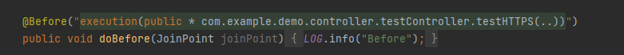

# Maven & Git Assignment - Part 2

1. Find at least ONE dependency for each packaging type on https://mvnrepository.com/repos/central 
   1. Packaging type is `war`
   2. Packaging type is `jar`
   3. Packaging type is `POM`
   4. Packaging type is other than all above
   ```
       <dependencies>
        <!-- https://mvnrepository.com/artifact/org.junit.jupiter/junit-jupiter-api -->
        <dependency>
            <groupId>org.junit.jupiter</groupId>
            <artifactId>junit-jupiter-api</artifactId>
            <version>5.10.2</version>
            <type>jar</type>
            <scope>test</scope>
        </dependency>
        <!-- https://mvnrepository.com/artifact/org.slf4j/slf4j-api -->
        <dependency>
            <groupId>org.slf4j</groupId>
            <artifactId>slf4j-api</artifactId>
            <version>2.0.16</version>
            <type>pom</type>
        </dependency>

        <dependency>
            <groupId>org.apache.maven.plugins</groupId>
            <artifactId>maven-war-plugin</artifactId>
            <version>3.4.0</version>
            <type>maven-plugin</type>
        </dependency>
        <!-- https://mvnrepository.com/artifact/org.jvnet.hudson.main/hudson-war -->
        <dependency>
            <groupId>org.jvnet.hudson.main</groupId>
            <artifactId>hudson-war</artifactId>
            <version>1.394</version>
            <scope>test</scope>
            <type>war</type>
        </dependency>
    </dependencies>

   ```
2. Explain the difference between war , jar , and POM    

   **jar** is used to bundle multiple Java-related files, including class files and resources, into a single file.  
   
   **war** is a special jar file that is used to package a web application to make it easy to deploy on an application server.  
      
   **pom** is "Project Object Model", which is an XML representation of a Maven project. It doesn't contain application code itself.

3. Create a maven managed project in IntelliJ Idea, add above dependencies to your project
   1. Resolve all dependency-related errors
   2. Explain how you resolve them  
   
      
      I imported the dependencies by clicking on the icon on the top right of the corner.  

4. Build your project, even if it's empty  
   1. Resolve all build-related issues  
   2. Install your executable to local maven repository  
   
   As shown from the figure in Q3. The executable is installed under `\.m2\repository`  

5. Create a new module in your maven project, make 4.2) as a dependency of this module
   1. Resolve all dependency-related issue  

        
      The module inherit parent's dependencies and was built successfully. 
   
6. List Maven life cycles in order, compare them.  

   **Clean**: Delete the target folder   

   **Validate**: Validate the project is correct and all necessary information is available

   **Compile**: Compile Java source code

   **Test**: Test the compiled source code using a suitable unit testing framework. 

   **Package**: Take the compiled code and package it in its distributable format, such as a JAR

   **Verify**: Run any checks on results of integration tests to ensure quality criteria are met

   **Install**: Install the package into the local repository, for use as a dependency in other projects locally

   **Deploy**: Done in the build environment, copies the final package to the remote repository for sharing with
   other developers and projects.

7. Explain git merge vs git rebase  

   **git merge**: creates a new “merge commit” in the feature branch that ties together the histories of both branches  
     
   **git rebase**: moves the entire feature branch to begin on the tip of the main branch, effectively incorporating all
of the new commits in main. But, instead of using a merge commit, rebasing re-writes the project history by creating brand new commits for each commit in the original branch.  
     

9. Explain Trunk-based developement git branching strategy.  
Trunk-based development is a version control management practice where developers merge small, 
frequent updates to a core “trunk” or main branch. Since it streamlines merging and integration phases, 
it helps achieve CI/CD and increases software delivery and organizational performance.
Trunk-based development is a required practice for continuous integration.
   

9. Explain git reset options.   

   Given: - A - B - C <- HEAD

   **git reset --soft A** and you will see B and C's stuff in the 'staged files' area ready to commit

   **git reset --mixed A** (or git reset A) and you will see B and C's stuff in the 'unstaged files' area ready to be moved to staged and then committed

   **git reset --hard A** and you will no longer see B and C's changes anywhere (will be as if they never existed)  

   **git reset --merge A** always discards the index (staged changes); aborts if unstaged and staged changes present on any file

   **git reset --keep A** keeps, but unstages, the index; aborts if the B or C touches the same file