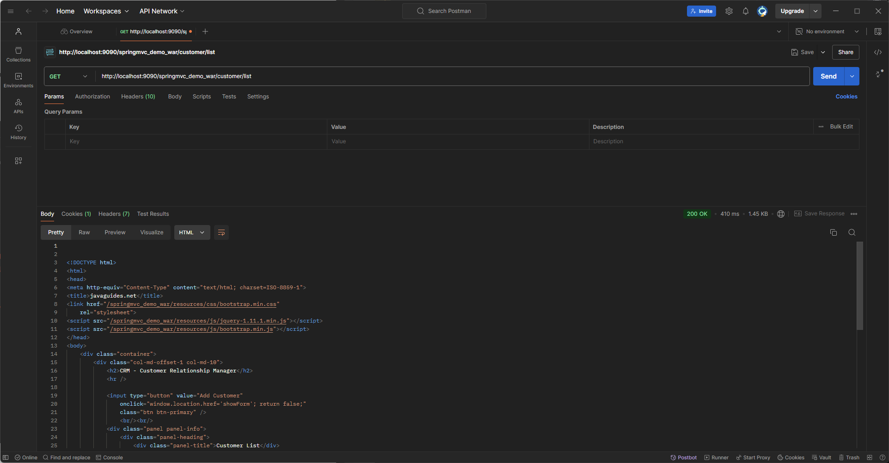

# hw10
## 1. List all of the annotations you learned from this class session.
## 2. Explain tight coupling vs. loose coupling and what does Spring IOC do?
- Tight Coupling: 
  - classes and modules are highly dependent on each other.
  - dependency makes the system less flexible and harder to maintain because changes in one module might require changes in another
- Loose Coupling:
  - Loose coupling means reducing the dependencies among components of a system
  - Components can be developed, tested, and updated more independently
- Spring IOC:
  - implemented through the Dependency Injection 
  - Components
  - Beans

    
## 3.What is MVC pattern?
- Model: fetching, storing, and manipulating data
- View: presenting data to the user
- Controller: an interface between Model and View 
## 4.What is Front-Controller?
- handles all the incoming requests and is responsible for authenticating requests, authorizing users, logging requests, and managing session information.
- DispatcherServlet

## 5.Explain DispatcherServlet and how it works.
- DispatcherServlet:
  - Request Handling:When a request comes in, the DispatcherServlet consults a set of handler mappings to call the appropriate Controller based on the URL
  - Controller Interaction: selected Controller takes the request, handles it and returns ModelAndView object back to the DispatcherServlet
  - View Resolution: uses a ViewResolver to find the specific view template specified in the ModelAndView
  - Response Return: the view is rendered and the response is returned to the user.

## 6. What is JSP and What is Model and View?
- JSP
  - JSP is a technology used for creating dynamically generated web pages based on HTML, XML, or other document types
  - JSP allows developers to embed Java code directly into the HTML page using special JSP tags

## 7. Explain servlet and servlet container, name some servlet implementations and servlet containers other than Tomcat.
- Servlet is a Java programming language class used to extend the capabilities of servers that host applications accessed by means of a request-response programming model.
- respond to any type of request
- server-side without an application-specific graphical user interface
- a client request a web page from server, the servlet that manages the request processes it and generates a response  and sent back to client.
- Servlet Containers:
  - Jetty
  - JBoss
  - WebSphere

## 8. 
- Coding
- 
- 