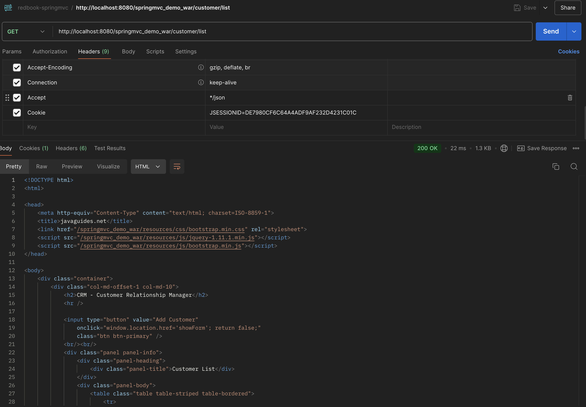
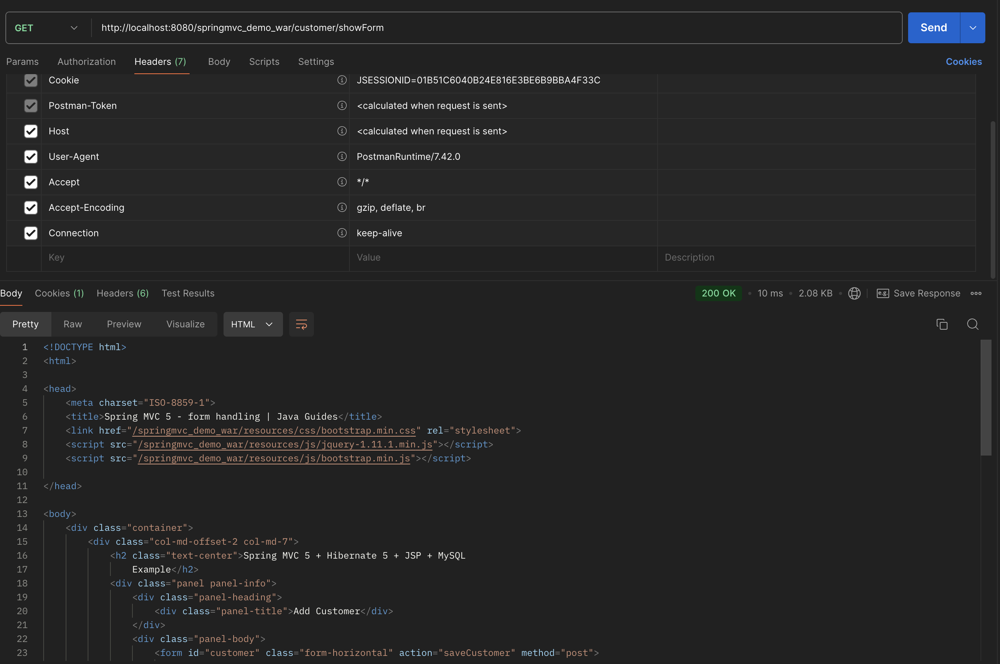
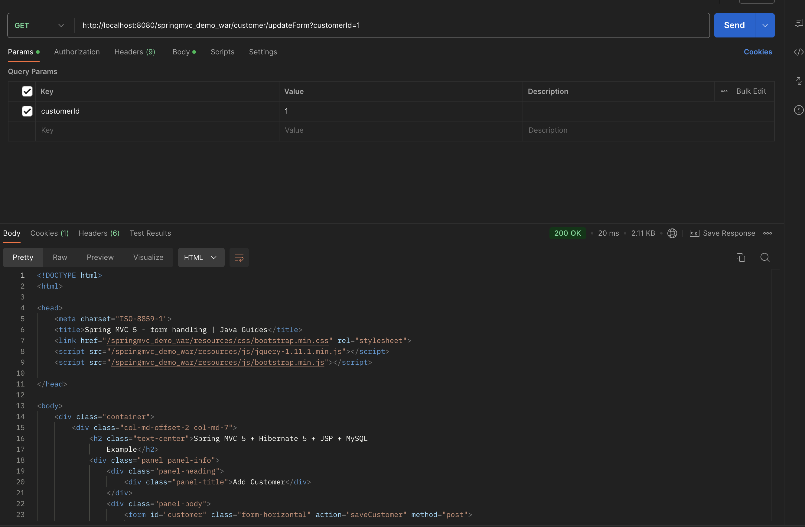
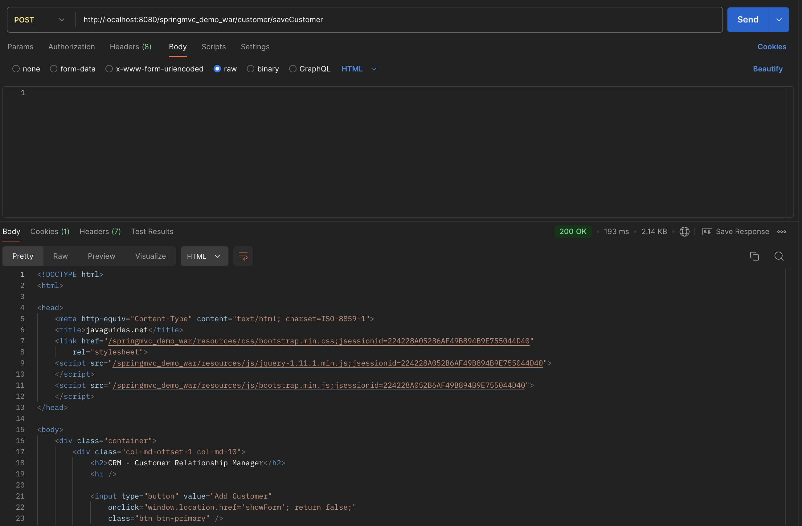
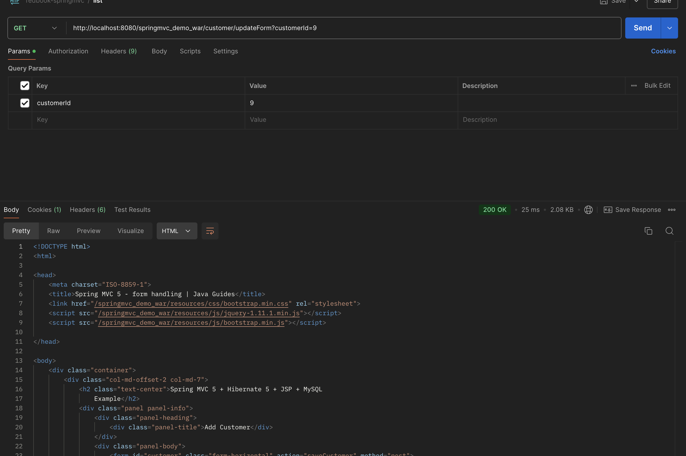
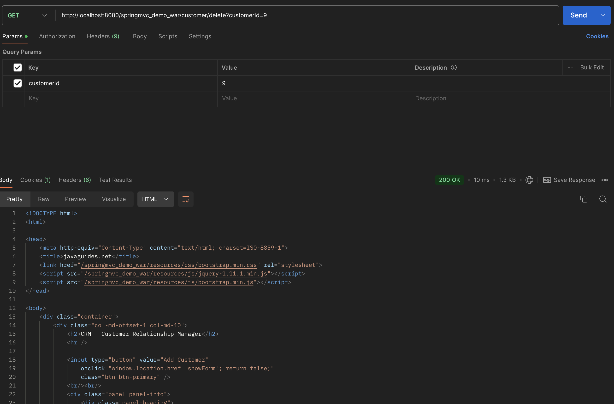

# hw10 Spring MVC

## 2. Explain tight coupling vs loose coupling and what does Spring IOC do?

Tight coupling: 

Tight coupling occurs when classes or modules are highly dependent on each other. Changes in one class often require changes in the other.

Loose coupling:

Loose coupling is when classes or modules have little to no knowledge of the other’s internal implementation.

Spring IoC promotes loose coupling by handling object creation and wiring, thus making the system easier to maintain, test, and extend.

## 3. What is MVC pattern?

The MVC (Model-View-Controller) pattern is a software design pattern used to separate the concerns of an application into three interconnected components: Model, View, and Controller. This helps in organizing code, improving maintainability, and enabling parallel development of different parts of an application.

## 4. What is Front-Controller?

In Spring MVC, the Front Controller is a design pattern where a single controller handles all incoming requests for an application and dispatches them to the appropriate handlers. This is implemented in Spring through the `DispatcherServlet`, which acts as the Front Controller.

## 5. Explain `DispatcherServlet` and how it works.

1. `DispatcherServlet` is the central component in the Spring MVC framework, acting as the Front Controller that handles all HTTP requests and responses in a Spring MVC web application.
2. How it works: 
   1. When tomcat receive an HTTP request, `DispatcherServlet` will handle the HTTP request.
   2. `DispatcherServlet` will call HandlerMapper based on the HTTP request.
   3. HandlerMapper will find the corresponding Controller and the corresponding method, and return it to `DispatcherServlet`.
   4. `DispatcherServlet` will call the method corresponding to the Controller, which will trigger callservice, repository, and database.
   5. Then the result (`ModelAndView`) is returned through the Controller. `viewname` is returned. The data is to be set in the `Model`.
   6. `DispatcerServlet` takes the `viewname` to call `viewResolver`.
   7. `ViewResolver` will help us find the `viewtemplate`. (.jsp file)
   8. Call `viewEngine` to set `Model` data into `viewtemplate`, then transfer it in HTML file.
   9. Show HTML info on the website.
   
## 6. What is JSP and What is ModelAndView?

1. JSP (JavaServer Pages) is a server-side technology used to create dynamic web pages in Java. It allows developers to embed Java code into HTML pages. JSP is primarily used for displaying data in web applications, and it can work with Java servlets to generate dynamic content.
2. ModelAndView is a class in Spring MVC that holds both the model data and the view name. It is used by controllers to return both the data (model) and the view (like a JSP page) to be rendered to the user.

## 7. Explain servlet and servlet container , name some servlet implementations and servlet containers other than tomcat.

A Servlet is a Java class that runs on a server and handles HTTP requests and responses. It is part of the Java EE (now Jakarta EE) specification and provides a way to create dynamic web content (such as HTML or JSON) in Java web applications.

Jetty, GlassFish, and WildFly, WebSphere (by IBM), WebLogic (by Oracle).

## 8. Run springmvc5-demo

Customer Controller test:

GET list:

GET showForm:

GET updateForm

POST saveCustomer

GET updateForm

GET delete

