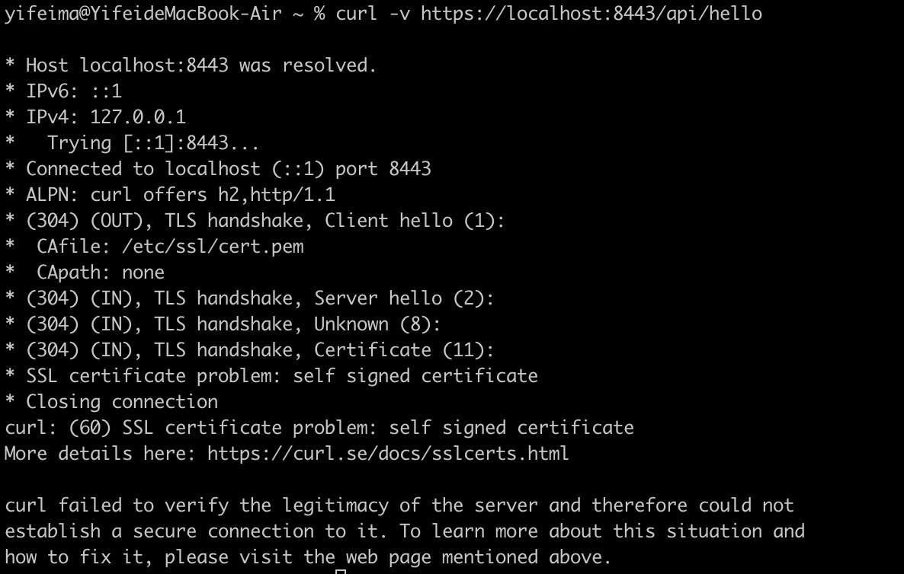
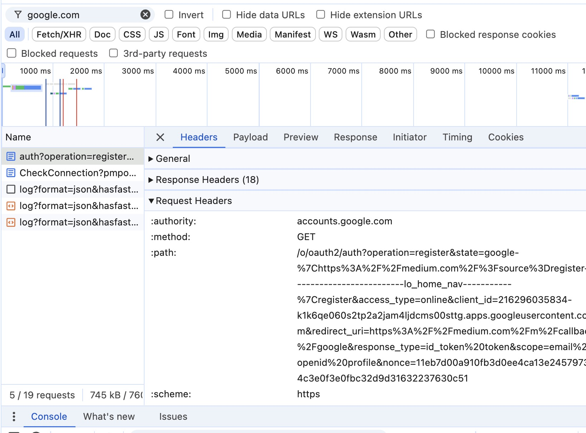

# HW11 -- SpringSecurity

## 2. Explain TLS, PKI, certificate, public key, private key, and signature

- **TLS (Transport Layer Security)**: A protocol that provides secure communication over a network by encrypting data and ensuring data integrity and confidentiality.

- **PKI (Public Key Infrastructure)**: A framework that manages public keys and digital certificates to enable secure communications, including authentication and encryption.

- **Certificate**: A digital document issued by a trusted entity (CA) that binds a public key to the identity of an organization or individual.

- **Public Key**: A key used in asymmetric encryption, shared publicly, and used to encrypt data or verify digital signatures.

- **Private Key**: A confidential key that is paired with a public key, used to decrypt data encrypted by the public key or to create digital signatures.

- **Signature**: A digital code created using the private key, used to verify the authenticity and integrity of a message or document.

## 3. Write a Spring security based application, which provides https APIs (one simple get controller with empty
response is good enough )instead of http, please generate a self-signed certificate to make your https
TLS verfication work.
   1. Pack your self-signed certificate in the form of jks file, as part of your application, name it properly
   2. Test if you can verify your HTTPs api without importing the self-signed certificate to your local
   certificate chain, if not, explain why.
   3. Explain what did you do to make https call work, do NOT bypass TLS/SSL verfication in Postman (this
   is cheating)!
   Tutorial: https://www.baeldung.com/spring-channel-security-https

1. 
2. 
   Explanation: This error occurs because the self-signed certificate is not trusted by default. The certificate has not been signed by a recognized Certificate Authority (CA), and it is not present in the system’s or browser’s list of trusted certificates. Thus, the SSL/TLS handshake fails, and the client cannot establish a secure connection.
3. - I generated a self-signed certificate (myapp.jks) using the keytool command and stored it in the src/main/resources directory of the Spring Boot application.
     ```java
     keytool -genkeypair -alias myapp -keyalg RSA -keysize 2048 -storetype PKCS12 -keystore src/main/resources/myapp.jks -validity 365
     ```
   - I set up the self-signed certificate in the Spring Boot application by configuring the application.properties file with the following properties:

## 4. list all http status codes that related to authentication and authorization failures.

### HTTP Status Codes for Authentication/Authorization Failures

- **401 Unauthorized**: Missing or invalid credentials.
- **403 Forbidden**: Authenticated but lacks permissions.
- **400 Bad Request**: Malformed request.
- **404 Not Found**: Resource not found.
- **405 Method Not Allowed**: HTTP method not supported.
- **407 Proxy Authentication Required**: Proxy authentication needed.
- **419 Authentication Timeout**: Session expired.
- **429 Too Many Requests**: Rate limit exceeded.
- **499 Client Closed Request**: Client canceled request.

## 5. Compare authentication and authorization? Name and explain important components in Spring security that undertake authentication and authorization

### Comparison of Authentication and Authorization

- **Authentication**: Verifies the identity of a user (e.g., username/password). It answers *“Who are you?”*.
- **Authorization**: Determines the access level and permissions a user has. It answers *“What can you do?”*.

### Important Components in Spring Security

- **`AuthenticationManager`**
    - Central interface for processing authentication requests.
    - Calls the `authenticate()` method to verify credentials.

- **`AuthenticationProvider`**
    - Performs specific authentication logic.
    - Can have multiple providers for different authentication methods (e.g., LDAP, OAuth).

- **`UserDetailsService`**
    - Loads user-specific data for authentication.
    - Retrieves `UserDetails` from database or another source.

- **`SecurityContext`**
    - Holds the authentication information (user details and roles).
    - Used to retrieve the currently authenticated user.

- **`AccessDecisionManager`**
    - Makes authorization decisions based on user roles and permissions.
    - Uses `AccessDecisionVoter` to grant or deny access.

- **`GrantedAuthority`**
    - Represents an authority or role assigned to a user (e.g., `ROLE_USER` or `ROLE_ADMIN`).

- **`SecurityFilterChain`**
    - Configures HTTP security, defining which endpoints require authentication and authorization.
    - Sets up security filters like `UsernamePasswordAuthenticationFilter` and `AuthorizationFilter`.

## 6. Explain HTTP Session?

### HTTP Session

- **Definition**: An HTTP session is a way to maintain state and store user-specific information (e.g., login status) across multiple HTTP requests in a stateless protocol like HTTP.

- **Usage**: Sessions are used to track user interactions with a web application, such as login status, user preferences, and shopping cart contents.

- **Implementation**:
    - Sessions are usually identified by a **session ID** stored in a cookie (e.g., `JSESSIONID`).
    - The server stores session data and associates it with the session ID.

- **Lifecycle**:
    - **Creation**: When a user first accesses the application or logs in.
    - **Persistence**: Session data is stored on the server and retrieved with each request using the session ID.
    - **Termination**: The session ends when the user logs out or the session times out.

- **Spring Session Support**:
    - Spring Security can use HTTP sessions to store authentication information (e.g., user details).
    - `HttpSessionSecurityContextRepository` is used to persist security context data within the session.

## 7. Explain Cookie? 

### Cookie

- **Definition**: A small piece of data stored on the client-side (browser) by the server, used to remember information between requests.

- **Purpose**:
    - Maintain state in stateless HTTP protocol.
    - Track user sessions, preferences, or authentication tokens.

- **Components**:
    - **Name**: Identifier for the cookie (e.g., `JSESSIONID`).
    - **Value**: Data stored in the cookie (e.g., session ID).
    - **Domain & Path**: Specifies where the cookie is valid.
    - **Expiry**: Determines cookie lifespan (`Session` or persistent).
    - **Secure & HttpOnly**: Security attributes that restrict access to the cookie.

- **Use Cases**:
    - Session management.
    - User tracking (e.g., analytics).
    - Storing user preferences.

- **Example**:
  ```http
  Set-Cookie: session_id=abc123; Path=/; HttpOnly; Secure
  ```
  
## 8. Compare Session and Cookie?

### Comparison: Session vs. Cookie

- **Storage Location**:
    - **Session**: Stored on the server.
    - **Cookie**: Stored on the client (browser).

- **Data Storage**:
    - **Session**: Stores large amounts of user-specific data.
    - **Cookie**: Limited to small key-value pairs (typically < 4KB).

- **Usage**:
    - **Session**: Used to maintain user-specific data (e.g., login status).
    - **Cookie**: Used for simple data storage (e.g., user preferences) and to store session identifiers.

- **Security**:
    - **Session**: More secure since data is stored server-side.
    - **Cookie**: Less secure as data is exposed to the client.

- **Expiration**:
    - **Session**: Ends when the user logs out or the session times out.
    - **Cookie**: Can persist across sessions based on the `expiry` attribute.

- **Example Use Case**:
    - **Session**: Track user’s shopping cart or authentication state.
    - **Cookie**: Remember language preference or session ID.

## 9. Find at least TWO websites who can be logged in using your Google Account, explain in detail on how Google SSO works with screenshots like below, find SSO-related Rest calls in Chrome developer tool:

GitHub and Medium

### Google SSO Workflow in Brief

1. **User Clicks "Sign in with Google"**:
  - The website sends a request to Google’s OAuth server (`https://accounts.google.com/o/oauth2/auth`).

2. **Redirect to Google**:
  - Google prompts the user to log in and grant permissions.

3. **Authorization Code Returned**:
  - After permissions are granted, Google redirects back to the app with an authorization code.

4. **Exchange Code for Tokens**:
  - App sends a POST request to `https://oauth2.googleapis.com/token` with the authorization code, client ID, and client secret.
  - Receives an `access_token` and an `id_token`.

5. **Verify and Retrieve User Info**:
  - App uses the `access_token` to fetch user info (e.g., profile, email) from `https://www.googleapis.com/oauth2/v2/userinfo`.

6. **User is Logged In**:
  - After verifying the `id_token`, the app logs the user in and establishes a session.



## 10. How do we use session and cookie to keep user information across the the application? 

### Using Session and Cookie to Keep User Information Across the Application

1. **Session**:
  - **How it Works**:
    - The server creates a session and generates a unique session ID for each user.
    - The session ID is stored on the server along with user-specific information (e.g., user ID, preferences).
    - The session ID is sent to the client in a cookie (e.g., `JSESSIONID`) when the user first logs in.
  - **How to Use**:
    - On subsequent requests, the client sends the session ID cookie back to the server.
    - The server uses the session ID to retrieve the stored session data and identify the user.
  - **Example**:
    ```http
    Set-Cookie: JSESSIONID=abc123; Path=/; HttpOnly; Secure
    ```
  - **Use Case**: Track user login status, shopping cart contents, or personalized settings.

2. **Cookie**:
  - **How it Works**:
    - Cookies store small pieces of data directly on the client-side (browser), such as session ID, user preferences, or authentication tokens.
    - Each cookie is sent with every HTTP request to the server within the specified domain and path.
  - **How to Use**:
    - Store information like user preferences or session IDs.
    - Use cookies for client-side state management (e.g., `theme=dark`).
  - **Example**:
    ```http
    Set-Cookie: session_token=eyJhbGciOiJIUzI1NiIsIn...; Path=/; HttpOnly; Secure
    ```
  - **Use Case**: Remember user preferences, session tokens, or keep the user logged in (e.g., "Remember Me" feature).

### Session and Cookie Integration

- **Step 1**: User logs in, and the server creates a session, storing user data (e.g., username) in the session.
- **Step 2**: The server sends the session ID to the client in a cookie (e.g., `JSESSIONID`).
- **Step 3**: On each subsequent request, the client sends the session ID cookie back to the server.
- **Step 4**: The server uses the session ID to fetch user data, maintaining user state across different pages.
- **Step 5**: Cookies can be used to store additional information, like "Remember Me" tokens, user preferences, or authentication status, directly on the client-side.

### Summary
- **Sessions**: Store user-specific data on the server and track users with a session ID stored in a cookie.
- **Cookies**: Store small client-side data and session IDs, allowing the server to identify users across requests.
- **Combination**: Sessions and

## 11. What is the spring security filter?

### Spring Security Filter

- **Definition**:  
  A series of filters that intercept HTTP requests in a Spring Boot application to handle security-related concerns such as authentication, authorization, and other security measures.

- **How It Works**:
  - The filter chain inspects each incoming request before reaching the application’s controllers.
  - Filters are applied in a predefined order, and each filter performs a specific security task (e.g., checking authentication credentials).
  - If a filter determines that the request should not proceed (e.g., unauthorized access), it can terminate the request and send an appropriate response (e.g., `401 Unauthorized`).

- **Key Filters in Spring Security**:
  1. **`UsernamePasswordAuthenticationFilter`**:
    - Handles login requests with username and password.
    - Processes `/login` POST requests and attempts authentication.

  2. **`BasicAuthenticationFilter`**:
    - Processes HTTP Basic Authentication headers (e.g., `Authorization: Basic ...`).
    - Validates credentials in the HTTP headers.

  3. **`SecurityContextPersistenceFilter`**:
    - Retrieves and saves the `SecurityContext` between requests, maintaining the user’s security context.
    - Useful for handling sessions and reusing the security context.

  4. **`ExceptionTranslationFilter`**:
    - Catches security-related exceptions (e.g., `AccessDeniedException`).
    - Redirects to an appropriate error page or sends an error response (e.g., `403 Forbidden`).

  5. **`FilterSecurityInterceptor`**:
    - The final filter in the chain.
    - Performs access control checks (authorization) based on URL patterns and user roles.

- **Customization**:
  - You can add, remove, or reorder filters in the security filter chain using a custom `SecurityFilterChain` configuration.
  - For example, adding JWT token validation by inserting a custom filter before `UsernamePasswordAuthenticationFilter`.

- **Example Filter Chain Flow**:
  1. **`SecurityContextPersistenceFilter`**: Establishes security context.
  2. **`UsernamePasswordAuthenticationFilter`**: Authenticates user credentials.
  3. **`BasicAuthenticationFilter`**: Validates basic authentication headers.
  4. **`ExceptionTranslationFilter`**: Handles any security exceptions.
  5. **`FilterSecurityInterceptor`**: Performs authorization checks.

- **Purpose**:  
  Ensures that security checks such as authentication and authorization are applied uniformly across all HTTP requests.

## 12. Explain bearer token and how JWT works.

### Bearer Token
- **Definition**: A type of access token used to authenticate and authorize API requests.
- **Usage**: Sent in the `Authorization` header as `Bearer <token>`.

### JSON Web Token (JWT)
- **Definition**: A compact, self-contained token for stateless authentication.
- **Structure**:
  - **Header**: Token type (`JWT`) and algorithm (`HS256`).
  - **Payload**: User claims (e.g., `sub`, `role`, `exp`).
  - **Signature**: Ensures token integrity.
- **How JWT Works**:
  1. User logs in, and server issues a signed JWT.
  2. Client stores and sends JWT with each request (`Authorization: Bearer <JWT>`).
  3. Server validates JWT, extracts claims, and grants access.
- **Advantage**: Stateless, secure, and scalable for distributed systems.

## 13. Explain how do we store sensitive user information such as password and credit card number in DB? 

### Storing Sensitive User Information in Database

1. **Password Storage**:
  - **Hashing**: Convert passwords into a fixed-length string using a hash function (e.g., `bcrypt`, `scrypt`, `PBKDF2`).
  - **Salting**: Add a random value (salt) to the password before hashing to prevent attacks like rainbow tables.
  - **Storage**: Store only the hashed password and salt in the database.
  - **Example**: `bcrypt` generates a hash with salt embedded, e.g., `$2a$10$abc123...`.

2. **Credit Card Storage**:
  - **Encryption**: Use strong encryption algorithms (e.g., AES-256) to encrypt credit card data.
  - **Tokenization**: Replace credit card numbers with tokens that have no exploitable value.
  - **Storage**: Store only the encrypted data or token, never store raw credit card numbers.
  - **Compliance**: Follow standards like PCI-DSS for securely handling credit card data.

### Summary
- Use **hashing and salting** for passwords.
- Use **encryption or tokenization** for credit card data.

## 14. Compare UserDetailService, AuthenticationProvider, AuthenticationManager, AuthenticationFilter?

### Comparison of Spring Security Components

1. **UserDetailsService**
  - **Purpose**: Loads user-specific data (e.g., username, password, roles) from a database or other source.
  - **Usage**: Implemented to provide `UserDetails` objects for authentication.
  - **Example**: `loadUserByUsername(String username)`.

2. **AuthenticationProvider**
  - **Purpose**: Performs authentication by validating user credentials.
  - **Usage**: Checks the user’s password and grants authentication if valid.
  - **Example**: `DaoAuthenticationProvider` uses `UserDetailsService` to authenticate.

3. **AuthenticationManager**
  - **Purpose**: Central interface that delegates authentication requests to one or more `AuthenticationProvider` instances.
  - **Usage**: Calls `authenticate()` method to authenticate a user.
  - **Example**: `ProviderManager` is a common implementation.

4. **AuthenticationFilter**
  - **Purpose**: Intercepts HTTP requests and attempts to extract and validate authentication credentials (e.g., username and password, JWT).
  - **Usage**: Passes the extracted credentials to `AuthenticationManager` for validation.
  - **Example**: `UsernamePasswordAuthenticationFilter` handles form login, `JwtAuthenticationFilter` processes JWT tokens.

### Summary
- **UserDetailsService**: Loads user data.
- **AuthenticationProvider**: Validates user credentials.
- **AuthenticationManager**: Manages authentication providers.
- **AuthenticationFilter**: Intercepts HTTP requests and performs initial authentication.

## 15. What is the disadvantage of Session? how to overcome the disadvantage?

### Disadvantages of Session

1. **Scalability Issues**:
  - Session data is stored on the server, increasing memory usage as the number of users grows.
  - In distributed applications, maintaining session consistency across multiple servers can be challenging.

2. **Performance Overhead**:
  - Session management adds additional overhead, especially when persisting sessions in databases or external storage.

3. **Stateful Nature**:
  - Sessions make the application stateful, which complicates scaling and deployment in cloud-based or microservices environments.

### How to Overcome Session Disadvantages

1. **Use Stateless Authentication (e.g., JWT)**:
  - Use JSON Web Tokens (JWT) to store user data client-side.
  - Reduces server-side memory usage and makes scaling easier.

2. **Session Replication or Centralized Session Store**:
  - Use a centralized session store (e.g., Redis) to maintain session consistency across multiple servers.
  - Ensures availability and state synchronization.

3. **Token-Based Authentication**:
  - Use tokens like OAuth or JWT for stateless authentication, allowing the application to be truly stateless.

### Summary
- **Disadvantages**: Scalability, performance overhead, statefulness.
- **Solutions**: Use JWT, centralized session store, or token-based authentication.

## 16. how to get value from application.properties in Spring security?

### How to Get Value from `application.properties` in Spring Security

1. **`@Value` Annotation**:
  - Injects property values directly into Spring beans.
  ```java
  @Value("${property.name}")
  private String propertyValue;
  ```
  - example
  ```java
  @Value("${security.jwt.secret}")
  private String jwtSecret;
  
  ```

2. **`@ConfigurationProperties` Annotation**:
  - Binds a group of related properties to a class, allowing easy access.
  ```java
  @ConfigurationProperties(prefix = "security.jwt")
  public class JwtProperties {
    private String secret;
    private long expiration;
  
    // Getters and Setters
  }
  ```
  - Register the configuration class with `@EnableConfigurationProperties(JwtProperties.class)`.

3. **`Environment` Interface**:
  - Provides programmatic access to property values.
  ```java
  @Autowired
  private Environment env;
  
  public void printProperty() {
          String secret = env.getProperty("security.jwt.secret");
          System.out.println("JWT Secret: " + secret);
          }
  ```

4. **Accessing in Security Configuration:t**:
  - To use property values in a security configuration class, inject them using `@Value` or Environment inside the `configure()` method of your security configuration class.
  ```java
  @Configuration
  @EnableWebSecurity
  public class SecurityConfig extends WebSecurityConfigurerAdapter {
  
    @Value("${security.jwt.secret}")
    private String jwtSecret;
  
    @Override
    protected void configure(HttpSecurity http) throws Exception {
      // Use jwtSecret in security configuration
    }
  }

  ```

## 17. What is the role of configure(HttpSecurity http) and configure(AuthenticationManagerBuilder auth)?

### Role of `configure(HttpSecurity http)` and `configure(AuthenticationManagerBuilder auth)`

1. **`configure(HttpSecurity http)`**:
  - Configures **web-based security** for HTTP requests.
  - Defines security rules like URL access restrictions, authentication mechanisms, CSRF protection, and session management.
  - Sets up filters like form login, HTTP Basic authentication, and custom security configurations.

2. **`configure(AuthenticationManagerBuilder auth)`**:
  - Configures **authentication mechanisms**.
  - Specifies how users are authenticated (e.g., in-memory, JDBC, LDAP).
  - Sets up custom authentication providers, password encoders, and user details services.

### Summary
- `configure(HttpSecurity http)`: Manages HTTP request security.
- `configure(AuthenticationManagerBuilder auth)`: Sets up user authentication.

## 18. Reading, 泛读⼀下即可，⾃⼰觉得是重点的，可以多看两眼。https://www.interviewbit.com/spring-security-interview-questions/#is-security-a-cross-cutting-concern
   1. 1-12
   2. 17 - 30

