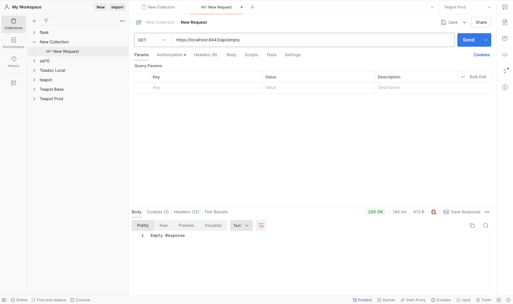

## Homework 11 Answers

### 2. TLS, PKI, certificate, public key, private key, and signature:

1. TLS (Transport Layer Security): A protocol ensuring privacy between communicating applications and users on the internet. When a server and client communicate, TLS prevents eavesdropping and tampering.
2. PKI (Public Key Infrastructure): A framework for managing public keys and digital certificates, enabling secure data exchange.
3. Certificate: A digital document used to prove ownership of a public key.
4. Public Key: Part of cryptographic key pairs used in asymmetric encryption; it is publicly distributed and used to encrypt messages.
5. Private Key: The secret counterpart to the public key, used to decrypt messages encrypted by the public key.
6. Signature: A cryptographic value that is calculated from the data and a private key, used to verify data integrity and authenticity.

### 3. Spring Security HTTPS Application:

### 4. HTTP status codes related to authentication and authorization failures:

1. 401 Unauthorized: When a user isn't authenticated.
2. 403 Forbidden: When a user is authenticated but does not have access to the requested resource.

### 5. Authentication vs Authorization:

 - Authentication: Verifying the identity of the user (e.g., logging in with a username and password).
 - Authorization: Determining what resources a user is allowed to access after authentication (e.g., permission to view certain pages or data).

### 6. HTTP Session: 

A session is a way to store data about a user's interaction with a web application over multiple requests.

### 7. Cookie: 

A small piece of data stored on the client-side used to store information like session IDs, user preferences, or authentication tokens.

### 8. Comparison of Session and Cookie:

Session: Stores data on the server, linked to a user via a session ID stored in a cookie.
Cookie: Stores data on the client-side, sent back to the server with each request.

### 9. Google SSO Examples:

Find two websites that allow login via Google, and use Chrome's developer tools to examine the REST API calls involved in the SSO process.

### 10. Session and Cookie for User Information: 

Sessions can store server-side data, while cookies store client-side data, often used to maintain a user's login status across pages or requests.

### 11. Spring Security Filter: 

A chain of filters that apply security rules (like authentication and authorization) to incoming HTTP requests.

### 12. Bearer Token and JWT:

Bearer Token: A token that is passed to the server in each request to authenticate and authorize the user.
JWT (JSON Web Token): A compact, URL-safe token that represents claims between two parties, often used for authentication.

### 13. Storing Sensitive User Information: 

Use hashing (e.g., bcrypt for passwords) and encryption for sensitive data such as credit card numbers before storing them in the database.

### 14. UserDetailService, AuthenticationProvider, AuthenticationManager, AuthenticationFilter: 

These are essential components of Spring Security that manage user details, authentication logic, and request filtering.

### 15. Disadvantages of Session:

Sessions are server-side and can consume server memory.
Overcoming the disadvantage: Use stateless tokens like JWT for session management to offload storage to the client-side.

### 16. Getting values from application.properties in Spring Security: 

Use @Value annotation to inject property values into your Spring Security configuration.

### 17. Role of configure(HttpSecurity http) and configure(AuthenticationManagerBuilder auth):

configure(HttpSecurity http): Configures HTTP security (e.g., which endpoints require authentication).
configure(AuthenticationManagerBuilder auth): Configures authentication mechanisms (e.g., in-memory, JDBC-based authentication).