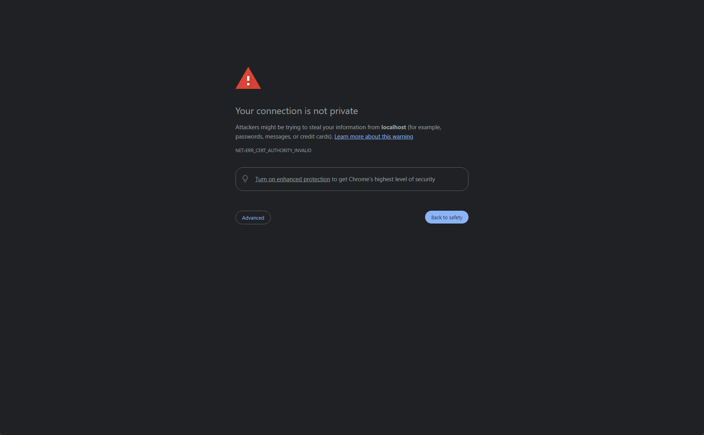
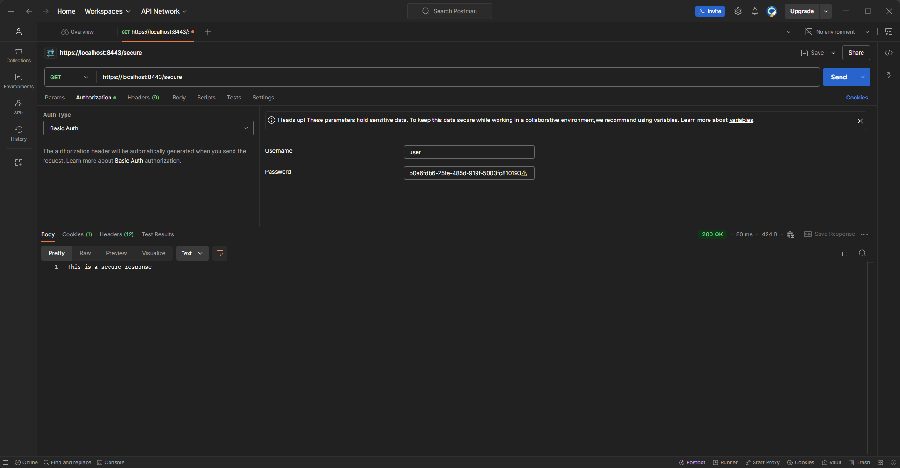
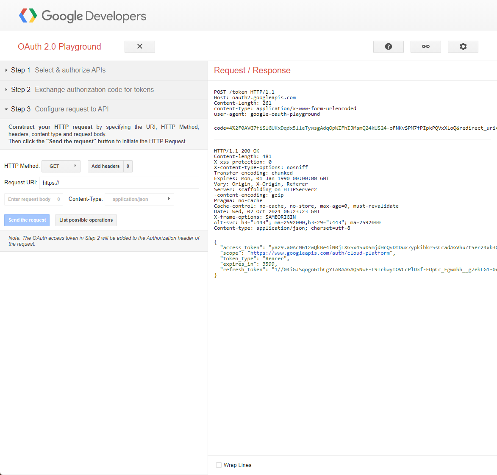
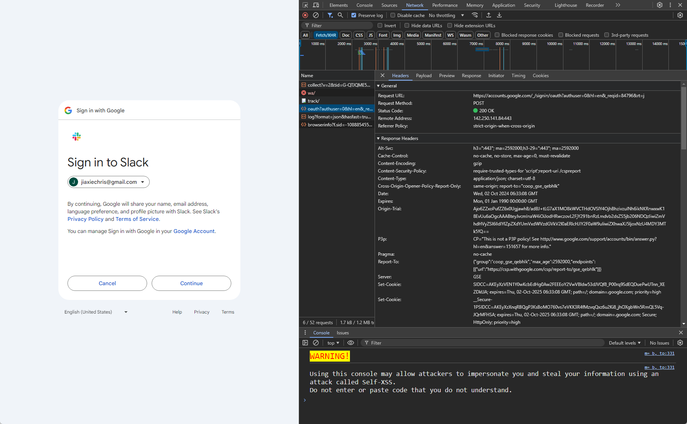

## 1. List all the annotations you learned from class and homework to annotaitons.md
- @EnableWebSecurity:Enables Spring Security’s web security features
- @PreAuthorize: Checks if the user has access to a method based on roles or permissions.
- @Secured: Restricts access based on roles.
- @RolesAllowed: Another way to restrict access based on roles.
- @WithMockUser: Used in testing to mock a user.

## 2. Explain TLS, PKI, certificate, public key, private key, and signature.
- TLS： A protocol for securing communication over the internet.
- PKI：  system for managing public-private key pairs and digital certificates.
- certificate： A digital document that binds a public key to an identity.
- public key： Used to encrypt data; it can be shared publicly.
- private key： Used to decrypt data encrypted by the public key; it must be kept secret.
- signature: Ensures the authenticity and integrity of a message or document by verifying the sender’s identity.

## 3. Write a Spring security-based application with HTTPS and a self-signed certificate


- Self-signed certificates are not trusted by default, as they are not issued by a trusted Certificate Authority.
- Create the certificate


## 4. List all HTTP status codes related to authentication and authorization failures.
- 401: The client must authenticate itself to get the requested response.
- 403 : The client does not have access rights to the content.
- 400 : This can be related to invalid authentication tokens or malformed requests.


## 5.Compare authentication and authorization.
- Authentication: The process of verifying the identity of a user 
- Authorization: The process of verifying what actions the authenticated user is allowed to perform

- Spring Security Components:
  - AuthenticationManager: Manages authentication.
  - AuthenticationProvider: Defines how authentication is processed.
  - UserDetailsService: Loads user-specific data.
  - SecurityContextHolder: Stores authentication details.


## 6. Explain HTTP Session?:
- HTTP Session: A server-side mechanism that stores user data across multiple requests from the same user. Sessions are typically identified by a session ID.


## 7. Explain Cookie?
- Cookie: A small piece of data stored on the client-side (in the browser) that is sent to the server with every request. It can store session information, preferences, or login tokens.


## 8.Compare Session and Cookie?
- Session is stored on the server and contains more secure and private information.
- Cookies are stored on the client-side and are less secure since they are visible in the browser.


## 9.Google SSO Login
- Google SSO works by redirecting the user to Google for authentication. After the user logs in, Google redirects back with an authentication token. Use Chrome’s Developer Tools to capture the authentication-related calls.


## 10. How do we use session and cookie to keep user information across the application?
- Session: Typically stores sensitive information such as user login status and preferences.
- Cookies: Can store session IDs or JWT tokens to keep users authenticated across the application.

## 11. What is the Spring Security filter?
- Spring Security’s filter chain intercepts HTTP requests to handle authentication and authorization. The UsernamePasswordAuthenticationFilter is commonly used for handling form-based login.


## 12. Explain bearer token and how JWT works.
- Bearer Token: A token that allows access to a resource. The client must include it in the header when making requests.
- JWT (JSON Web Token): A compact token format used to transmit user information. It consists of three parts: header, payload, and signature. It’s commonly used for stateless authentication.

## 13. How do we store sensitive information such as passwords and credit card numbers in DB?
- Sensitive data should be hashed (for passwords) and encrypted (for credit cards). Use strong algorithms such as bcrypt for hashing and AES for encryption.

## 14. Compare UserDetailService, AuthenticationProvider, AuthenticationManager, AuthenticationFilter.
- UserDetailsService: Fetches user data.
- AuthenticationProvider: Authenticates users with credentials.
- AuthenticationManager: Manages authentication processes.
- AuthenticationFilter: Intercepts and processes authentication requests.


## 15. What is the disadvantage of Session?
- Sessions consume server memory for each user, which can lead to scalability issues in large applications. Stateless authentication methods like JWT are often used to overcome this.


## 16.How to get value from application.properties in Spring security?
- Use the @Value annotation
```aiignore
@Value("${your.property.name}")
private String propertyValue;
```


## 17.What is the role of configure(HttpSecurity http) and configure(AuthenticationManagerBuilder auth)?
- configure(HttpSecurity http): Defines how HTTP requests are secured
- configure(AuthenticationManagerBuilder auth): Sets up authentication mechanisms




- POST request to https://oauth2.googleapis.com/token
- Once the authorization code is obtained, the application exchanges this code for an access token by making a POST request to Google's token endpoint


- A POST request is sent to https://accounts.google.com as seen in the Network tab.
- This request is for the authorization to access the user's Google account on Slack's behalf.


