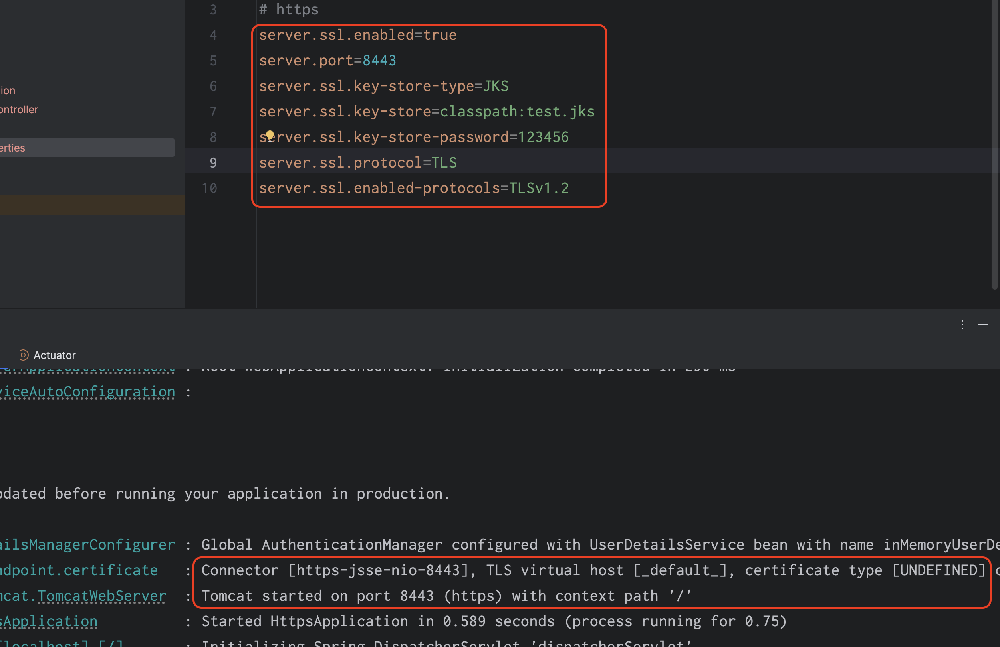
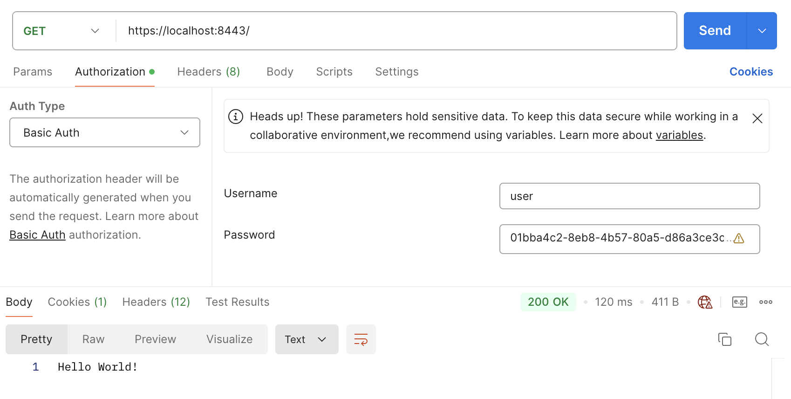
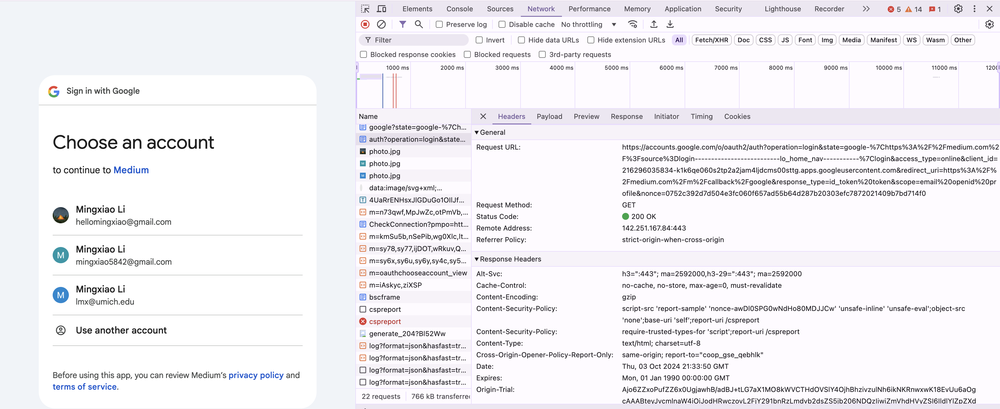
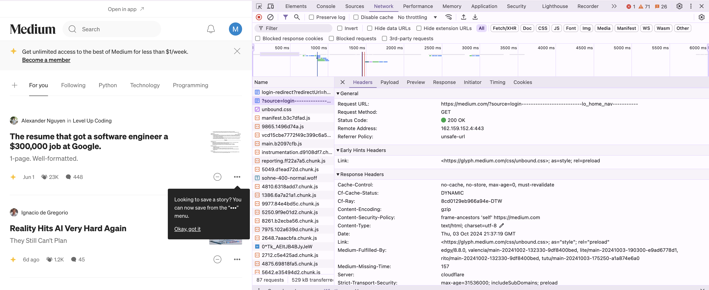

# hw11 Spring Security

## 2. Explain TLS, PKI, certificate, public key, private key, and signature.

TLS (Transport Layer Security) is a cryptographic protocol that ensures secure communication over a network. It's the successor to SSL (Secure Sockets Layer) and is commonly used to secure HTTP (resulting in HTTPS). It provides confidentiality, integrity, and authentication between two communicating parties (usually a client and a server). TLS uses a combination of symmetric encryption, asymmetric encryption (public/private keys), and certificates to establish a secure connection.

PKI (Public Key Infrastructure) is the framework of policies, roles, hardware, software, and procedures needed to create, manage, distribute, use, store, and revoke digital certificates and public-key encryption. PKI enables users to securely exchange information using public-key cryptography. At the heart of PKI is the Certificate Authority (CA), which issues digital certificates that validate ownership of a public key.

A digital certificate (or public key certificate) is an electronic document that links a public key with the identity of the owner. It is issued by a trusted Certificate Authority (CA), and it contains:
The public key of the owner; Information about the owner (e.g., domain or individual name). The CA's digital signature to validate the certificate's authenticity. Certificates are essential in establishing trust in PKI and TLS, ensuring that the public key belongs to the claimed entity.

The **public key** is used to <span style="color:green">encrypt data</span> or <span style="color:green">verify a digital signature</span>. Public keys are meant to <span style="color:orange">be distributed freely and can be shared with anyone.</span> However, data encrypted with a public key can only be decrypted by the corresponding private key.

The **private key** is used to <span style="color:green">decrypt data</span> that was encrypted with the public key or to <span style="color:green">create a digital signature.</span> Anyone with access to the private key can impersonate the owner of the key, so it's crucial to protect it.

Asymmetric encryption: **Public key encryption and private key decryption**,.

A digital signature is a mathematical scheme used to verify the authenticity and integrity of a message or document.

## 3. Write a Spring security based application, which provides https APIs (one simple get controller with empty response is good enough) instead of http, please generate a self-signed certificate to make your https TLS verfication work.

Adding jks certificate to my Spring Boot project -> adding https configuration.



GET request in the postman


## 4. List all http status codes that related to authentication and authorization failures.

### **401 Unauthorized**
- **Meaning**: The request requires user authentication. It indicates that the client must authenticate itself to get the requested response.
- **Typical Use**: Returned when the user is not logged in or has provided invalid credentials.

### **403 Forbidden**
- **Meaning**: The server understands the request, but the client is not allowed to access the requested resource. Authentication may have been provided, but the user does not have the necessary permissions.
- **Typical Use**: Returned when the user is authenticated but lacks permission to access a resource.

### **407 Proxy Authentication Required**
- **Meaning**: Similar to a 401 status, but it indicates that the client must first authenticate itself with the proxy.
- **Typical Use**: Returned when a client is trying to use a proxy server that requires authentication but has not provided the credentials or they have failed.

### **419 Authentication Timeout (Non-Standard)**
- **Meaning**: Although not officially part of the HTTP standard, some applications use this status code to indicate that authentication has expired or timed out.
- **Typical Use**: Commonly used in web applications to indicate that session-based authentication has timed out.

### **422 Unprocessable Entity** (sometimes related to authorization)
- **Meaning**: Typically related to validation errors, but in some cases, this status code can be used for issues such as invalid tokens or sessions.
- **Typical Use**: Seen when the client provides invalid or malformed credentials or tokens.

### **498 Invalid Token (Non-Standard)**
- **Meaning**: Some systems use this non-standard code to indicate that the token provided for authentication is invalid.
- **Typical Use**: Seen in APIs using token-based authentication when the token provided is expired or invalid.

### **499 Token Required (Non-Standard)**
- **Meaning**: Used in some systems to indicate that a token is required but was not provided in the request.
- **Typical Use**: API endpoints requiring token-based authentication may return this if a token is missing.

### **440 Login Timeout (Microsoft) (Non-Standard)**
- **Meaning**: Used by Microsoft’s IIS when a session has expired and the user needs to re-authenticate.
- **Typical Use**: Indicates that the session has timed out, typically seen in web applications that require a session token for authentication.

## 5. Compare authentication and authorization? Name and explain important components in Spring security that undertake authentication and authorization.

### 1. **Authentication**:
- **Definition**: The process of verifying the identity of a user or system.
- **Goal**: To confirm whether the user is who they claim to be.
- **Process**: The user typically provides credentials (like a username and password), and the system verifies the validity of those credentials.
- **Example**: Logging in with a username and password.
  
### 2. **Authorization**:
- **Definition**: The process of granting or denying access to resources after authentication.
- **Goal**: To ensure that the authenticated user has the right permissions to access certain resources or perform specific actions.
- **Process**: Once authenticated, the system checks the user’s roles/permissions to see if they can access the requested resource.
- **Example**: Allowing an admin user to access an admin-only page, while denying access to regular users.

### **Key Differences**:
| Aspect          | Authentication                              | Authorization                                  |
|-----------------|---------------------------------------------|------------------------------------------------|
| **Purpose**     | Verifying identity                          | Granting permission to resources               |
| **Occurs When** | Before authorization                        | After authentication                           |
| **Data Used**   | Credentials (username, password, etc.)       | Roles, permissions, access control rules       |
| **Example**     | Login to a website                          | Access to user profile or admin dashboard      |


### Important Components in Spring Security for Authentication and Authorization

### 1. **AuthenticationManager**:
- **Role**: Central interface for authentication in Spring Security.
- **Function**: It processes an `Authentication` object and returns an authenticated `Authentication` object (or throws an exception if authentication fails).
- **Key Method**: 
  - `authenticate(Authentication authentication)` – Verifies the user’s credentials.

### 2. **AuthenticationProvider**:
- **Role**: Provides the actual authentication logic.
- **Function**: It checks the credentials (e.g., username and password) and creates a fully populated `Authentication` object if successful.
- **Key Method**: 
  - `supports(Class<?> authentication)` – Determines if the `AuthenticationProvider` can handle the type of authentication.
  - `authenticate(Authentication authentication)` – Performs authentication by validating credentials.

### 3. **UserDetailsService**:
- **Role**: Loads user-specific data for authentication.
- **Function**: Provides the `UserDetails` object (which contains user information) from a user repository, typically through the method `loadUserByUsername(String username)`.
- **Key Method**: 
  - `loadUserByUsername(String username)` – Retrieves a `UserDetails` object, typically from a database or an in-memory store, used for authentication.

### 4. **UserDetails**:
- **Role**: Represents the core user information.
- **Function**: Stores user information such as username, password, and authorities (roles/permissions).
- **Key Methods**: 
  - `getUsername()` – Returns the username.
  - `getPassword()` – Returns the hashed password.
  - `getAuthorities()` – Returns the roles and permissions of the user.

### 5. **GrantedAuthority**:
- **Role**: Represents an authority granted to the user (e.g., a role or permission).
- **Function**: Encapsulates the authorities (permissions) assigned to a user, such as `ROLE_USER`, `ROLE_ADMIN`.
- **Key Method**: 
  - `getAuthority()` – Returns the authority string (e.g., `ROLE_ADMIN`).

### 6. **SecurityContextHolder**:
- **Role**: Holds the security context (including the authenticated user’s details) for the current request/thread.
- **Function**: Provides access to the `SecurityContext`, which contains the authentication information for the current user.
- **Key Method**: 
  - `getContext()` – Returns the current `SecurityContext` that holds authentication details.

### 7. **AccessDecisionManager**:
- **Role**: Responsible for making access control decisions.
- **Function**: Decides whether a user has the necessary permissions to access a specific resource based on the user’s authorities and the required permissions.
- **Key Method**: 
  - `decide(Authentication authentication, Object object, Collection<ConfigAttribute> configAttributes)` – Determines if access should be granted.

### 8. **@PreAuthorize, @Secured, and @RolesAllowed** Annotations:
- **Role**: Annotations that restrict access to methods or resources based on roles or permissions.
- **Function**: Used in method-level security to specify required authorities.
  - `@PreAuthorize("hasRole('ROLE_ADMIN')")` – Only allows access if the user has the `ROLE_ADMIN` role.
  - `@Secured({"ROLE_USER", "ROLE_ADMIN"})` – Allows access for users with specific roles.
  - `@RolesAllowed({"ROLE_USER", "ROLE_ADMIN"})` – Similar to `@Secured`, used to define access roles.

### 9. **FilterSecurityInterceptor**:
- **Role**: Intercepts requests and applies security rules.
- **Function**: Checks if a user is authorized to access a specific resource by consulting the `AccessDecisionManager`.
- **Key Methods**: 
  - `beforeInvocation()` – Checks permissions before a request is processed.

**Authentication** verifies the identity of users, while 

**authorization** determines their permissions.

In Spring Security, components like `AuthenticationManager`, `UserDetailsService`, and `AccessDecisionManager` handle the core authentication and authorization logic.

## 6. Explain HTTP Session?

### 1. **Definition**:
An **HTTP session** is a way to maintain state across multiple requests between a client (e.g., a web browser) and a server. Since HTTP is a stateless protocol (it does not store any information between requests), sessions are used to track the identity and actions of users over a series of interactions.

### 2. **How It Works**:
- When a user first interacts with a web server (e.g., logging in), the server creates a **session** and assigns a unique **session ID** to the user.
- This session ID is sent to the client, usually in the form of a **cookie**.
- On subsequent requests, the client sends the session ID back to the server, allowing the server to retrieve stored data (like user preferences or login status) for that session.

### 3. **Purpose of a Session**:
- **Tracking User State**: Sessions help track which user is interacting with the server, allowing the server to provide a personalized experience, like showing user-specific data.
- **Managing User Logins**: Sessions store login status, so users don't need to log in on every request.
- **Storing Temporary Data**: Sessions can store temporary data, such as shopping cart contents in an e-commerce website, while users navigate across multiple pages.

### 4. **Session Lifecycle**:
- **Creation**: The session is created when the user first connects (e.g., when logging in).
- **Storage**: Session data is typically stored server-side, while the session ID is stored in a cookie on the client-side.
- **Expiration**: Sessions have a limited lifespan and will expire after a certain period of inactivity or when the user logs out. This helps ensure security.

### 5. **Key Concepts**:
- **Session ID**: A unique identifier assigned by the server to each session. It is passed back and forth between the client and server with every HTTP request.
- **Cookies**: Used to store the session ID on the client’s browser and send it back to the server on each request.
- **Server-Side Storage**: The session data (such as user information or temporary data) is stored on the server and linked to the session ID.

### 6. **Security Considerations**:
- **Session Hijacking**: If a session ID is intercepted (e.g., via a man-in-the-middle attack), an attacker could impersonate the user. Using **HTTPS** and secure cookies mitigates this risk.
- **Session Timeout**: Sessions expire after a period of inactivity to prevent unauthorized access if the user leaves their session open.

### Example Workflow:
1. A user logs in to a website.
2. The server creates a session and assigns a session ID to the user.
3. The server sends the session ID to the user's browser, which stores it in a cookie.
4. On subsequent requests (like navigating to another page), the browser sends the session ID to the server.
5. The server uses the session ID to retrieve session data (e.g., login status) and provide a personalized response.

## 7. Explain Cookie?

### 1. **Definition**:
A **cookie** is a small piece of data stored on a user's web browser by a website. Cookies allow websites to remember information about the user, such as their preferences, login status, or items in a shopping cart.

### 2. **How Cookies Work**:
- When a user visits a website, the server sends a cookie to the browser, which stores it locally.
- On subsequent visits or interactions with the website, the browser sends the stored cookie back to the server.
- This allows the server to recognize the user and retrieve any stored data related to that cookie.

### 3. **Types of Cookies**:
- **Session Cookies**: Temporary cookies that are deleted when the browser is closed. They are used to store data for the duration of a browsing session (e.g., keeping a user logged in).
- **Persistent Cookies**: These remain on the user's device even after the browser is closed. They have an expiration date and are used to remember user preferences or login status across sessions.
- **First-party Cookies**: Set by the website the user is visiting. They are commonly used for login sessions and personalizing the user experience.
- **Third-party Cookies**: Set by a different domain (often advertisers) and are used for tracking and online advertising purposes.

### 4. **Purpose of Cookies**:
- **Session Management**: Cookies help websites keep users logged in across different pages.
- **Personalization**: Store user preferences, such as language or theme settings.
- **Tracking**: Cookies can track user behavior, such as pages visited, for analytics or advertising.

### 5. **Security Considerations**:
- **Secure Cookies**: Only transmitted over secure HTTPS connections to prevent interception.
- **HttpOnly Cookies**: Prevent access to cookies via JavaScript to mitigate certain types of attacks, like cross-site scripting (XSS).
- **SameSite Attribute**: Helps prevent cross-site request forgery (CSRF) attacks by controlling how cookies are sent with requests from other sites.

### 6. **Example**:
- When a user logs in to a website, a cookie is created to keep them logged in as they navigate between pages.
- The next time the user visits the site, the cookie is sent back to the server, so they don’t need to log in again.

## 8. Compare Session and Cookie?

| Aspect              | **Session**                                          | **Cookie**                                        |
|---------------------|------------------------------------------------------|---------------------------------------------------|
| **Definition**       | A server-side storage mechanism to maintain user data across multiple requests. The session data is stored on the server, while the client only holds the session ID. | A client-side storage mechanism where small pieces of data are stored directly in the user's browser and sent to the server with each request. |
| **Data Storage Location** | Stored on the **server** (session ID is stored on the client, usually in a cookie). | Stored **on the client** (in the user's browser). |
| **Size Limit**       | Limited only by server memory or configuration limits. | Typically limited to **4KB** per cookie. |
| **Lifetime**         | Sessions usually expire when the browser is closed or after a specified timeout. | Cookies can be **persistent** (remain after the browser is closed) or **session cookies** (deleted when the browser is closed). |
| **Security**         | More secure, as the actual data is stored server-side, and only the session ID is shared with the client. | Less secure because data is stored on the client and can be manipulated or stolen if not secured properly (e.g., with `HttpOnly`, `Secure` flags). |
| **Use Cases**        | Typically used for **user authentication**, storing sensitive data (like login status), and managing user sessions. | Often used for **storing preferences**, tracking user behavior, and maintaining small pieces of information like session IDs or persistent logins. |
| **Expiration Control**| Sessions usually have an expiration time based on server settings or user activity (e.g., log out or timeout). | Cookies can have a defined expiration date or be session-based (expire when the browser is closed). |
| **Accessibility**    | Session data is stored on the server and not accessible by the user directly. | Cookies are stored in the browser and can be accessed or modified by the user or through JavaScript (unless marked `HttpOnly`). |
| **Data Transfer**    | Only the session ID is passed between the client and server. The actual session data remains on the server. | Cookies are sent with every HTTP request to the server, increasing the request size. |

## 9. Find at least TWO websites who can be logged in using your Google Account, explain in detail on how Google SSO works with screenshots like below, find SSO-related Rest calls in Chrome developer tool:

Google SSO (Single Sign On) comes, GET request to Google:



After sign in, GET request to Medium:



## 10. How do we use session and cookie to keep user information across the the application?

**Using Session for Storing User Information**

- Step 1: User Login: When a user logs in to the application, the server validates their credentials.
  
- Step 2: Create a Session: Once authenticated, the server creates a **session** and stores user information (like user ID, roles, etc.) in server-side memory associated with a unique **session ID**.

- Step 3: Send Session ID to Client: The server sends the **session ID** to the client, typically as a **cookie**. The client’s browser stores this session ID cookie.

- Step 4: Subsequent Requests: For every subsequent request, the browser automatically sends the session ID back to the server in the cookie. The server retrieves the corresponding session data using the session ID and provides a personalized response (e.g., showing the user's profile).

- Session Expiration: Sessions typically expire after a period of inactivity or when the browser is closed (if session cookies are used). The session data on the server is cleared once the session expires.

**Using Cookie for Storing User Information**

- Step 1: User Login: When a user logs in, the server verifies their credentials.

- Step 2: Create a Cookie: After authentication, the server can create a cookie to store user information, such as user preferences (e.g., theme) or login status.

- Step 3: Send Cookie to Client: The cookie is sent to the client’s browser, which stores it locally. This cookie can have a persistent duration, meaning it remains in the browser even after the browser is closed.

- Step 4: Subsequent Requests: With every request, the browser automatically sends the cookie back to the server. The server can then use the cookie data to personalize the user experience (e.g., remembering the user’s preferred language or keeping them logged in).

## 11. What is the spring security filter?

### 1. **Definition**:
A **Spring Security Filter** is a part of the **filter chain** in Spring Security that intercepts HTTP requests to perform security-related tasks like authentication, authorization, and session management.

### 2. **Purpose**:
- To process incoming requests before they reach the application and outgoing responses before they reach the client.
- It ensures that requests are properly authenticated and authorized based on the security configurations.

### 3. **How It Works**:
- The filter is part of a **filter chain** where multiple security filters can work together to handle different aspects of security (e.g., validating user credentials, checking permissions).
- The main filter in Spring Security is the **`FilterSecurityInterceptor`**, but there are others for tasks like handling logins, managing sessions, and enforcing access control.

### 4. **Common Spring Security Filters**:
- **UsernamePasswordAuthenticationFilter**: Handles login form authentication.
- **BasicAuthenticationFilter**: Handles HTTP Basic Authentication.
- **SecurityContextPersistenceFilter**: Manages the `SecurityContext` across requests.
- **ExceptionTranslationFilter**: Handles access-denied errors and authentication exceptions.

### 5. **Filter Chain Execution**:
- When an HTTP request is made, Spring Security passes it through the **filter chain**.
- Each filter in the chain processes the request and either passes it to the next filter or blocks the request based on security rules (e.g., if the user is not authenticated).

## 12. Explain bearer token and how JWT works.

1. **Bearer Token**: is a type of authentication token that gives the bearer (or holder) access to a protected resource. It is typically used in **OAuth 2.0** for authorizing API requests. The term "bearer" means whoever holds the token can access the resource without needing further credentials.
   
    **How It Works**:
    - The client (e.g., a web app or mobile app) requests access to a protected resource.
    - If authenticated, the server issues a **Bearer Token** to the client.
    - The client includes the token in the **Authorization** header of subsequent HTTP requests to access protected resources.

2. **JWT (JSON Web Token)**: is a compact, URL-safe token format used for securely transmitting information between parties. It is often used as a **Bearer Token** for authentication and authorization in web applications.

    A JWT consists of three parts:
    1. **Header**: Contains metadata about the token, such as the type of token (JWT) and the signing algorithm (e.g., HS256).
    2. **Payload**: Contains the actual data (claims), like user information (e.g., user ID, roles). This part is **base64-encoded** but not encrypted.
    3. **Signature**: Used to verify the integrity of the token. It is created by hashing the header and payload with a secret key.

    **How It Works**:
    - The user provides credentials (e.g., username and password) to log in.
    - If the credentials are valid, the server generates a JWT and sends it to the client. The token contains encoded information (e.g., user ID) and is signed by the server using a secret key.
    - The client stores the JWT, typically in **localStorage** or a **cookie**.
    - For each subsequent request to a protected resource, the client sends the JWT in the **Authorization** header.
    - The server verifies the token’s signature to ensure it hasn't been tampered with and checks if the token is still valid (not expired). If valid, the server grants access to the requested resource.

## 13. Explain how do we store sensitive user information such as password and credit card number in DB?

Passwords should never be stored in plaintext to prevent exposure in case of a database breach.

**Best Practices for Storing Passwords**:
- **Hashing**: Use a secure cryptographic **hashing algorithm** (e.g., `bcrypt`, `PBKDF2`, or `Argon2`) to convert the password into a fixed-length string that cannot be reversed (unlike encryption).
- **Salting**: Add a unique, random **salt** to each password before hashing it. This ensures that even if two users have the same password, their hashed values will be different.

Storing raw credit card numbers is risky and should be avoided unless absolutely necessary. Instead, use tokenization or third-party payment providers to handle sensitive data.

**Best Practices for Storing Credit Card Information**:
- **Encryption**: Use strong encryption (e.g., AES-256) to store credit card numbers if they must be stored. Encryption ensures that only authorized parties with the decryption key can access the credit card details.
- **Tokenization**: Replace the credit card number with a token (random string) that has no meaningful relationship to the original card. The token is stored in the database, and the actual card number is stored securely with a payment gateway or tokenization service provider.
- **PCI DSS Compliance**: Ensure that the storage and handling of credit card data complies with the Payment Card Industry Data Security Standard (PCI DSS), which outlines strict security requirements.

## 14. Compare UserDetailService, AuthenticationProvider, AuthenticationManager, AuthenticationFilter?

1. **UserDetailsService**: An interface provided by Spring Security used to **retrieve user-specific data**. It loads user details such as username, password, and authorities from a data source (e.g., a database) for authentication purposes.
  
2. **AuthenticationProvider**: An interface responsible for **validating user credentials** (like username and password) during authentication. It contains the actual logic to authenticate the user by comparing the provided credentials with the stored data.

3. **AuthenticationManager**: A **central component** in Spring Security responsible for handling the authentication process. It delegates the authentication request to one or more `AuthenticationProvider` instances to perform the actual validation.

4. **AuthenticationFilter**: A filter that **intercepts HTTP requests** and attempts to authenticate the user by extracting credentials (e.g., from headers, form data). It triggers the authentication process by passing the credentials to the `AuthenticationManager`.

## 15. What is the disadvantage of Session? how to overcome the disadvantage?

**Disadvantages**:
- **Server-Side Resource Usage**: 
  - Sessions are stored on the server, which consumes memory and resources as the number of users grows. This can lead to performance issues, especially in large-scale applications.
  
- **Scalability Issues**: 
  - Since session data is tied to the server where it was created, it can cause problems in **distributed environments** (e.g., load-balanced applications), where multiple servers are handling user requests. A user's session may not be available across all servers unless explicitly synchronized.

**How to Overcome the Disadvantage**:

- **Session Persistence**:
  - Use **session persistence mechanisms** such as **sticky sessions** (also known as session affinity) to ensure that a user is always directed to the same server that holds their session data.
  
- **Session Replication**:
  - Replicate session data across all servers in a distributed environment, so it is available no matter which server handles the request.

- **External Session Storage**:
  - Use external storage systems, like a **distributed cache** (e.g., Redis, Memcached) or a **database**, to store session data. This decouples the session from any specific server, enabling better scalability and fault tolerance.

- **Stateless Authentication (JWT)**:
  - Switch to **stateless authentication** using **JWT (JSON Web Tokens)** instead of server-side sessions. In this approach, the token is stored client-side and contains all the information needed for authentication, reducing the burden on the server.

## 16. How to get value from application.properties in Spring security?

### 1. Using `@Value` annotation

The `@Value` annotation is used to inject property values from `application.properties` directly into Spring-managed beans, including those in Spring Security.

`application.properties`:
```Java
security.jwt.secret=mySecretKey
security.jwt.expiration=3600
```
Using `@Value` to inject property value:
```Java
@Component
public class SecurityConfig {

    @Value("${security.jwt.secret}")
    private String jwtSecret;

    @Value("${security.jwt.expiration}")
    private int jwtExpiration;
}
```

### 2. Using `Enviroment' bean
```Java
@Component
public class SecurityConfig {

    @Autowired
    private Environment env;

    public void getJwtProperties() {
        String jwtSecret = env.getProperty("security.jwt.secret");
        int jwtExpiration = Integer.parseInt(env.getProperty("security.jwt.expiration"));
        
        // Use jwtSecret and jwtExpiration
    }
}
```

### 3. In Spring Security Configuration
```Java
@Configuration
@EnableWebSecurity
public class SecurityConfig extends WebSecurityConfigurerAdapter {

    @Value("${security.jwt.secret}")
    private String jwtSecret;

    @Value("${security.jwt.expiration}")
    private int jwtExpiration;

    @Override
    protected void configure(HttpSecurity http) throws Exception {
        // Use jwtSecret and jwtExpiration in your security configuration
        http
            .csrf().disable()
            .authorizeRequests()
            .anyRequest().authenticated();
    }
}
```

## 17. What is the role of configure(HttpSecurity http) and configure(AuthenticationManagerBuilder auth)?

In Spring Security, the `configure(HttpSecurity http)` and `configure(AuthenticationManagerBuilder auth)` methods play crucial roles in setting up the security configuration for your application. 

The `configure(HttpSecurity http)` method is used to define the security rules and configurations for HTTP requests in your application. It allows you to customize how your application handles various security aspects like authentication, authorization, and CSRF protection.

The `configure(AuthenticationManagerBuilder auth)` method is responsible for setting up authentication mechanisms for your application. This is where you define how user credentials are validated.


 


