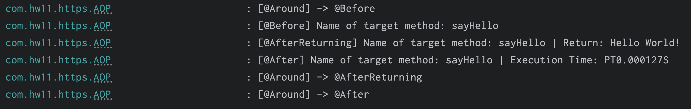

# hw12 Spring AOP

## 3. What is the Aspect Oriented Programming, explain it with detailed use cases?

Aspect-oriented programming (AOP) is a programming technique that supports the separation of cross-cutting concerns (Join Points) in order to increase modularity. AOP is designed based on proxy mode.

AOP is useful when we debug our code, AOP allows us add some test code at specific time during the running of our code, and the test code do not affect the original code.

## 4. What are the advantages and disadvantages of Spring AOP?

### Advantages: 

- It is easy to configure.
- Spring AOP is implemented in pure Java, so separate compilation unit or separate class loader are not required.
- It utilizes Spring's IOC container for dependency injection.
- Can create aspects using @AspectJ annotation based or using XML based.
- It integrates cross-cutting concerns (Join Points) into the classes.

### Disadvantages:

- Debugging the AOP framework-based application code is a little challenge.
- Only methods with a public visibility will be recommended to use AOP join point, not those with a private, protected, or default visibility.
- Aspect cannot be proxied by other aspect. This is because once a class is marked as an aspect (@Aspect), Spring prevents it from being proxied by other class.

## 5. Explain following concept in your own words, you may include codes nippet as part of your answer.

### 1. Aspect

An aspect is a cross-cutting module that combines advice and pointcuts. A standard class tagged with the `@Aspect` annotation can be used to implement an aspect.

### 2. PointCut

A Pointcut is an expression that defines where (i.e., on which methods or join points) the advice should be applied.

### 3. JoinPoint

A Join Point is a point during the execution of a program where the aspect's advice can be applied. In Spring AOP, a join point typically represents a method execution. In other words, it's a specific location in your code where advice can be injected, such as before or after method execution, during exception handling, etc.

### 4. Advice

An Advice is the action taken by an aspect at a particular join point. It defines what needs to be done at a certain join point. In Spring AOP, there are 5 types of advice based on when they are executed relative to the join point (@Before, @AfterReturning, @AfterThrowing, @After, @Around).

Example:
```Java
@Aspect
@Component
public class Aspect {  // The whole class with '@Aspect' is an Aspect
    @Before("execution(* class.path.methodname(..))")  // PointCut
    public void beforeMethod() {  // The method is Advice of the Aspect, and is a Before Advice
        System.out.println("Before");
    }
}
```

## 6. How do we declare a pointcut, can we declare it without annotating an empty method? Name some expressions to do it.

Pointcuts can be declared using expressions, and typically, they are associated with methods annotated with `@Pointcut`. However, it's not mandatory to annotate an empty method; you can also directly declare pointcut expressions within the advice annotations themselves.
```Java
@Pointcut(value = "execution(* class.path.methodname(..))")
public void pointCut() {}
```
When we plan to use this pointcut:
```Java
@After(value = "pointCut()")
```

## 7. Compare different types of advices in Spring AOP.

| Type of device | When it executes |
|----------------|--------------|
|`@Before`|Executes before the target method.|
|`@AfterReturning`|Executes after the method returns successfully.|
|`@AfterThrowing`|Executes if the target method throws an exception.|
|`@After`|Executes after the method has finished executing, whether it finished successfully or threw an exception.|
|`@Around`|Can be executed in everywhere. Before the `@Before`, after the `@After`|

## 8. On top of your Spring application which you did in Assignment#11

In `Coding/hw12/` directory.

Customizing logger:

