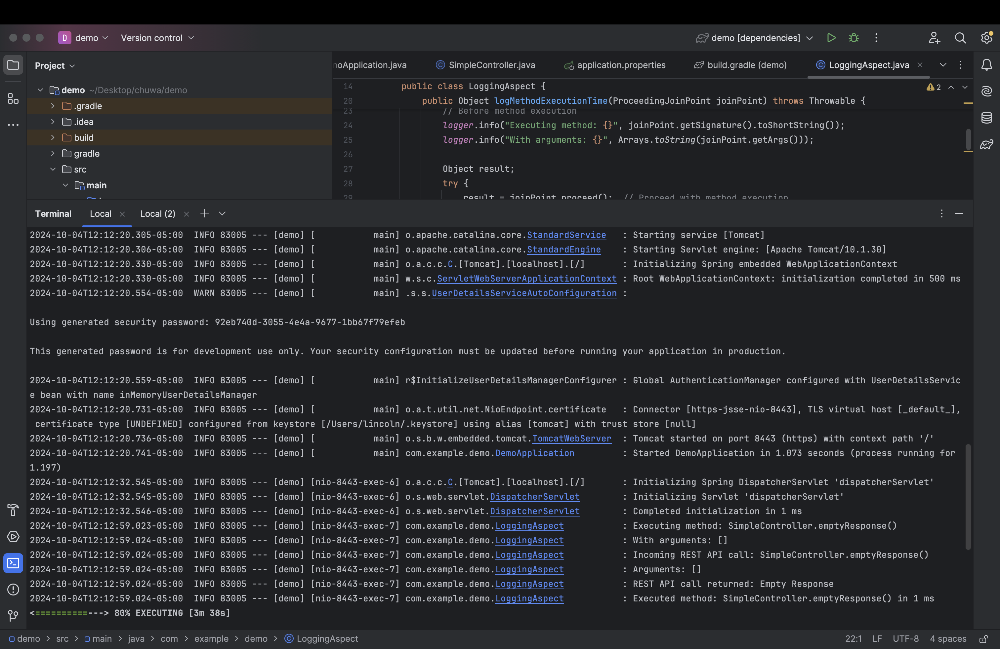

## Homework 12

### 3. What is Aspect-Oriented Programming? Explain it with detailed use cases.
Aspect-Oriented Programming (AOP) is a programming paradigm that aims to increase modularity by allowing the separation of cross-cutting concerns. Cross-cutting concerns are aspects of a program that affect multiple modules but aren't easily decomposed into classes.
Example Use Cases:
 1. Logging: You can have a logging aspect that logs method calls across multiple classes without having to inject logging logic into each class.
 2. Security: You can create a security aspect to enforce security rules across multiple components.
 3. Transaction Management: With AOP, you can manage transactions declaratively in your application by creating an aspect that begins, commits, or rolls back transactions based on business logic.

### 4. What are the advantages and disadvantages of Spring AOP?
Advantages:
- Modularization: Cross-cutting concerns like logging, security, or transaction management are handled in separate aspects, leading to cleaner and more maintainable code.
- Reusability: Common functionalities (e.g., logging) can be reused across different modules without duplicating code.
- Centralized Management: Changes to cross-cutting concerns are centralized in one place, reducing the risk of errors.
- Code Transparency: Developers don't need to include boilerplate code like logging in their business logic.

Disadvantages:
- Complexity: AOP can make debugging and tracing more difficult because some behavior is injected dynamically, and not all logic is explicitly visible in the source code.
- Performance Overhead: AOP adds a slight performance overhead due to the dynamic proxy generation and advice execution.
- Learning Curve: Developers unfamiliar with AOP concepts may find it harder to understand the flow of the program.

### 5. Explain the following concepts in your own words (with code snippets):
Aspect: An aspect is a module that encapsulates a cross-cutting concern. It defines what cross-cutting concern is applied and how it is applied to the target code.
```java
@Aspect
public class LoggingAspect {
    @Before("execution(* com.example.service.*.*(..))")
    public void logBeforeMethod(JoinPoint joinPoint) {
        System.out.println("Method called: " + joinPoint.getSignature());
    }
}
```

PointCut: A PointCut defines the where in your code the cross-cutting concern should be applied.
```java
@Pointcut("execution(* com.example.service.*.*(..))")
public void serviceLayer() {}
```

JoinPoint: A JoinPoint represents a point in the execution of the program, such as the execution of a method, where an aspect can be applied.
```java
@Before("execution(* com.example.service.*.*(..))")
public void logBeforeMethod(JoinPoint joinPoint) {
    System.out.println("Method signature: " + joinPoint.getSignature());
}
```

Advice: Advice defines the what and when of your cross-cutting concern. 
```java
@Before("execution(* com.example.service.*.*(..))")
public void logAdvice() {
    System.out.println("Executing before method");
}
```

### 6. How do we declare a PointCut? Can we declare it without annotating an empty method? Name some expressions to do it.

In Spring AOP, we can declare a PointCut using the @Pointcut annotation. You can declare PointCuts in two ways:
- With an empty method:
 - Define the PointCut in a method that serves only to hold the annotation.

- Directly in Advice annotation:
 - You can directly declare the PointCut expression within the advice annotations, without needing an empty method.

Expressions for PointCuts:

execution(* com.example.service.*.*(..)): Match all methods in classes under com.example.service.
within(com.example.service..*): Match all methods in classes within the com.example.service package and its sub-packages.
this(com.example.MyInterface): Match methods where the bean implements MyInterface.
args(java.lang.String): Match methods that take a String as a parameter.

### 7. Compare different types of advices in Spring AOP.
@Before: Runs before the method execution. It is used for tasks like logging or security checks before a method starts.

@After: Runs after the method execution, regardless of its outcome (whether it returns normally or throws an exception). Useful for cleanup activities.

@AfterReturning: Runs after a method successfully returns (without throwing an exception). Typically used to log the return value or perform some post-processing.

@AfterThrowing: Runs only when the method throws an exception. It can be used to log exceptions or trigger alerts.

@Around: The most powerful type of advice, allowing you to control the method execution completely. It can perform custom logic before and after method execution, and even prevent the method from being called.

### 8. 

