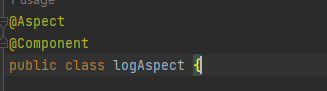

# Spring AOP Homework

## 1. List all of the annotations you learned from class and homework

- `@Aspect`
- `@Pointcut`
- `@Before`
- `@After`
- `@AfterReturning`
- `@AfterThrowing`
- `@Around`
- `@EnableScheduling`
- `@Scheduled`
- `@Component`
- `@Bean`

## 2. Briefly read: [Spring AOP Interview Questions](https://www.techgeeknext.com/spring-boot/spring-aop-interview-questions)

## 3. What is Aspect-Oriented Programming? Explain it with detailed use cases.

Aspect-Oriented Programming (AOP) is a programming paradigm that allows the separation of cross-cutting concerns such as logging, security, and transaction management from the business logic of the application. 

### Use Case: Logging
In a typical application, logging might be required in multiple classes or methods. Instead of writing logging code within each method, we can use AOP to define a logging aspect. The logging logic is applied across the methods at various points of execution (e.g., before, after, or around method execution) without modifying the original business logic.

### Code Example:

## 4. What are the advantages and disadvantages of Spring AOP?

### Advantages:
- **Separation of concerns**: AOP separates cross-cutting concerns like logging and security from business logic.
- **Code reusability**: Common functionality can be reused across multiple modules.
- **Improved maintainability**: Changes to cross-cutting concerns can be made in one place, rather than modifying each affected class.

### Disadvantages:
- **Complex debugging**: The indirection introduced by AOP can make debugging difficult.
- **Performance overhead**: AOP can introduce a slight performance overhead due to proxy creation and method interception.

## 5. Explain the following concepts in your own words, including code snippets.

### Aspect
An aspect is a class that modularizes a concern that cuts across multiple classes. It contains advice and pointcuts.

### PointCut
A pointcut defines at which joinpoints the associated advice should be applied.

### JoinPoint
A joinpoint is a point during the execution of the program, such as method execution or object creation, where AOP logic can be applied.

### Advice
Advice defines what action should be taken at a joinpoint. It can run before, after, or around the method execution.

## 6. How do we declare a pointcut? Can we declare it without annotating an empty method? Name some expressions to do it.

Yes, we can declare a pointcut without annotating an empty method. We can directly use the expression in the advice annotation:

## 7. Compare different types of advices in Spring AOP.

- **Before**: Executes before the target method.

- **After**: Executes after the target method has completed.

- **AfterReturning**: Executes after the method returns a result.

- **AfterThrowing**: Executes if the method throws an exception.

- **Around**: Executes before and after the method, and can control method execution.

## 8. Customized Logger Implementation
