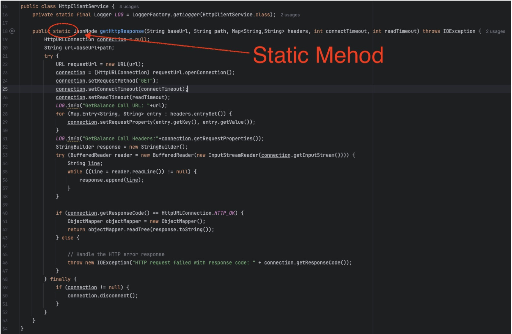

# HW14 --testing2

## Explain and compare following concepts, provide specific examples when doing comparison: 

### Testing related:

#### 1. Unit Testing

- **Definition**: Testing individual components or modules of a software to validate that each part functions correctly in isolation. 
- **Example**: Verifying if a single method in a class returns the expected output.
- **Comparison**: Unit testing is low-level and tests only one function or method at a time, unlike integration or functional testing, which consider multiple components.

#### 2. Functional Testing

- **Definition**: Testing the software against functional requirements to ensure it behaves as expected.
- **Example**: Checking if the login feature works correctly with valid and invalid inputs.
- **Comparison**: Unlike unit testing, functional testing evaluates the overall functionality, often involving multiple units.

#### 3. Integration Testing

- **Definition**: Testing combined modules or components to evaluate their interactions and data flow.
- **Example**: Testing the interaction between the frontend and backend APIs.
- **Comparison**: Integration testing focuses on how modules work together, whereas unit testing focuses on individual components.

#### 4. Regression Testing

- **Definition**: Re-testing the software to ensure that recent code changes haven’t adversely affected existing features.
- **Example**: After adding a new feature, re-running tests for all existing features.
- **Comparison**: While other tests validate new or individual functionalities, regression testing ensures stability after updates.

#### 5. Smoke Testing

- **Definition**: A preliminary test to check if the basic functionalities of the software are working correctly.
- **Example**: Verifying if the application launches successfully and main features are accessible.
- **Comparison**: Smoke testing is a high-level test, unlike unit testing, and is often performed before deeper testing begins.

#### 6. Performance Testing

- **Definitio**n: Testing to evaluate the system’s performance under various conditions, such as load, stress, or scalability.
- **Example**: Measuring response times when 1000 users access the application simultaneously.
- **Comparison**: While functional testing ensures features work correctly, performance testing focuses on speed, stability, and scalability.

#### 7. A/B Testing

- **Definition**: Testing two or more versions of a component to determine which performs better for a specific objective.
- **Example**: Comparing two different layouts of a webpage to see which one results in higher user engagement.
- **Comparison**: A/B testing is more related to UX and optimization, unlike other tests that focus on functionality and performance.

#### 8. User Acceptance Testing

- **Definition**: Testing conducted by end-users to validate the software meets business requirements and is ready for deployment.
- **Example**: Allowing users to test the final product and provide feedback before the official release. 
- **Comparison**: UAT is done from the user's perspective and evaluates business value, unlike unit or integration testing that focuses on technical correctness.

### Environment related:
#### 1. Development

- **Definition**: An environment where developers write, build, and test new code.
- **Characteristics**: Code is frequently updated and may be unstable. This environment is used for implementing new features, debugging, and unit testing.
- **Example**: A developer working on a new feature for a website might use their local development environment to build and test it before pushing changes to a shared repository.

#### 2. QA (Quality Assurance)
- **Definition**: An environment dedicated to testing the software by QA engineers to identify bugs, ensure stability, and verify functionalities.
- **Characteristics**: The environment is stable, reflecting a near-production state. It’s used for integration, functional, and regression testing.
- **Example**: After developers complete a feature, it is deployed to the QA environment where QA engineers perform testing to ensure that it works as expected and does not break any existing functionality.

#### 3. Pre-prod/Staging
- **Definition**: A mirror of the production environment used to test the software under production-like conditions.
- **Characteristics**: It simulates the production environment with real data and configurations, used for final verification and User Acceptance Testing (UAT).
- **Example**: Before launching a new version of a mobile app, it is deployed to the staging environment to perform UAT and ensure it behaves exactly as it would in production. Any remaining issues are addressed here before going live.

#### 4. Production
- **Definition**: The live environment where the software is accessed and used by end-users.
- **Characteristics**: This is the final environment where all features are deployed and accessed by real users. It is highly stable, optimized, and monitored continuously for issues.
- **Example**: A banking application used by customers to check their balances and transfer money is in the production environment. Any issue in this environment could impact real users directly.

## Write unit test using Junit and PowerMock for following code (a static http client method which calls an external public API):

You can call any public API (such as github public api: https://api.github.com/users/{UserId}/repos?page=1)
In your unit test code, make sure you mock and stub everything properly, do NOT make real call to the API!

[hw14code](../Coding/hw14)