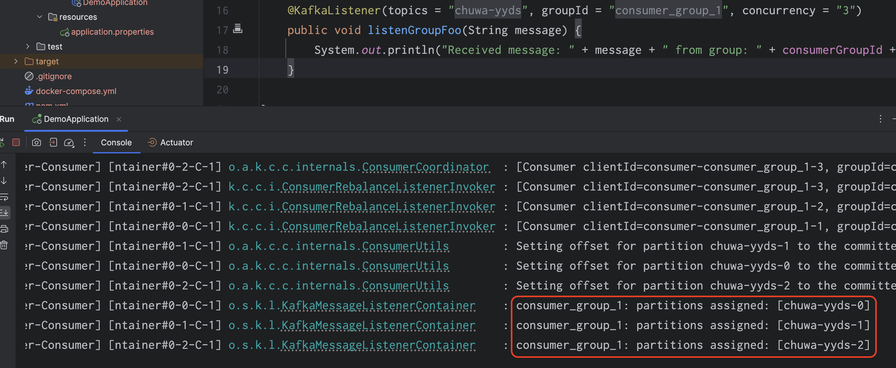
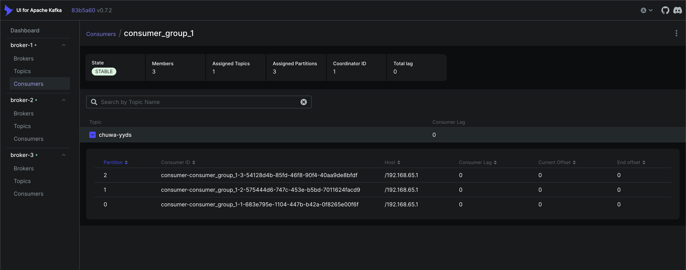
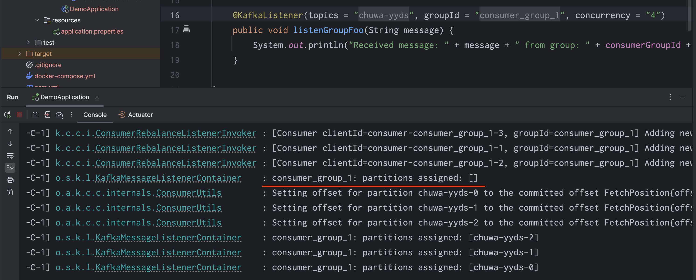
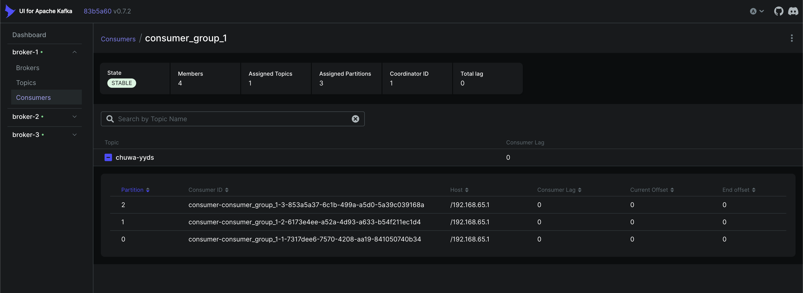
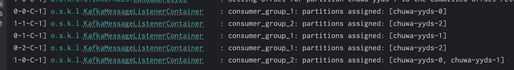
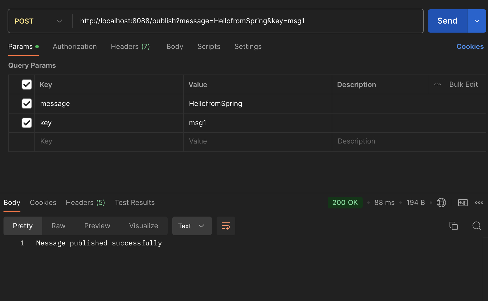
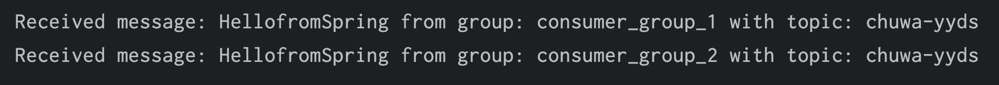
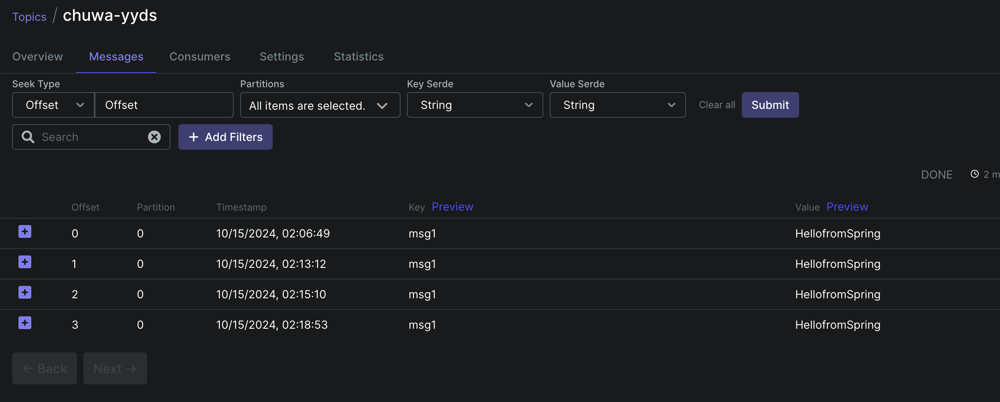
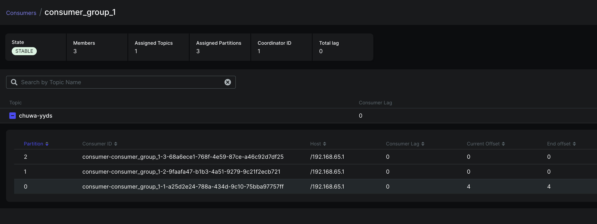
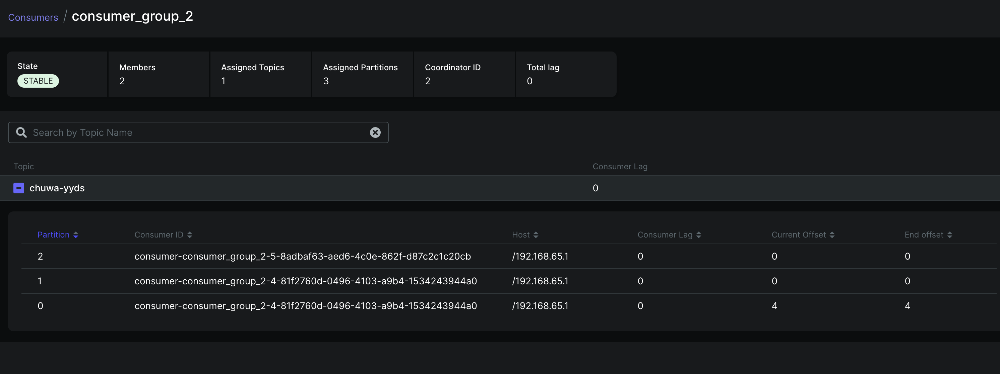

# hw15 

## Explain following concepts, and how they coordinate with each other:

- Topic: A topic is a category or feed name to which records (messages) are published by producers. It's a stream of records, like a queue, where each message belongs to a specific topic.

- Partition: A partition is a further division of a topic. Each topic can be split into multiple partitions, and each partition is an ordered sequence of records.

- Broker: A broker is a server in a Kafka cluster that stores data and serves client requests.

- Producer: A producer is an entity (typically an application) that produces (sends) messages to a Kafka topic.

- Consumer group: A consumer is an entity (usually an application or service) that reads (subscribes to) messages from a Kafka topic. A consumer group is a group of consumers that work together to read from a set of partitions in a topic.

- Offset: An offset is a unique identifier for a record within a partition. It's essentially a sequential ID number given to each record within a partition.

- Zookeeper: Zookeeper is a centralized service for maintaining configuration information, naming, synchronization, and providing group services. Kafka uses Zookeeper to manage and coordinate brokers.

## 1. Given N (number of partitions) and M (number of consumers) what will happen when N >= M and N < M respectively?

When N >= M, each consumer will be assigned one or more partitions.

When N < M, the first N consumers can consume from different partitions, while consumers from N + 1 to M will be idle (unable to consume from any partition).

## 2. Explain how brokers work with topics?

Brokers physically store topic partitions. Brokers manage message writes and reads by acting as leaders for specific partitions. Kafka ensures fault tolerance by replicating partitions across multiple brokers, and leadership of partitions can shift between brokers if needed. Producers and consumers interact with the brokers responsible for their partitions, with brokers balancing load across the Kafka cluster.

## 3. Are messages pushed to consumers or consumers pull messages from topics?

In Kafka, consumers pull messages from topics.

## 4. How to avoid duplicate consumption of messages?

Ensure that your consumer's message processing logic is idempotent, meaning processing the same message multiple times does not have adverse effects. This guarantees that even if a message is consumed more than once, the result will be the same.

## 5. What will happen if some consumers are down in a consumer group? Will data loss occur? Why?

If some consumers are down in a consumer group, Kafka will rebalance the partitions across the remaining consumers. The downed consumers' partitions will be reassigned to the remaining active consumers, ensuring no data loss.

## 6. What will happen if an entire consumer group is down? Will data loss occur? Why?

When an entire consumer group goes down, no data loss occurs, as Kafka retains the messages in the topic partitions until they are consumed or deleted based on the retention policy.

## 7. Explain consumer lag and how to resolve it?

Consumer Lag Occurs when:

- High Message Production Rate: If producers are sending messages faster than the consumers can process them, the consumer will fall behind, causing lag.
- Slow Consumer Processing: If the consumer is slow to process messages (e.g., due to complex business logic or resource limitations), it can't keep up with the incoming messages.
- Rebalancing Events: During consumer group rebalancing (when consumers are added or removed), there can be a temporary delay in processing, leading to lag.

To resolve lag, you can scale the number of consumers, optimize consumer processing, increase resources, and monitor the lag to stay ahead of potential issues.

## 8. Explain how Kafka tracks message delivery?

By tracking offsets and using consumer groups, Kafka ensures that messages are delivered at least once and processed in the correct order without loss, unless there is a configuration or processing issue.

## 9. Compare Kafka vs RabbitMQ, compare messaging frameworks vs MySQL (Why Kafka)?

Kafka vs RabbitMQ:

| **Feature**                | **Kafka**                                    | **RabbitMQ**                                  |
|----------------------------|----------------------------------------------|-----------------------------------------------|
| **Type**                   | Distributed streaming platform               | Message broker (traditional message queue)    |
| **Message Model**           | Publish-subscribe, logs with partitions      | Queue-based (push-pull) message broker        |
| **Message Retention**       | Messages are retained until deleted by policy (time/size-based) | Messages are deleted once consumed (unless acknowledged manually) |
| **Use Case**               | High-throughput, real-time data streaming, event sourcing | Task queuing, job processing, lower-latency message delivery |
| **Message Ordering**       | Guarantees ordering within partitions         | FIFO per queue but not across multiple queues |
| **Throughput**             | Extremely high throughput due to log-based design | Lower throughput compared to Kafka            |
| **Durability**             | Messages are persisted by default and replicated | Can persist messages but not replicated by default |
| **Scalability**            | Horizontal scalability by adding brokers and partitions | Scalable but less so than Kafka, more complex for large scale |

Kafka vs MySQL:

| **Feature**                | **Kafka**                                    | **MySQL**                                      |
|----------------------------|----------------------------------------------|------------------------------------------------|
| **Type**                   | Distributed streaming platform               | Relational Database Management System (RDBMS)  |
| **Use Case**               | Real-time data processing, event sourcing    | Transactional applications, data storage and retrieval |
| **Data Consistency**       | Eventual consistency; focuses on throughput   | Strong consistency with ACID transactions       |
| **Schema**                 | Schema can evolve (schema registry available) | Fixed schema; schema changes require migrations  |
| **Storage**                | Logs messages to disk; retention policies (time/size) | Data stored in tables with rows and columns    |
| **Performance**            | Optimized for high-throughput and low-latency message delivery | Optimized for complex queries and transactions    |

- **Kafka** is designed for real-time data streaming and processing, handling large volumes of events with high throughput.
- **MySQL** is suited for structured data storage and complex transactions, focusing on data integrity and relationships.

## 10. Spring-Producer-Consumer

### Write your consumer application with Spring Kafka dependency, set up 3 consumers in a single consumer group.

### Increase number of consumers in a single consumer group, observe what happens, explain your observation.

As we can see, one consumer is idle, because the number of consumer is more than the number of partition.

### Create multiple consumer groups using Spring Kafka, set up different numbers of consumers within each group, observe consumer offset.

consumer_group_1: 3 consumers

consumer_group_2: 2 consumers

### Prove that each consumer group is consuming messages on topics as expected, take screenshots of offset records

After sending message 4 times.

Since message stream is not too busy, the message always be consumed by the first consumer (in Partition 0). And the offset of consumer will be updated when consumer consume a message.

