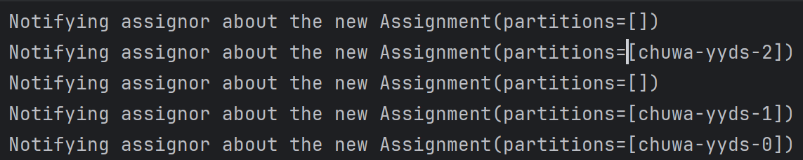

## HW 15
1. Topic: It is a category or feed name to which records are sent by producers. It is similar to a table in a database but only for streaming data.
2. Partition: It is a division of a Kafka topic, allowing data within a topic to be split and distributed across multiple brokers.
3. Broker: It is a Kafka server that hosts topic partitions and handles incoming data, storage, and data retrieval for consumers.
4. Consumer Group: It is a group of consumers that work together to consume data from a Kafka topic.
5. Producer: It is a client that publishes messages to Kafka topics.
6. Offset: It is a unique identifier assigned to each message in a partition. It denotes the position of a message within that partition.
7. Zookeeper: It is used by Kafka for managing metadata about brokers, partitions, and consumers.

### Question 1
* When N (partitions) ≥ M (consumers), Each consumer in the consumer group will be assigned at least one partition. Some consumers may be assigned more than one partition if the number of partitions exceeds the number of consumers.
* When N (partitions) < M (consumers),some consumers will not receive any partitions and remain idle. Because Kafka ensures that each partition is consumed by only one consumer, so consumers will only be assigned if there are partitions to consume.

### Question 2
* Brokers store partitions of topics, and each partition has a leader on one broker and followers on others for replication.
* The leader broker handles all write requests from producers and serves reads to consumers.
* Follower brokers replicate the leader’s data to ensure fault tolerance.
*  Zookeeper coordinates broker assignments for partitions and handles leader election in case of failures.
  
### Question 3
In Kafka, consumers pull messages from topics. Consumers in Kafka actively **poll** the brokers to retrieve messages from the partitions of the topics they are subscribed to. The consumer requests data at a frequency it decides, asking for a batch of messages, which gives consumers control over the rate at which they consume data.


### Question 4
1. **Offset Management**: Kafka consumers use offsets to track which messages have been processed. By correctly managing offsets, like setting the configuration `enable.auto.commit = true`, we can avoid reprocessing the same message multiple times.
2. **Idempotent Processing**: It means applying the same operation multiple times should result in the same outcome.
In Kafka, Producers can use the `enable.idempotence=true` setting, which ensures that even if a producer sends the same message multiple times (due to retries, network issues, etc.), Kafka will guarantee that only one instance of the message is written to the partition.

### Question 5
Kafka is designed to ensure fault tolerance and resilience, so when consumers fail, the system handles their absence through a process called **rebalance**. 
* **Rebalancing of Partitions**: When one or more consumers in the group go down, Kafka triggers a rebalance:
  * The partitions that were assigned to the downed consumers are redistributed among the remaining active consumers.

* Data is not lost because Kafka stores messages in partitions on the broker, independent of consumers. Even if a consumer is down, messages remain in the topic partition on the broker until they are consumed.

### Question 6
Kafka stores messages in partitions on the broker, independent of consumers.  These messages are written to disk and retained for a configurable period, regardless of whether they have been consumed. 
As long as messages are within the retention period, they remain available for consumption when the consumer group resumes operation. If the consumer group remains down beyond the retention period, data loss can occur.

### Question 7
Consumer lag in Kafka refers to the difference between the latest offset of a partitionand the offset of the last message that a consumer group has processed.
High consumer lag indicates that consumers are not keeping up with the data being produced, leading to delays in data processing.
* **Resolving Consumer Lag**:
  * Code Profiling: Use profilers to identify slow methods or bottlenecks, and optimize inefficient code segments.
  * Efficient Serialization: Use faster data formats and avoid unnecessary conversions.

### Question 8
* **Commit Process**: Consumers commit offsets after successfully processing messages. Kafka considers the message "delivered" when the offset is committed. Kafka use it to track message delivery.
* **Consumer Groups**: Kafka tracks offsets for each consumer group, ensuring that consumers know where to resume reading after a restart or rebalance.

### Question 9
#### Kafka vs RabbitMQ
* Type:
  * **Kafka**: Distributed event streaming platform. Mainly used for high-throughput, real-time data pipelines and streaming applications.
  * **RabbitMQ**: Message broker. Focuses on message queuing and guaranteeing delivery between producers and consumers.
* Message Model: 
  * **Kafka**: **Log-based**: Messages are appended to partitions and retained for a configurable time, allowing consumers to replay them from any point.
  * **RabbitMQ**: **Queue-based**: Messages are delivered to queues and consumed. Once consumed, they are no longer available unless they are explicitly requeued.
* Message Retention
  * **Kafka**: Stores messages for a configurable retention period. Consumers can rewind and replay messages.
  * **RabbitMQ**: Deletes messages once they are acknowledged by consumers unless explicitly configured to store them.
* Delivery Guarantees:
  * **Kafka**: Supports at-least-once, at-most-once, and exactly-once delivery semantics depending on configuration.
  * **RabbitMQ**: Supports at-most-once and at-least-once delivery. Exactly-once delivery can be more complex to achieve.
* Consumer Model:
  * **Kafka**: Consumers poll Kafka for messages.
  * **RabbitMQ** pushes messages to consumers.
* Partitioning:
  * **Kafka** partitions topics, enabling parallelism and scalability. Each partition can be consumed by a single consumer within a consumer group.
  * **RabbitMQ** uses queues, which are FIFO message buffers. It has no native partitioning mechanism, so parallelism and scalability are handled through multiple queues and exchanges.

### Question 10
```
    factory.setConcurrency(3);
    factory.getContainerProperties().setPollTimeout(3000);
```

set: factory.setConcurrency(5);

Two consumers become idle
