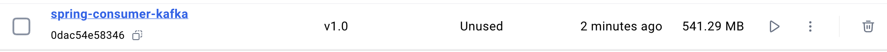
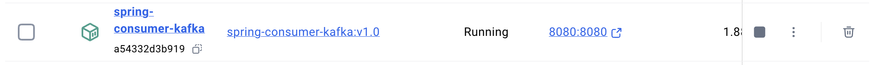
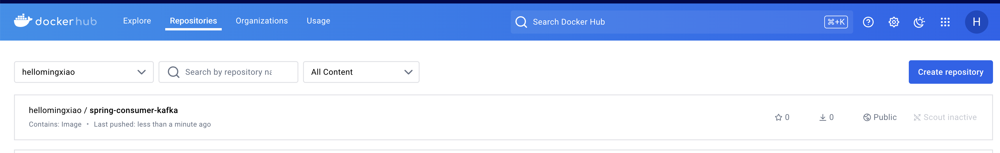
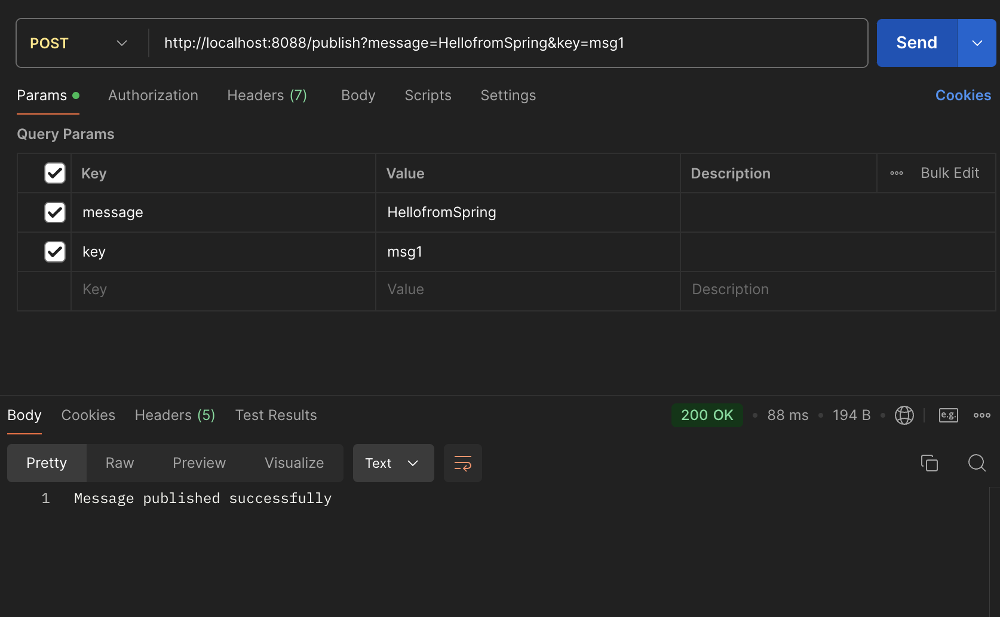

# hw16 Docker & K8S

## 1. Build your Spring-Producer-Consumer application as a Docker image.

```
vim Dockerfile
```
```
FROM openjdk:17

LABEL author=mingxiao

COPY demo-0.0.1-SNAPSHOT.jar /demo-0.0.1-SNAPSHOT.jar

EXPOSE 8080

ENTRYPOINT ["java", "-jar", "/demo-0.0.1-SNAPSHOT.jar"]
```
```
docker build -f Dockerfile -t spring-consumer-kafka:v1.0 .
```



## 2. Save and load above image on local.



## 3. Push your image to your repository under Docker hub registry.

```
docker push hellomingxiao/spring-consumer-kafka:v1.0
```



## 4. Add this image to the existing docker-compose.yml, together with other services.

### 1. Test if your container works as expected, test controllers via Postman.




## Docker daemon

The Docker daemon is the **background service** running on a Docker host that **manages Docker objects** (like images, containers, networks, and volumes). It's responsible for building, running, and managing Docker containers. It is also responsible for managing images, containers, networks, and volumes on the host. Talking to the Docker Registry to pull or push images.

## Docker host

The Docker host is the machine where the Docker daemon runs. The host is responsible for running the Docker daemon and hosting the containers and managing them using the Docker engine.

## Docker registry

The Docker Registry is a storage and distribution system for Docker images. It allows you to store and retrieve Docker images. There are two main types of registries:

- Docker Hub: The default public Docker registry, where you can upload and download images. It is the largest container registry.
- Private Registry: You can set up a private Docker registry within your organization to store and share custom Docker images.

## Docker Image / Image tag

A Docker image is a lightweight, standalone package that contains everything needed to run a piece of software, including the code, runtime, libraries, and dependencies. It's like a snapshot of a container.

An image tag is a label (e.g., nginx:latest) used to identify a specific version of a Docker image. Tags allow you to differentiate between different builds or versions of the same image.

## Docker Container

A container is a lightweight, isolated environment that runs applications using a Docker image. It shares the host system's OS kernel but keeps the app and its dependencies separate from other containers.

## Docker Volume

A Docker volume is a storage mechanism that allows containers to persist data outside of the container's lifecycle. It stores data on the host system and lets containers share or retain data even after they are stopped or removed.

## Docker Namespace vs Kubernetes Namespace

Docker Namespace is focused on OS-level resource isolation for containers.

Kubernetes Namespace is used for logical grouping and management of resources within a Kubernetes cluster.

## Kubernetes Node

A machine (physical or virtual) in the Kubernetes cluster that runs applications. It hosts Pods and is managed by the control plane.

## Kubernetes Pod

The smallest deployable unit in Kubernetes, which can contain one or more containers that share the same network and storage.

## Kubernetes Service

An abstraction that defines a way to expose a set of Pods as a network service, enabling communication between different components in the cluster.

## Kubernetes ReplicaSet

Ensures that a specified number of identical Pods are running at any given time, providing high availability.

## Kubernetes Deployment

A higher-level abstraction that manages ReplicaSets and allows you to define updates to your application (rolling updates, rollbacks) in a controlled way.

