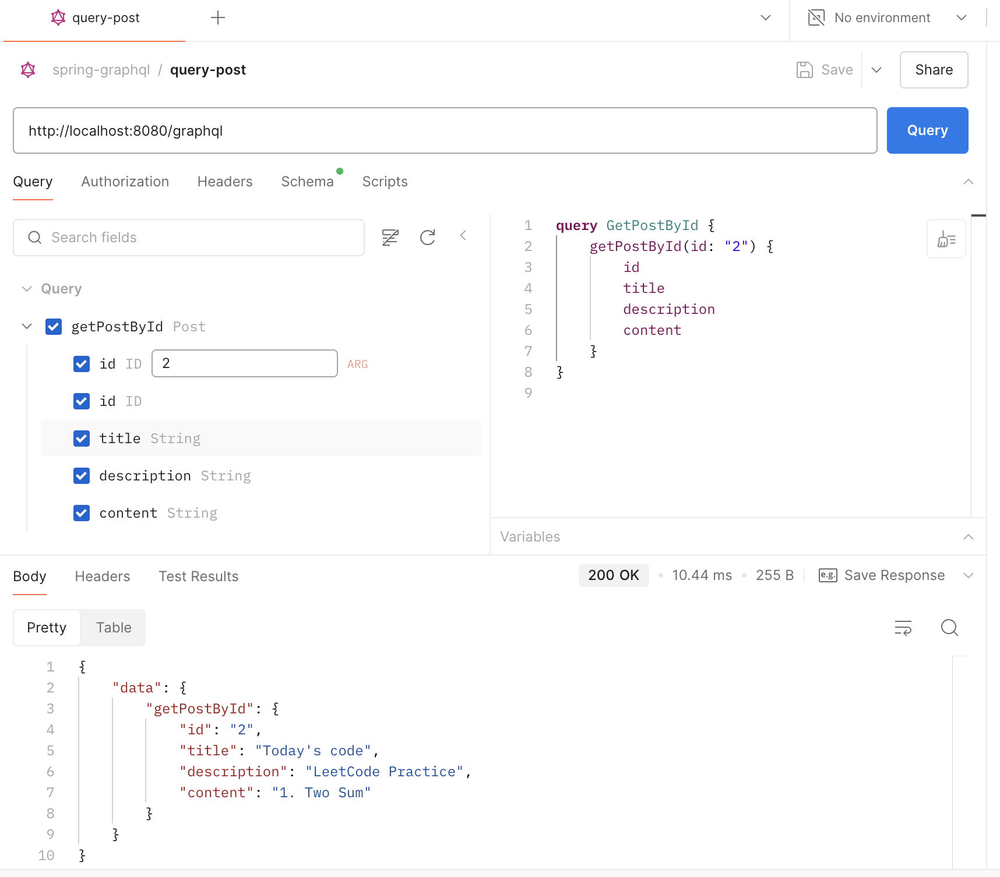

# hw17

## Adding graphql support to redbook application

Code is in `/Coding/hw17/springboot-redbook-04_comment` directory

Get Post By id:

Create Post:

Get Comment By postId:

Create Comment By postId:

After some Create and Read operations, the result of Post table and Comment table:

Post table:

Comment table:

