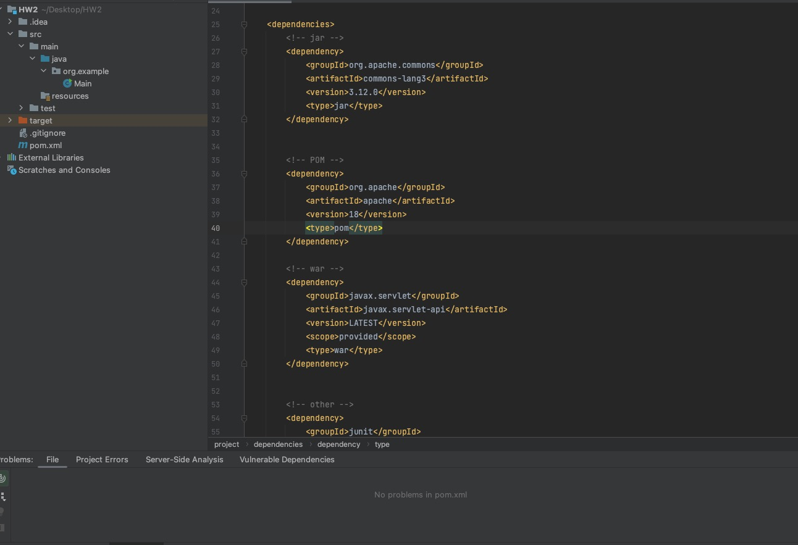
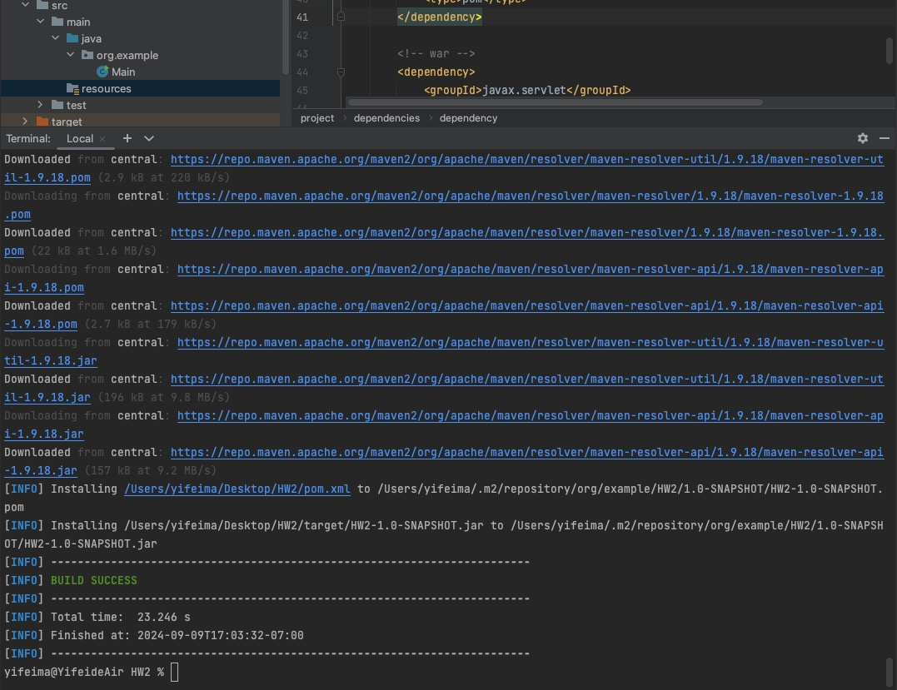
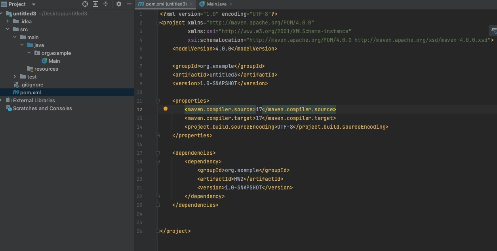

# HW2 -- part2

## 1. Find at least ONE dependency for each packaging type on https://mvnrepository.com/repos/central

### 1.1  Packaging type is `war`

```text
<dependency>
    <groupId>javax.servlet</groupId>
    <artifactId>javax.servlet-api</artifactId>
    <version>LATEST</version>
    <scope>provided</scope>
    <type>war</type>
</dependency>
```

### 1.2  Packaging type is `jar`

```text
<dependency>
    <groupId>org.apache.commons</groupId>
    <artifactId>commons-lang3</artifactId>
    <version>3.12.0</version>
    <type>jar</type>
</dependency>
```

### 1.3  Packaging type is `pom`

```text
<dependency>
    <groupId>org.apache</groupId>
    <artifactId>apache</artifactId>
    <version>18</version>
    <type>pom</type>
</dependency>
```

### 1.3  Packaging type is other than all above

```text
test-jar:

<dependency>
    <groupId>junit</groupId>
    <artifactId>junit</artifactId>
    <version>LATEST</version>
    <scope>test</scope>
</dependency>
```

## 2. Explain the difference between `war` , `jar` , and `POM`

- **war**: For web applications.
- **jar**: For Java libraries or standalone apps.
- **POM**: For Maven project configuration and dependency management.

##  3. Create a maven managed project in IntelliJ Idea, add above dependencies to your project

]

##  4. Build your project

]

## 5. Create a new module in your maven project, make 4.2) as a dependency of this module

]

## 6. List Maven life cycles in order, compare them.

- **validate**: Validate the project is correct and all necessary information is available.
- **compile**: Compile the source code of the project.
- **test**: Test the compiled source code using unit tests.
- **package**: Package the compiled code into a distributable format, such as a JAR or WAR.
- **verify**: Run any checks to verify the package is valid and meets quality criteria.
- **install**: Install the package into the local repository for use as a dependency in other projects.
- **deploy**: Deploy the final package to a remote repository for sharing with other developers or projects.

## 7. Explain `git merge` vs `git rebase`

- `git merge`: Integrates changes from one branch into another with a merge commit, preserving the history of both branches.
- `git rebase`: Re-applies commits from one branch onto another to create a linear history, making it easier to understand but rewriting commit history.

## 8. Explain `Trunk-based developement` git branching strategy.

**Trunk-based development** is a version control management practice where developers merge small, frequent updates to a core “trunk” or main branch.

## 9. Explain `git reset` options.

`Git reset` is a powerful command that is used to undo local changes to the state of a Git repo. Git reset operates on "The Three Trees of Git".

1. **`--soft<commit>`**: 

- Moves `HEAD` to the specified commit.
- Keeps all changes in the staging area.
- Does not modify the working directory.
- Use when you want to undo commits but keep changes staged.

2. **`--mixed<commit>`**:

- Moves `HEAD` to the specified commit.
- Unstages all changes (removes them from the staging area).
- Does not modify the working directory.
- Use when you want to undo commits and unstage changes but keep them in your working directory.

3. **`--hard<commit>`**:

- Moves `HEAD` to the specified commit.
- Clears the staging area.
- Discards all changes in the working directory.
- Use when you want to completely undo commits, unstage, and discard all changes.
