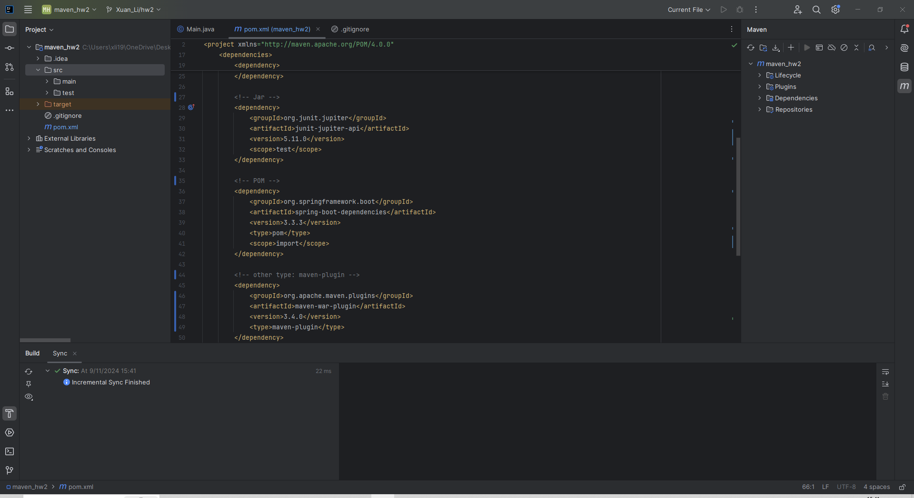
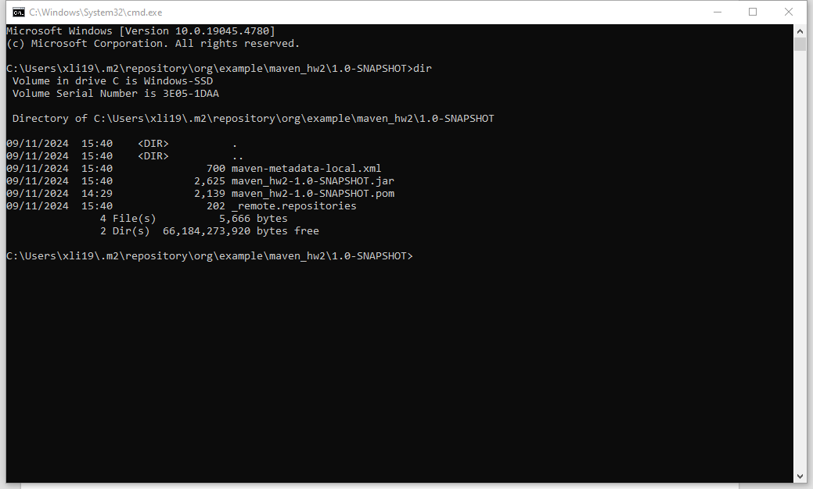
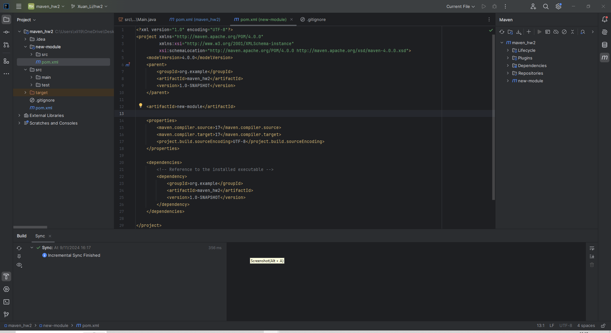

## 1. Find dependency for each packaging type:

- **war**:
  ```
  <dependency>
      <groupId>org.jvnet.hudson.main</groupId>
      <artifactId>hudson-war</artifactId>
      <version>1.395</version>
      <scope>test</scope>
      <type>war</type>
  </dependency>
  ```
- **jar**:
  ```
  <dependency>
      <groupId>org.junit.jupiter</groupId>
      <artifactId>junit-jupiter-api</artifactId>
      <version>5.11.0</version>
      <scope>test</scope>
  </dependency>
  ```
- **POM**:
  ```
  <dependency>
      <groupId>org.springframework.boot</groupId>
      <artifactId>spring-boot-dependencies</artifactId>
      <version>3.3.3</version>
      <type>pom</type>
      <scope>import</scope>
  </dependency>
  ```
- **maven-plugin**:
  ```
  <dependency>
      <groupId>org.apache.maven.plugins</groupId>
      <artifactId>maven-war-plugin</artifactId>
      <version>3.4.0</version>
      <type>maven-plugin</type>
  </dependency>
  ```

## 2. Explain the difference between war, jar, and POM

- **POM**: Describes the project structure, and its `<packaging></packaging>` will define it to build JAR or WAR files.

- **JAR** and **WAR** are both packaging formats. **JAR** is for general Java packaging, but **WAR** is specifically for web applications.

- **JAR** can be executed directly if they have a main class, **WAR** needs to be deployed to a server, and **POM** is not executable

## 3. Create a maven managed project in IntelliJ Idea, add above dependencies to your project

1. Resolve all dependency-related errors

   Project is attached in `Coding/maven_hw2`

   Screenshot:
   

2. Explain how you resolve them

   I resolved dependency issues by clicking on `reload maven dependencies` button

## 4. Build your project, even if it's empty

1. Resolve all build-related issues

   Screenshot:
   

2. Install your executable to local maven repository

   Screenshot:
   

## 5. Create a new module in your maven project, make 4.2 as a dependency of this module

New module is attached in `Coding/maven_hw2/new-module`

Screenshot:  
 

## 6. List Maven life cycles in order, compare them.

- **validate:** validate the project is correct and all necessary information is available
- **compile:** compile the source code of the project
- **test:** test the compiled source code using a suitable unit testing framework. These tests should NOT require the code be packaged or deployed
- **package:** take the compiled code and package it in its distributable format, such as a JAR.
- **verify:** run any checks on results of integration tests to ensure quality criteria are met
- **install:** install the package into the local repository, for use as a dependency in other projects locally
- **deploy:** done in the build environment, copies the final package to the remote repository for sharing with other developers and projects

## 7. Explain git merge vs git rebase

`git merge`and `git rebase` are both methods for integrating changes from one branch into another, but they have differences:

- `git merge` preserves history exactly as it happened.
  `git rebase` rewrites history, making commit history leaner so that work is always based on the latest version, making it easier to revert to previous version.

- `git merge` creates a new merge commit.
  `git rebase` creates new commits for each commit in the original branch.

## 8. Explain Trunk-based developement git branching strategy.

1. **Single Main Branch (Trunk)** contains the latest stable code that is production-ready.
2. **short-lived feature branches** for new features or bug fixes
3. **Continuous Integration (CI)** will enable the changes to be integrated and tested immediately
4. **discourages long-lived branches** like **develop**, **release**, or long-running feature branches.
5. **feature flags (or toggles)** are commonly used to hide unfinished features from production environments

## 9. Explain git reset options.

`git reset` is used to undo changes.
1. `--soft`: does not modify the staging area or working directory
2. `--hard`: clears the staging area, and modifies the working directory
1. `--mixed`: unstages the changes in the staging area (index), but it does not touch the working directory