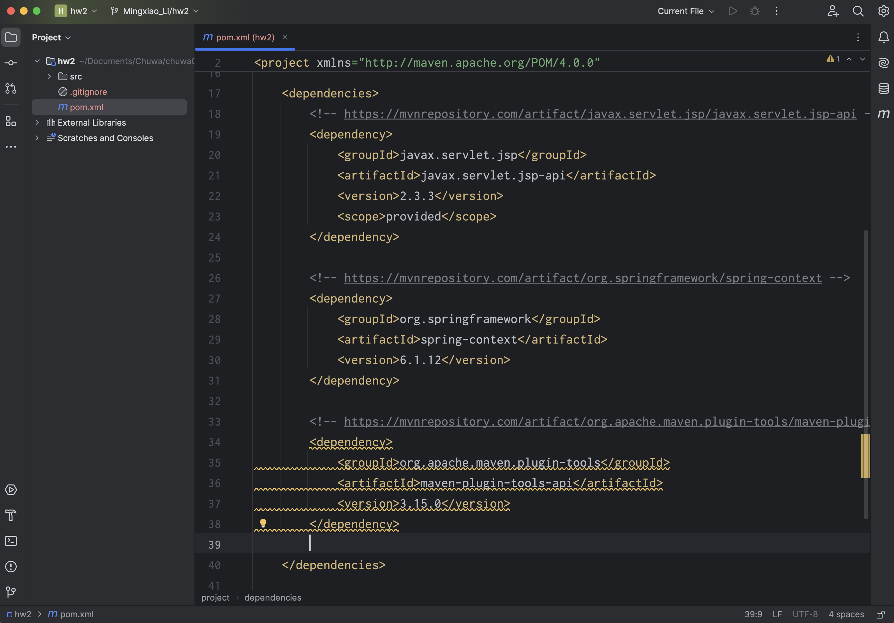
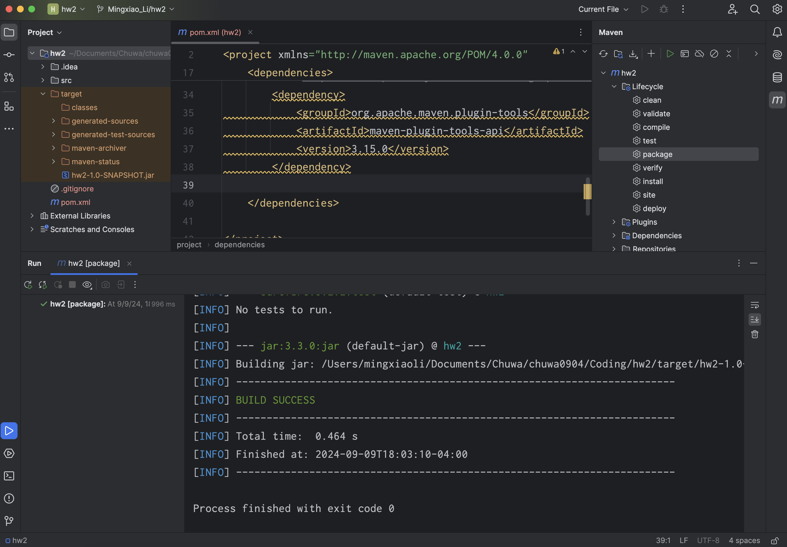
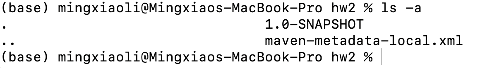
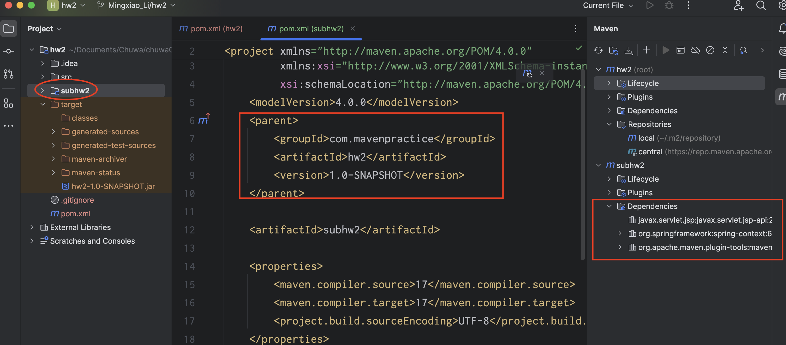
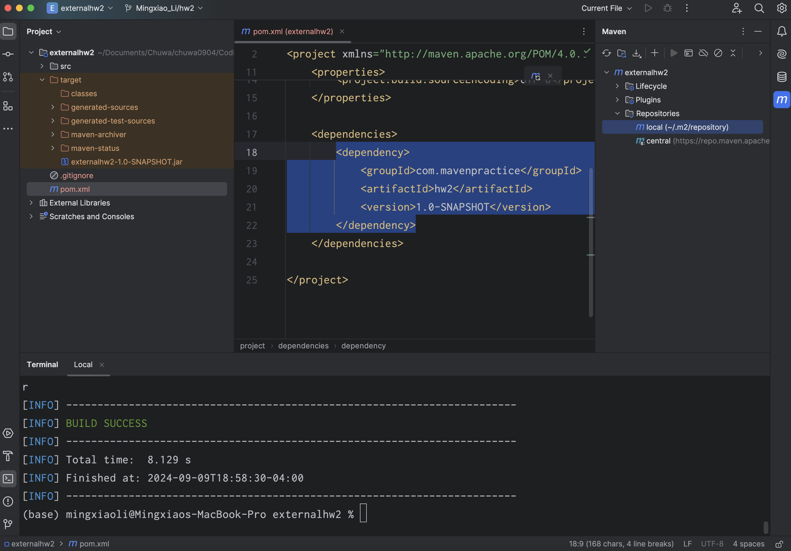

# Maven & Git Homework

## 1. Find at least ONE dependency for each packaging type on https://mvnrepository.com/repos/central 

### 1.1 Packaging type is war

```
<!-- https://mvnrepository.com/artifact/javax.servlet.jsp/javax.servlet.jsp-api -->
<dependency>
    <groupId>javax.servlet.jsp</groupId>
    <artifactId>javax.servlet.jsp-api</artifactId>
    <version>2.3.3</version>
    <scope>provided</scope>
</dependency>

```

### 1.2 Packaging type is jar 

.jar is Default

```
<!-- https://mvnrepository.com/artifact/org.springframework/spring-context -->
<dependency>
    <groupId>org.springframework</groupId>
    <artifactId>spring-context</artifactId>
    <version>6.1.12</version>
</dependency>
```

### 1.3 Packaging type is POM

```
<!-- https://mvnrepository.com/artifact/org.apache.maven.plugin-tools/maven-plugin-tools-api -->
<dependency>
    <groupId>org.apache.maven.plugin-tools</groupId>
    <artifactId>maven-plugin-tools-api</artifactId>
    <version>3.15.0</version>
</dependency>
```

### 1.4 Packaging type is other than all above, ejb

```
<!-- https://mvnrepository.com/artifact/javax.ejb/ejb-api -->
<dependency>
    <groupId>javax.ejb</groupId>
    <artifactId>ejb-api</artifactId>
    <version>3.0</version>
    <scope>provided</scope>
</dependency>
```

Ref: https://www.baeldung.com/maven-packaging-types

## 2. Explain the difference between war, jar, and POM

- war: war file is used to packages a web application servlets, JSPs, HTML. Configuration files, classes, and libraries needed to deploy the application to a web server.


- jar: jar file is one of the most popular packaging types. Projects with this packaging type produce a compressed zip file with the .jar extension.

- pom: pom packaging is used when a project does not generate any final artifact but is intended to act as a parent project or aggregator for submodules.

## 3. Create a maven managed project in IntelliJ Idea, add above dependencies to your project.



When adding those dependencies to `pom.xml` at the first time, it will report some error, and then clicking the reload maven project button to solve the problem.

## 4. Build your project

### 4.1 Maven package command
```
mvn package
```

mvn package command will **Compiling the Code** (Maven will compile the source code of your project, including any dependent libraries defined in the pom.xml), **Testing the Code** (If there are unit tests (under src/test/java), Maven will run them), **Packaging the Artifact** (Create jar/war file)



**mvn package command will not install jar file to user's local repository.**

### 4.2 Maven install command

```
mvn install
```

mvn install command will install the jar file to user's local repository.



## 5. Create a new module in your maven project, make 4.2 as a dependency of this module

In hw2 maven project, creating a child module sub_hw2 behind hw2 module, sub_hw2 will automatically have all dependencies in hw2.



If creating an external project:

Add dependency from local repository:

```
<dependency>
    <groupId>com.mavenpractice</groupId>
    <artifactId>hw2</artifactId>
    <version>1.0-SNAPSHOT</version>
</dependency>
```

Then,

```
mvn package
```



## 6. List Maven lifecycles in order, compare them.

**Validate -> Compile -> Test -> Package -> Verify -> Install -> Deploy**

validate - validate the project is correct and all necessary information is available

compile - compile the source code of the project

test - test the compiled source code using a suitable unit testing framework. These tests should NOT require the code be packaged or deployed

package - take the compiled code and package it in its distributable format, such as a JAR

verify - run any checks on results of integration tests to ensure quality criteria are met

install - install the package into the local repository, for use as a dependency in other projects locally

deploy - done in the build environment, copies the final package to the remote repository for sharing with other developers and projects

## 7. Explain git merge vs git rebase

- git merge: git merge will store changes from one branch and merges them into another branch
- git rebase: Instead of merging the branches together, git rebase will rewrite the commit history to create a "linear" history.

## 8. Explain Trunk-based developement git branching strategy.

Trunk-Based Development is a branching strategy where all developers commit to a single branch, typically the main (or trunk) branch. It emphasizes short-lived feature branches (if used at all) and encourages frequent integration into the main branch, ensuring that the project remains up to date and conflicts are resolved early and often.

## 9. Explain git reset options.

git reset is used to undo changes in your working directory and commit history.


