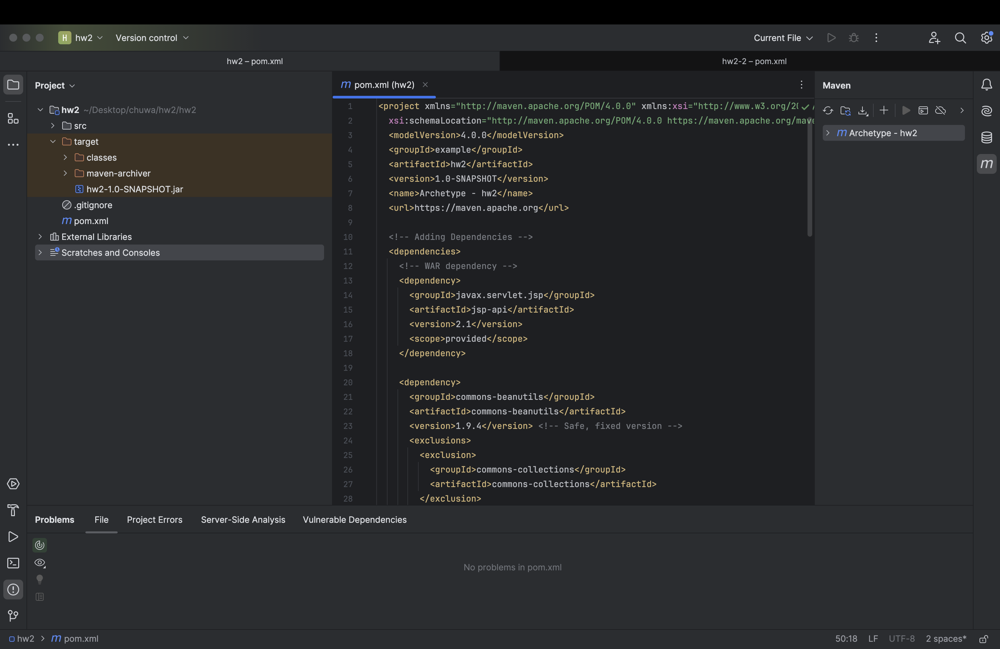
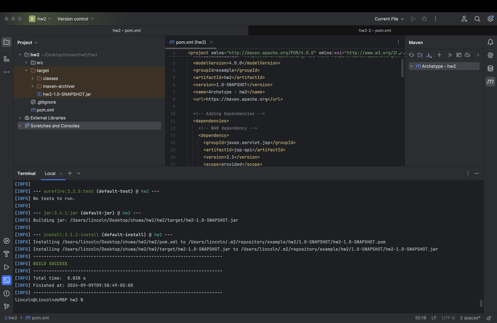
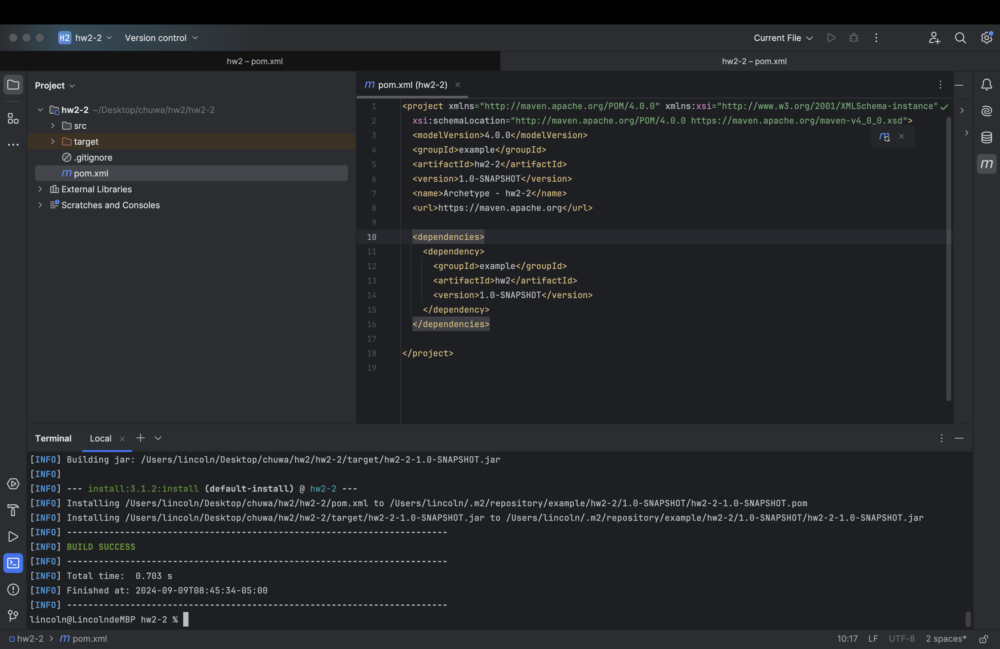

# Maven & Git Homework - Answer Sheet

## 1. Find at least ONE dependency for each packaging type

### 1.1 Packaging type: WAR
```xml
<dependency>
    <groupId>javax.servlet.jsp</groupId>
    <artifactId>jsp-api</artifactId>
    <version>2.1</version>
    <scope>provided</scope>
</dependency>
```

### 1.2 Packaging type: JAR
```xml
<dependency>
    <groupId>com.google.guava</groupId>
    <artifactId>guava</artifactId>
    <version>32.1.2-jre</version>
</dependency>
```

### 1.3 Packaging type: POM
```xml
<dependency>
    <groupId>org.apache.maven.plugins</groupId>
    <artifactId>maven-dependency-plugin</artifactId>
    <version>3.1.1</version>
    <scope>provided</scope>
</dependency>
```

### 1.4 Packaging type: Other
```xml
<dependency>
    <groupId>javax.ejb</groupId>
    <artifactId>ejb-api</artifactId>
    <version>3.0</version>
</dependency>
```

## 2. Explain the difference between WAR, JAR, and POM

- WAR: A package used to distribute a collection of web components for Java web applications.

- JAR: A package used for distributing compiled Java classes and resources. JAR files are used for both libraries and standalone Java applications.

- POM: A special type of package in Maven, primarily used for project configuration. It helps manage project dependencies and plugins.

## 3. Create a Maven-managed project in IntelliJ IDEA
    
### 3.1 Dependency-related issues and resolution
    
To resolve dependency-related errors, I will do:

1. Checked the mvn dependency:tree to identify conflicting or outdated dependencies.
2. Used <exclusions> to remove vulnerable transitive dependencies
```xml
<dependency>
      <groupId>com.google.guava</groupId>
      <artifactId>guava</artifactId>
      <version>32.1.2-jre</version> <!-- Use the latest version available -->
      <exclusions>
        <exclusion>
          <groupId>commons-beanutils</groupId>
          <artifactId>commons-beanutils</artifactId>
        </exclusion>
      </exclusions>
    </dependency>
```

## 4. Build the project

### 4.1 Resolving build-related issues

Ensured that there is no error.
Used mvn clean install to ensure a successful build.



### 4.2 Installing executable to local Maven repository
    
After running mvn clean install, the executable (JAR file) was installed to the local Maven repository at:
~/.m2/repository/example/hw2/1.0-SNAPSHOT/hw2-1.0-SNAPSHOT.jar



## 5. Create a new module and add 4.2) as a dependency

To create a new module in the project:

1. Added the dependency for hw2-1.0-SNAPSHOT in the new module's pom.xml:
```xml
<dependency>
    <groupId>example</groupId>
    <artifactId>hw2</artifactId>
    <version>1.0-SNAPSHOT</version>
</dependency>
```



## 6. List Maven life cycles in order and compare them
Maven life cycles in order:

1. Validate: Checks if the project is correct and all information is available.

2. Compile: Compiles the source code of the project.

3. Test: Runs unit tests using a testing framework.

4. Package: Packages the compiled code into a distributable format.

5. Integration Test: Deploys the package to a testing environment.

6. Verify: Runs checks to ensure the package is valid and meets quality standards before deployment.

7. Install: Installs the package into the local Maven repository.

8. Deploy: Copies the final package to a remote repository, where other developers and projects can use it.
    
Comparison:

- Validate, Compile, Test are the early phases. They ensure that the code builds successfully and that all basic functionality passes the unit tests.
- Package, Integration Test are the middle phases.  They forcus on creating a final package and verifying its functionality in an environment.
- Verify, Install, Deploy are the late phases. Ensure the package work as expected and Maven installs and deployes it to the local repository.

## 7. Explain git merge vs git rebase

- git merge: Combines two branches, keeping both histories intact. It creates a merge commit when integrating changes from one branch into another.

- git rebase: Re-applies changes from one branch onto another branch’s history. It avoids creating a merge commit and results in a linear project history.

## 8. Explain Trunk-based development git branching strategy

Trunk-based development is a where all developers work on a single branch. Developers integrate small changes, reducing the need for long-lived feature branches, and encouraging rapid integration and deployment.

## 9. Explain git reset options

- git reset --soft: Moves the HEAD pointer to a previous commit but keeps changes staged for commit.

- git reset --mixed: Moves the HEAD pointer to a previous commit and unstages changes, but keeps them in the working directory.

- git reset --hard: Moves the HEAD pointer to a previous commit and discards all changes in the working directory and the index.