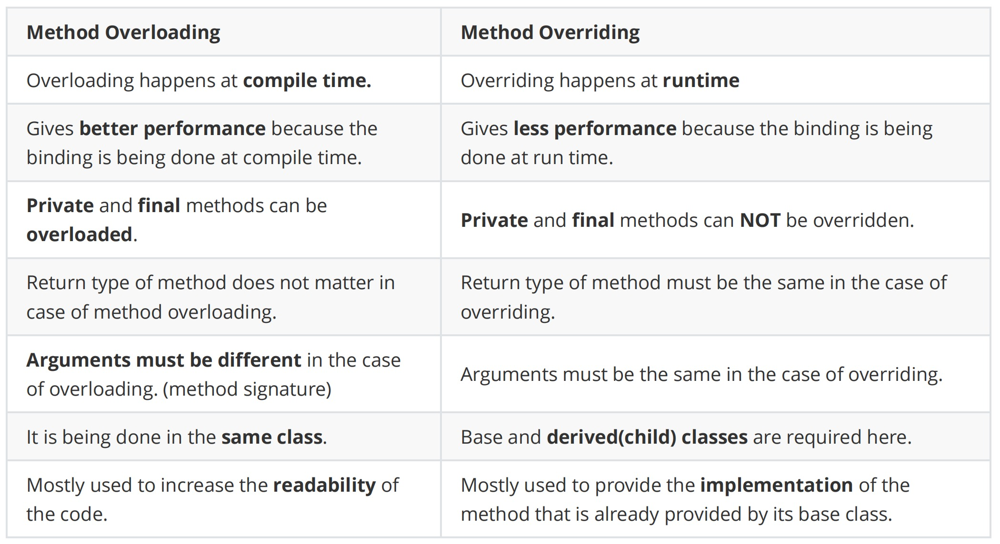

# HW3 - Java & OOP

### 1. Write up Example code to demonstrate the three fundamental concepts of OOP.

1. `Encapsulation`

```java
class Person {
   // Private fields (Encapsulated data)
   private String name;
   private int age;

   public String getName() {
      return name;
   }

   public void setName(String name) {
      this.name = name;
   }

   public int getAge() {
      return age;
   }

   public void setAge(int age) {
      this.age = age;
   }
}

public class EncapsulationExample {
   public static void main(String[] args) {
      Person person = new Person();

      person.setName("Lily");
      person.setAge(29);

      System.out.println("Name is " +person.getName());
      System.out.println("Age is " + person.getAge());
   }
}
```

2. `Polymorphism`

```java
// Parent class
class Animal {
   public void makeSound() {
      System.out.println("Animal makes a sound");
   }
}

// Child classes
class Dog extends Animal {
   @Override
   public void makeSound() {
      System.out.println("Dog barks");
   }
}

class Cat extends Animal {
   @Override
   public void makeSound() {
      System.out.println("Cat meows");
   }
}

// Usage
public class PolymorphismExample {
   public static void main(String[] args) {
      Animal myAnimal = new Animal();  // Animal reference and object
      Animal myDog = new Dog();        // Animal reference but Dog object
      Animal myCat = new Cat();        // Animal reference but Cat object

      myAnimal.makeSound();  // Outputs: Animal makes a sound
      myDog.makeSound();     // Outputs: Dog barks
      myCat.makeSound();     // Outputs: Cat meows
   }
}
```


3. `Inheritance`

```java
// Parent class
class School {

   protected String schoolName = "Chuwa";
   public String performance() {
      return "Performs Great!";
   }
}

// Child class
class Student extends School {
   private String studentName = "Liam";
   public String getStudentName() {
      return studentName;
   }
}

// Usage
public class InheritanceExample {
   public static void main(String[] args) {
      School mySchool = new School();
      Student myStudent = new Student();

      System.out.println(myStudent.schoolName + " " +
            myStudent.getStudentName() + " " + myStudent.performance()); // Output: Chuwa Liam Performs Great!

   }
}
```

### 2. What is **`wrapper class`** in Java and Why we need wrapper class?

A wrapper class is a class in Java that encapsulate a primitive data type into an object. Java provides a wrapper class for each of the eight data types.

Wrapper class provides a way to use primitive data typse(like `int`, `char`, etc) as object.They belong to `java.lang` package and are immutable, meaning their value can't be changed once created.

Wrapper class is necessary for working with Java's object-oriented features, such as collections (`ArrayList`, `HashMap`) that only store objects. Wrapper classes provide utility methods for converting between types, parsing strings, and performing other operations that primitives cannot do directly. They also support autoboxing and unboxing, making code easier to write and read. Additionally, wrapper classes can hold null values, which is useful when working with databases or data that may be missing.

### 3. What is the difference between **`HashMap`** and **`HashTable`**?

**HashMap** is not synchronized, allowing multiple threads to access it simultaneously, which makes it faster but not thread-safe. It permits one `null` key and multiple `null` values, and uses a fail-fast iterator that throws a `ConcurrentModificationException` if modified during iteration. HashMap is part of the Java Collections Framework and is preferred for non-threaded applications due to its performance.

**Hashtable** is synchronized, meaning it is thread-safe but slower due to the overhead of locking. It does not allow null keys or values and uses an older enumerator for iteration, which is not fail-fast. Hashtable is considered a legacy class from earlier Java versions, and while it ensures thread safety, it is often replaced by `ConcurrentHashMap` in modern applications for better performance and concurrency support.

### 4. What is **`String pool`** in Java and why we need String pool? Explain String immunity.

The **String Pool** in Java is a special memory area that stores and reuses string literals to save memory and improve performance. 

When a `String` object is created using a string literal (e.g., String s = "Hello";), the Java Virtual Machine (JVM) checks the string pool to see if an identical string already exists. If it does, the JVM will reference the existing string, rather than creating a new one. If it doesn't, a new string is added to the pool.

**String immutability** means that once a `String` object is created, it cannot be modified. Any operation that seems to modify a string (like concatenation, trimming, or replacing characters) actually creates a new String object, while the original string remains unchanged.

**String immutability** ensures that strings remain unchanged once created, enhancing security, thread safety, performance, and hashcode consistency. 


### 5. Explain **`garbage collection`**?

**Garbage Collection (GC)** in Java is the process of automatically identifying and freeing memory that is no longer in use by the program. The Java Virtual Machine (JVM) automatically manages memory by periodically reclaiming memory occupied by objects that are no longer accessible or needed. This helps prevent memory le

### 6. What are *`*access modifiers`** and their scopes in Java?

**Access modifiers** in Java are keywords that define the scope (visibility) of classes, methods, constructors, and fields. They determine which other classes can access the specified members. 

- **`Default((no modifier specified, also known as "package-private")`** 

Scope: Accessible **only within the same package**. No keyword is needed; simply omit any access modifier.

- **`Private`**

Scope: Accessible **only within the same class**.

- **`Protected`**

Scope: Accessible within the **same package** and **subclasses** in other packages.

- **`Public`**

Scope: Accessible from **anywhere**.

### 7. Explain `final` key word? (`Filed`, `Method`, `Class`)

The `final` keyword in Java is used to restrict modification. It can be applied to fields (variables), methods, and classes to make them unchangeable in different ways.

- **`final` field (variables)**: Value cannot change after assignment.

- **`final` method**: Method cannot be overridden by subclasses.

- **`final` class**: Class cannot be subclassed (extended) by other classes.

### 8. Explain `static` keyword? (Filed, Method, Class). When do we usually use it?

The `static` keyword in Java is used to indicate that a particular field (variable), method, or inner class belongs to the **class itself** rather than to instances of the class. This means that `static` members are shared among all instances of a class.

- **`static` field**: A class-level variable shared by all instances of the class.
- **`static` method**:  A class-level method that can be called without creating an instance of the class.
- **`static` class: A nested class that does not require an instance of the enclosing class.

### 9. What is the differences between `overriding` and `overloading`?



### 10. Explain how Java defines a `method signature`, and how it helps on overloading and overriding.

A **method signature** is a combination of the method's **name** and its **parameter list**. The parameter list includes the number, type, and order of parameters. The method signature does not include the return type, access modifiers (like public, private), throws clauses, or the method's body.

- **Method Overloading** uses method signatures to allow multiple methods with the **same name** but **different parameter lists** within the same class.
- **Method Overriding** requires the **same method signature** in the **subclass** and **superclass**.

### 11. What is the differences between `super` and `this`?

- `this` is used to refer to the current object, its fields, methods, or constructors.
- `super` is used to refer to the parent class, its fields, methods, or constructor

### 12. Explain how `equals` and `hashCode` work

The `equals()` method is used to checks if two objects are considered equal. By default, the `equals()` method in the Object class checks for **reference** equality, meaning it returns true if and only if the two references point to the same object in memory.

The `hashCode()` method returns an integer value (hash code) that represents the memory address of the object in a more managed way. In collections like `HashMap`, `HashSet`, and `Hashtable`, the `hashCode` method is used to determine the bucket location where the object is stored.

### 13. What is the Java `load sequence`?

The **load sequence** (or initialization sequence) refers to the order in which a Java class is loaded, linked, initialized, and executed by the Java Virtual Machine (JVM). This process ensures that classes and objects are correctly prepared and initialized before they are used in a program.

### 14. What is `Polymorphism` ? And how Java implements it ?

**Polymorphism** allows us to perform a single action in different ways. In other words, polymorphism allows you to define one interface and have multiple implementations.

**Compile-time(Static) polymorphism** is through **overloading** 

**Runtime(Dynamic) polymorphism** is through **overriding**.

### 15. What is `Encapsulation` ? How Java implements it? And why we need encapsulation?

**Encapsulation** is the practice of bundling data and methods within a class and restricting access to some components.

**Java implements encapsulation** by using **private** fields and **public getter and setter methods** to control access to those fields.

**Benefits of encapsulation**: data hiding, improved security, modularity, easier maintenance, flexibility, and easier testing and debugging.

### 16.  Compare `interface` and `abstract class`.

**Interfaces** are used when there is a set of behaviors that all subclasses must **support**, but the implementation details can vary.

An **abstract class** abstract classes are used when there is some common behavior that all subclasses must **share**.

In details:

An **interface** is a reference type, similar to a class, that can contain only method signatures (abstract methods without bodies) and constants (public, static, and final fields). Interfaces are used to define a contract or a set of methods that a class must implement.

**Abstract** is a class that cannot be instantiated on its own and may contain both abstract methods (methods without a body) and concrete methods (methods with an implementation). Abstract classes are used to provide a common base class with shared code or behavior that other classes can extend.

### 17. Write a factory pattern in code.

```java
public interface Notification {
    void notifyUser();
}

```

```java
public class SMSNotification implements Notification {
    @Override
    public void notifyUser() {
        System.out.println("Sending an SMS notification.");
    }
}
```

```java
public class EmailNotification implements Notification {
    @Override
    public void notifyUser() {
        System.out.println("Sending an Email notification.");
    }
}
```

```java
public class NotificationFactory {

    // Method to create notification objects based on the type
    public Notification createNotification(String channel) {
        if (channel == null || channel.isEmpty()) {
            return null;
        }
        if (channel.equalsIgnoreCase("SMS")) {
            return new SMSNotification();
        } else if (channel.equalsIgnoreCase("EMAIL")) {
            return new EmailNotification();
        }
        return null;
    }
}
```

```java
public class FactoryPatternExample {

    public static void main(String[] args) {
        NotificationFactory factory = new NotificationFactory();

        // Get an object of SMS Notification and call its notify method
        Notification notification1 = factory.createNotification("SMS");
        notification1.notifyUser();

        // Get an object of Email Notification and call its notify method
        Notification notification2 = factory.createNotification("EMAIL");
        notification2.notifyUser();
    }
}
```

### 18. Write an `adapter pattern` in code.

```java
public interface MediaPlayer {
    void play(String audioType, String fileName);
}
```

```java
public interface AdvancedMediaPlayer {
    void playVlc(String fileName);
    void playMp4(String fileName);
}
```

```java
public class VlcPlayer implements AdvancedMediaPlayer {
    @Override
    public void playVlc(String fileName) {
        System.out.println("Playing vlc file. Name: " + fileName);
    }

    @Override
    public void playMp4(String fileName) {
        // Do nothing
    }
}

public class Mp4Player implements AdvancedMediaPlayer {
    @Override
    public void playVlc(String fileName) {
        // Do nothing
    }

    @Override
    public void playMp4(String fileName) {
        System.out.println("Playing mp4 file. Name: " + fileName);
    }
}
```

```java
public class MediaAdapter implements MediaPlayer {

    AdvancedMediaPlayer advancedMediaPlayer;

    public MediaAdapter(String audioType) {
        if (audioType.equalsIgnoreCase("vlc")) {
            advancedMediaPlayer = new VlcPlayer();
        } else if (audioType.equalsIgnoreCase("mp4")) {
            advancedMediaPlayer = new Mp4Player();
        }
    }

    @Override
    public void play(String audioType, String fileName) {
        if (audioType.equalsIgnoreCase("vlc")) {
            advancedMediaPlayer.playVlc(fileName);
        } else if (audioType.equalsIgnoreCase("mp4")) {
            advancedMediaPlayer.playMp4(fileName);
        }
    }
}
```

```java
public class AudioPlayer implements MediaPlayer {
    MediaAdapter mediaAdapter;

    @Override
    public void play(String audioType, String fileName) {
        // Built-in support for playing mp3 music files
        if (audioType.equalsIgnoreCase("mp3")) {
            System.out.println("Playing mp3 file. Name: " + fileName);
        }
        // MediaAdapter is used to play other formats
        else if (audioType.equalsIgnoreCase("vlc") || audioType.equalsIgnoreCase("mp4")) {
            mediaAdapter = new MediaAdapter(audioType);
            mediaAdapter.play(audioType, fileName);
        } else {
            System.out.println("Invalid media. " + audioType + " format not supported");
        }
    }
}
```

```java
public class AdapterPatternDemo {

    public static void main(String[] args) {
        AudioPlayer audioPlayer = new AudioPlayer();

        audioPlayer.play("mp3", "song.mp3");
        audioPlayer.play("mp4", "video.mp4");
        audioPlayer.play("vlc", "movie.vlc");
        audioPlayer.play("avi", "movie.avi");
    }
}
```

### 19. Write `singleton pattern` in code, make sure your code is `thread-safe`.

```java
public class Singleton { 
   // Private constructor to prevent instantiation from outside the class
   private Singleton() {
   }
 
   static{
   // do something
    }
    
   // Static inner class to hold the Singleton instance
   private static class SingletonHolder {
      private static final Singleton INSTANCE = new Singleton();
   }
   
   // Public static method to get the Singleton instance
   public static Singleton getInstance() {
      return SingletonHolder.INSTANCE;
   }
}
```

### 20. design a `parking lot` (put the code to codingQuestions/coding1 folder)

[See Coding/coding1](../Coding/coding1)

### 21. What are `Queue` interface implementations and what are the differences and when to use what?

The `Queue` interface in Java represents a collection designed to hold elements before processing. It is part of the Java Collections Framework and provides various methods to perform standard queue operations, such as inserting, removing, and examining elements. There are multiple implementations of the Queue interface, each with different characteristics and use cases.

- **`LinkedList`**: Use for simple FIFO operations where thread safety is not required.
- **`PriorityQueue`**: Use when need to process elements based on priority rather than insertion order.
- **`ArrayDeque`**: Use for both stack (LIFO) and queue (FIFO) operations where thread safety is not required.
- **`ConcurrentLinkedQueue`**: Use in high-concurrency environments where non-blocking operations are needed.
- **`LinkedBlockingQueue`**: Use for thread-safe operations with optional capacity limits, such as producer-consumer scenarios.
- **`ArrayBlockingQueue`**: Use when need a thread-safe, fixed-size queue.
- **`DelayQueue`**: Use when need to delay processing of elements.
- **`SynchronousQueue`**: Use for direct hand-off between threads.
- **`PriorityBlockingQueue`**: Use when need a thread-safe priority queue with blocking support.