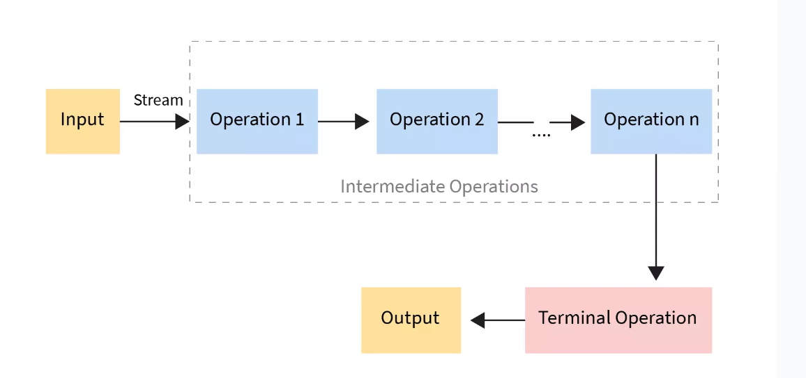

#Hw4

## Question 1
Generic class is can operate on objects of various types using type parameters. The type parameter in this example is T. It also have < T extends Comparable<T>>,it means T must implement the Comparable<T> interface.
Note for Type parameter:
| Type Parameter | Meaning                | Common Usage Context        |
|----------------|------------------------|-----------------------------|
| **T**          | Type                   | General generic type        |
| **E**          | Element                | Collections, data structures |
| **K**          | Key                    | Key in key-value pair       |
| **V**          | Value                  | Value in key-value pair     |
| **N**          | Number                 | Numeric types               |
| **R**          | Return Type            | Return types, functional interfaces |
| **S, U, V**    | Second, third, etc.     | Multiple type parameters    |
| **D**          | Data or Domain Type    | Data-centric contexts       |
| **?**          | Wildcard (unknown type) | Bounds with extends/super   |
| **B**          | Builder                | Builder pattern             |


## Question 2, 3, 4
I read all the code and finish all the question below after understanding the code

## Question 5
* Use Optional to Handle Null Values
  ```
    public class User {
        private String name;

        public String getName() {
            return name;
        }
    }
    public class Example {
        public static void main(String[] args) {
            User user = new User();
            Optional<String> name = Optional.ofNullable(user.getName());
            name.ifPresent(System.out::println);  // Prints the name if present
        }
    }
  ```
* Check for Null Early 
  ```
  public void processUser(User user) {
    if (user == null) {
        throw new IllegalArgumentException("User cannot be null");
    }
  }
  ```

## Question 6
* Functional Inteface and lambda expression
```
interface Hello {
    void sayHello(String s);
}
//use lambda expression to make it work
Hello hello = (s) -> System.out.println("Hello" + s);
```
* Stream api and Collectors and Method reference
```
List<String> names = Arrays.asList("Jack", "Jackson", "Jalen", "Nick")
List<String> j_names = names.stream().
                        .filter(name -> name.startwith("J"))
                        .map(String::toUpperCase)
                        .collect(Collectors.toList());

System.out.println(j_names);
[Jack, Jackson, Jalen]
```
* Optional Class
```
Optional<String> name = Optional.ofNullable(tree.nextNode());  // nextNode() might return null
name.ifPresent(t -> System.out.println(t.value));
```
## Question 7
The primary advantage of Optional is that it helps to avoid NullPointerException. Also, Optional integrates well with the Stream API and supports functional programming constructs, such as map(), filter()

## Question 8
A functional interface is an interface with exactly one abstract method. Lambda expreesion can represent a methods without a name. The example I gave in question 6 explain how functional interface work with lambda expression
```
interface Hello {
    void sayHello(String s);
}
//use lambda expression to make it work
Hello hello = (s) -> System.out.println("Hello" + s);
```


## Question 9 
Method reference is a shorthand used to refer to methods or constructors by their name, without executing them. Like in question 6:
```
.map(String::toUpperCase)  // I use String::toUpperCase as the input function of map()
```

## Question 10
This rule ensures that the lambda expression behaves consistently even if it's executed later or in a different thread.
```
public class LambdaExample {
    public static void main(String[] args) {
        int number = 10;  // This is effectively final because it's not modified later
        //number = 20     this is not allowed because it would make "threshold" not effectively final
        // Lambda expression using the "number" variable
        Runnable runnable = () -> {
            System.out.println("The number is: " + number);
        };

        runnable.run();  // Outputs: The number is: 10
    }
}
```
In this case if we don't modify the number, Java will take it because it is effectively final, if we try to modify it, it will be not effectively final. For code integraty, we should just use final varible when using lambda

## Question 11
Yes it can
```
@FunctionalInterface
interface A {
    void methodA();
}

@FunctionalInterface
interface B extends A {
    // Inherits methodA() from interface A, so this is still a valid functional interface
}
```
The above case is compliable

```
interface C {
    default void methodC() {
        System.out.println("Default method in C");
    }
}

@alInterface
interface D extends C {
    void methodD();
}
```
It still works if the super interface is not a functional Interface

## Question 12

Intermediate operations are operations that transform a stream into another stream. They are lazy, meaning that they only execute once terminal when operation is invoked. Intermediate operations are designed to be chained together to build a pipeline of transformations. Common Intermediate Operations are:
* filter(Predicate<? super T> predicate): Filters elements based on a condition.
* map(Function<? super T, ? extends R> mapper): Transforms elements using the provided function.
* flatMap(Function<? super T, ? extends Stream<? extends R>> mapper): Flattens nested structures into a single stream.
* sorted(Comparator<? super T> comparator): Sorts elements in the stream.
* distinct(): Removes duplicates from the stream: Removes duplicates from the stream.

Terminal operations are operations that trigger the actual processing of the stream. They produce a result (a value or a side-effect) and typically close the stream, meaning no further operations can be performed on it.
* collect(Collector<? super T, A, R> collector)
* forEach(Consumer<? super T> action)
* reduce(BinaryOperator<T> accumulator)
* count()： Gathers elements of the stream into a collection or another data structure.
* findFirst(): Returns first element from the stream, if any.
* findAny()： Returns any element from the stream
* allMatch(Predicate<? super T> predicate): Returns true if all elements match the given predicate.
* anyMatch(Predicate<? super T> predicate): Returns true if any element matches the given predicate.
* noneMatch(Predicate<? super T> predicate): Returns true if none of the elements match the given predicate.
  



## Question 13
The most common used stream intermediate operation is map() and filter(). I will use the code I wrote above as a sample
```
List<String> names = Arrays.asList("Jack", "Jackson", "Jalen", "Nick")
List<String> j_names = names.stream().
                        .filter(name -> name.startwith("J"))
                        .map(String::toUpperCase)
                        .collect(Collectors.toList());
```
## Question 14
* Definition and Purpose: Collection is a data structure that stores and manages groups of objects like List, Set, or Map. It provides many interfaces like Set, List, Queue, Deque and Classes like ArrayList, Vector, LinkedList, PriorityQueue, HashSet, and provides methods for adding, removing, and accessing elements.
* Mutability: Collections are mutable, but Streams are immutable.
* Evaluation: Operations on collections like sorting or filtering are eagerly evaluated, meaning the changes happen immediately. Stream operations are lazily evaluated. The operations are not executed until a terminal operation like collect(), forEach() is invoked. Intermediate operations like filter() or map() are only processed when the terminal operation is called.
 
## Question 15
```
    public MyStream<T> filter(Predicate<T> predicate){
        List<T> res = new ArrayList<>();
        for(T element : source){
            if(predicate.test(element)){
                res.add(element);
            }
        }
        return new MyStream<>(res);
    }

    public <R> MyStream<R> map(Function<T, R> mapper){
        List<R> res = new ArrayList<>();
        for(T element : source){
            res.add(mapper.apply(element));
        }
        return new MyStream(res);
    }
```
Full MyStream class code is in /coding/Stream.java