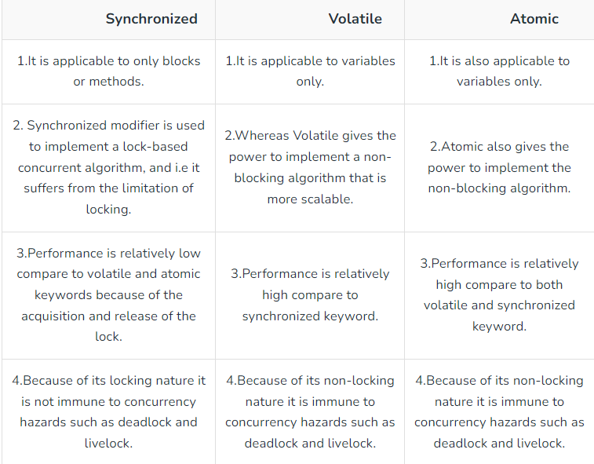

1. Read: https://www.interviewbit.com/multithreading-interview-questions/#class-level-lock-vs-object-level-lock
What's the difference between class lock and object lock? Class Lock: make static data thread-safe. Object Lock:
protect non-static data.  

2. Write a thread-safe singleton class  

```java
// Singleton.java
public class Singleton {
    // Volatile keyword ensures visibility of changes to variables across threads
    private static volatile Singleton instance;

    // Private constructor prevents instantiation from other classes
    private Singleton() {
        // Optional: Code to initialize the Singleton instance
    }

    // Public method to provide access to the instance with double-checked locking
    public static Singleton getInstance() {
        if (instance == null) { // First check (no locking)
            synchronized (Singleton.class) {
                if (instance == null) { // Second check (with locking)
                    instance = new Singleton();
                }
            }
        }
        return instance;
    }

    // Example method to demonstrate the Singleton functionality
    public void showMessage() {
        System.out.println("Hello from the Singleton instance!");
    }
}
```

3. How to create a new thread(Please also consider Thread Pool approach)?  

```java
public class MyThread extends Thread {
@Override
public void run() {
System.out.println("start new thread using extends thread");
 }
}
Thread t = new MyThread(); // JVM没有创建thread
t.start(); // 此时JVM才创建新的thread

public class MyCallable implements Callable<String> {
    @Override
    public String call() throws Exception {
        Thread.sleep(5000);
        return "Start new thread using Callable";
    }
}
class Task implements Runnable {
    private final String name;
    public Task(String name) {
        this.name = name;
    }
    @Override
    public void run() {
        System.out.println("start task " + name);
        try {
            Thread.sleep(1000);
        } catch (InterruptedException e) {
        }
        System.out.println("end task " + name);
    }
}
public static void main(String[] args) {
    ExecutorService executor = Executors.newFixedThreadPool(2);
    executor.execute(new Task("Alice"));
    executor.shutdown();
    Thread thread=new Thread(new Task("Bob"));
    thread.start();
}
```

4. Difference between Runnable and Callable?

runnable has no return;
callable has return;

5. What is the difference between t.start() and t.run()?

t.start starts a new thread to excute the task（run()）
t.run() excute the task in the current thread

6. Which way of creating threads is better: Thread class or Runnable interface?

[Yes](https://stackoverflow.com/questions/541487/implements-runnable-vs-extends-thread-in-java): 
implements Runnable is the preferred way to do it, IMO. You're not really specialising the thread's behaviour. 
You're just giving it something to run. That means composition is the philosophically "purer" way to go.

In practical terms, it means you can implement Runnable and extend from another class as well... 
and you can also implement Runnable via a lambda expression as of Java 8.

7. What are the thread statuses?  

初始(NEW)：新创建了⼀个线程对象，但还没有调⽤start()⽅法。  
运⾏(RUNNABLE)：Java线程中将就绪（ready）和运⾏中（running）两种状态笼统的称为“运⾏”。线程对象创
建后，其他线程(⽐如main线程）调⽤了该对象的start()⽅法。该状态的线程位于可运⾏线程池中，等待被线程调
度选中，获取CPU的使⽤权，此时处于就绪状态（ready）。就绪状态的线程在获得CPU时间⽚后变为运⾏中状态
（running）。   
阻塞(BLOCKED)：表示线程阻塞于锁。  
等待(WAITING)：进⼊该状态的线程需要等待其他线程做出⼀些特定动作（通知或中断）。  
超时等待(TIMED_WAITING)：该状态不同于WAITING，它可以在指定的时间后⾃⾏返回。  
终⽌(TERMINATED)：表示该线程已经执⾏完毕。  
   
8. Demonstrate deadlock and how to resolve it in Java code.  

```java
class Task implements Runnable{
    private static Integer num=1;
    private Boolean odd;
    Task(Boolean odd){
        this.odd=odd;
    }
    @Override
    public void run() {
        synchronized(Task.class){
            for(int i=0;i<5;i++){
                System.out.println("debug");
                if((odd&&num%2==1)||(!odd&&num%2==0)){
                    System.out.println(num++);
                    notify();
                }else{
                    try {
                        wait();
                    } catch (InterruptedException e) {
                        throw new RuntimeException(e);
                    }
                }
            }
        }
    }
}
```

9. How do threads communicate each other?

wait(), notify()

10. What’s the difference between class lock and object lock?

Class Lock: make static data thread-safe. Object Lock: protect non-static data.

11. What is join() method?

main thread wait for t thread end. main thread's status  is Timed Waiting.

12. what is yield() method

The yield() basically means that the thread is not doing anything particularly important and if any other threads or
processes need to be run, they should run. Otherwise, the current thread will continue to run.

13. What is ThreadPool? How many types of ThreadPool? What is the TaskQueue in ThreadPool?

A thread pool reuses previously created threads to execute current tasks and offers a solution to the problem of thread 
cycle overhead and resource thrashing.

14. Which Library is used to create ThreadPool? Which Interface provide main functions of thread-pool?

```java
public static void main(String[] args) {

    ExecutorService executor = Executors.newFixedThreadPool(2);
    executor.execute(new Task("Alice"));
    executor.shutdown();
}
```

15. How to submit a task to ThreadPool?

        executor.submit(new Task("Alice"));


16. What is the advantage of ThreadPool?

Using thread pools generally offers better performance and resource management compared to creating single
threads directly. Thread pools control the number of concurrent tasks, reduce the overhead of thread creation
and destruction, and improve performance. Moreover, thread pools allow task queuing for pending execution,
automatically manage thread lifecycles, and provide more flexible error handling mechanisms. However, in
some simple scenarios, using a single thread might be more straightforward.

17. Difference between shutdown() and shutdownNow() methods of executor

Two different methods are provided for shutting down an ExecutorService. The shutdown() method will allow previously 
submitted tasks to execute before terminating, while the shutdownNow() method prevents waiting tasks from starting and 
attempts to stop currently executing tasks.

18. What is Atomic classes? How many types of Atomic classes? Give me some code example of Atomic
    classes and its main methods. when to use it?

原⼦操作实现了⽆锁的线程安全:

```java
public class AtomicDemo {
    private static AtomicInteger atomicInteger = new AtomicInteger(1);
    public static void main(String[] args) {
        System.out.println(atomicInteger.getAndIncrement()); //count++ vs ++count
        System.out.println(atomicInteger.get());//count
    }
}
```



19. What is the concurrent collections? Can you list some concurrent data structure (Thread-safe)

Thread safe collections.  
List - CopyOnWriteArrayList  
Map - ConcurrentHashMap  
Set - CopyOnWriteArraySet  
Queue - ArrayBlockingQueue / LinkedBlockingQueue  
Deque - LinkedBlockingDeque  


20. What kind of locks do you know? What is the advantage of each lock?

Intrinsic Locks - The simplest and most commonly used lock mechanism in Java is the synchronized keyword.  
ReentrantLock - You can manually lock and unlock, giving more flexibility compared to the synchronized block. Threads 
waiting on a lock can be interrupted, which is not possible with intrinsic locks.  
ReadWriteLock - manages two types of locks: one for reading (shared lock) and one for writing (exclusive lock).

24. What is future and completableFuture? List some main methods of CompletableFuture.

Future represents the result of an asynchronous computation. CompletableFuture is an enhancement of Future. It not only 
represents a future result but also provides a plethora of methods to compose, combine, execute asynchronous tasks, and 
handle their results without blocking.

```java
public class Main {
    public static void main(String[] args) throws Exception {
// 创建异步执⾏任务:
        CompletableFuture<Double> cf = CompletableFuture.supplyAsync(Main::fetchPrice);
// 如果执⾏成功:
        cf.thenAccept((result) -> {
            System.out.println("price: " + result);
        });
// 如果执⾏异常:
        cf.exceptionally((e) -> {
            e.printStackTrace();
            return null;
        });
// 主线程不要⽴刻结束，否则CompletableFuture默认使⽤的线程池会⽴刻关闭:
        // 思考：如何解决以上问题？
        System.out.print("Michaeal yyds")
        Thread.sleep(200);
    }
    static Double fetchPrice() {
        try {
            Thread.sleep(100);
        } catch (InterruptedException e) {
        }
        if (Math.random() < 0.3) {
            throw new RuntimeException("fetch price failed!");
        }
        return 5 + Math.random() * 20;
    }
}
}
```

22. Type the code by your self and try to understand it. (package com.chuwa.tutorial.t08_multithreading)
23. Write a code to create 2 threads, one thread print 1,3,5,7,9, another thread print 2,4,6,8,10. (solution is in
    com.chuwa.tutorial.t08_multithreading.c05_waitNotify.OddEventPrinter)
    1. One solution use synchronized and wait notify
    2. One solution use ReentrantLock and await, signal

```java
class Task implements Runnable{
    private static Integer num=1;
    private final Boolean odd;
    private static final Object lock = new Object();
    Task(Boolean odd){
        this.odd=odd;
    }
    @Override
    public void run() {
        synchronized(lock){
            for(int i=0;i<5;i++){
                while ((odd && num % 2 == 0) || (!odd && num % 2 == 1)) {
                    try {
                        lock.wait();
                    } catch (InterruptedException e) {
                        throw new RuntimeException(e);
                    }
                }
                System.out.println(num++);
                lock.notify();
            }
        }
    }
}

class Task implements Runnable{
    private static Integer num=1;
    private final Boolean odd;
    private static final Lock lock=new ReentrantLock();
    private static final Condition condition = lock.newCondition();

    Task(Boolean odd){
        this.odd=odd;
    }
    @Override
    public void run() {
        lock.lock();
        try {
            for(int i=0;i<5;i++){
                while ((odd && num % 2 == 0) || (!odd && num % 2 == 1)) {
                    try {
                        condition.await();
                    } catch (InterruptedException e) {
                        throw new RuntimeException(e);
                    }
                }
                System.out.println(num++);
                condition.signal();
            }
        }finally {
            lock.unlock();
        }
    }
}

```

24. create 3 threads, one thread ouput 1-10, one thread output 11-20, one thread output 21-22. threads run
    sequence is random. (solution is in com.chuwa.exercise.t08_multithreading.PrintNumber1)
    Thread-0: 1
    Thread-1: 2
    Thread-0: 3
    Thread-1: 4
    Thread-0: 5
    Thread-1: 6
    Thread-0: 7
    Thread-1: 8
    Thread-0: 9
    Thread-1: 10
    Process finished with exit code 0
    Thread-0: 1
    Thread-0: 2
    Thread-0: 3
    Thread-0: 4
    Thread-0: 5
    Thread-0: 6
    Thread-0: 7
    Thread-0: 8
    Thread-0: 9
    Thread-0: 10
    Thread-2: 11
    Thread-2: 12
    Thread-2: 13
    Thread-2: 14
    Thread-2: 15
    Thread-2: 16
    Thread-2: 17
    Thread-2: 18
    Thread-2: 19
    Thread-2: 20
    Thread-1: 21
    Thread-1: 22
    Thread-1: 23
    Thread-1: 24
    Thread-1: 25
    Thread-1: 26
    Thread-1: 27
    Thread-1: 28
    Thread-1: 29
    Thread-1: 30

```java
class Task implements Runnable{
    private final Integer start;
    private static final Lock lock=new ReentrantLock();
    private static final Condition condition = lock.newCondition();

    Task(Integer start){
        this.start=start;
    }
    @Override
    public void run() {
        lock.lock();
        try {
            for(int i=0;i<10;i++){
                System.out.println("Thread-"+(start/10+1)+": "+(start+i));
            }
        }finally {
            lock.unlock();
        }
    }
}
```

25. completable future:
    1. Homework 1: Write a simple program that uses CompletableFuture to asynchronously get the sum
       and product of two integers, and print the results.
    2. Homework 2: Assume there is an online store that needs to fetch data from three APIs: products,
       reviews, and inventory. Use CompletableFuture to implement this scenario and merge the fetched
       data for further processing. (需要找public api去模拟，)
       1. Sign In to Developer.BestBuy.com
       2. Best Buy Developer API Documentation (bestbuyapis.github.io)
       3. 可以⽤fake api https://jsonplaceholder.typicode.com/
       4. Github public api: https://api.github.com/users/your-user-name/repos
    3. Homework 3: For Homework 2, implement exception handling. If an exception occurs during any API
       call, return a default value and log the exception information.