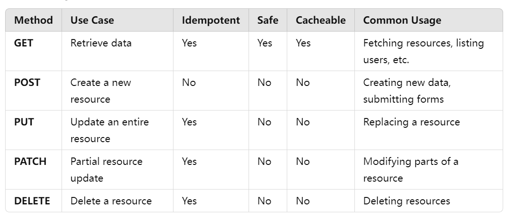

# HW6 -- short questions

## 1. Compare Rest API methods ( `Get` , `Post `, `Put` , `Patch` , `Delete` ) in detail.



## 2. Compare `Soap` vs `Rest API` vs `gRPC` vs `GraphQL` in detail.


- **SOAP**: Best for highly secure, enterprise-level applications where formalized contracts are essential.
- **REST**: Best for general web and mobile applications requiring lightweight, easy-to-use APIs.
- **gRPC**: Best for high-performance, real-time communication between microservices.
- **GraphQL**: Best for apps where flexible and efficient data fetching is required (especially front-end heavy apps

## 3. Explain components in http requests (`header`, `body`, `uri` etc...), and what do they do?

1. **Request Line**:
   - **Method**: Defines the action (e.g., `GET`, `POST`, `PUT`).
   - **URI (Uniform Resource Identifier)**: Specifies the resource (e.g., `/api/users`).
   - **HTTP Version**: Indicates the protocol version (e.g., `HTTP/1.1`).
2. **Headers**:
   - Provide metadata about the request (e.g., content type, authentication).
   - Example: `Content-Type: application/json`, `Authorization: Bearer <token>`.
3. **Body**:
   - Contains the data sent to the server (used in POST, PUT, PATCH).
   - Example (JSON data):
   - ```JSON
     { "name": "John", "email": "john@example.com" }
     ```
4. **URI (Uniform Resource Identifier)**:
   - Identifies the target resource.
   - May include a **path** (e.g., `/api/users`) and **query parameters** (e.g., `?id=123`).
5. **HTTP Version**:
   - Specifies the protocol version (e.g., `HTTP/1.1` or `HTTP/2`).

## 4. Explain components in http responses (`header`, `body` etc...), and what do they do?

1. **Status Line**:
   - **HTTP Version**: The protocol version (e.g., `HTTP/1.1`).
   - **Status Code**: Indicates the result of the request (e.g., 200 OK, 404 Not Found).
   - **Reason Phrase**: A brief message explaining the status code.
   Example: HTTP/1.1 200 OK

2. **Headers**:
   - Provide metadata about the response, such as content type, length, and caching instructions.
   - Example:
   ```http
   Content-Type: application/json
   Content-Length: 123
   ```

3. **Body**:
   - Contains the data returned by the server (if applicable, such as for a `GET` request).
   - Can be in formats like JSON, HTML, XML, etc.
   ```JSON
   { "id": 123, "name": "John Doe" }
   ```
   
## 5. Compare `SQL` DB vs `NoSQL` DB in detail


## 6. Explain types of SQL language, and their purpose?

1. **DML (Data Manipulation Language)**
   - **Purpose**: Used to manipulate or manage the data in a database (e.g., insert, update, delete, or retrieve data).
   - **Commands**:
     - **INSERT**: Adds new records to a table.
     - **UPDATE**: Modifies existing records.
     - **DELETE**: Removes records from a table.
   - **Example**:
   ```sql
   INSERT INTO employees (name, department) VALUES ('John', 'Sales');
   UPDATE employees SET department = 'HR' WHERE name = 'John';
   DELETE FROM employees WHERE name = 'John';
   ```

2. **DDL (Data Definition Language)**
   - **Purpose**: Used to define, alter, or remove the structure of database objects like tables, indexes, and views.
   - **Commands**:
     - **CREATE**: Creates new database objects (e.g., tables, views, indexes).
     - **ALTER**: Modifies existing database objects.
     - **DROP**: Deletes database objects.
     - **TRUNCATE**: Deletes all records from a table but keeps the structure.
   - **Example**:
   ```sql
   CREATE TABLE employees (id INT, name VARCHAR(100), department VARCHAR(50));
   ALTER TABLE employees ADD salary INT;
   DROP TABLE employees;
   ```

3. **DCL (Data Control Language)**
   - **Purpose**: Used to control access to data in the database (e.g., grant or revoke user permissions).
   - **Commands**:
     - **GRANT**: Provides privileges to users.
     - **REVOKE**: Removes privileges from users.
   - **Example**:
   ```sql
   GRANT SELECT, INSERT ON employees TO user1;
   REVOKE INSERT ON employees FROM user1;
   ```

4. **TCL (Transaction Control Language)**
   - **Purpose**: Used to manage database transactions to ensure data integrity, particularly in multi-operation or multi-user environments.
   - **Commands**:
   - **COMMIT**: Saves all changes made in the current transaction.
   - **ROLLBACK**: Undoes changes made in the current transaction.
   - **SAVEPOINT**: Sets a savepoint within a transaction to which you can later rollback.
   - **SET TRANSACTION**: Sets the characteristics of the transaction.
   - **Example**:
   ```sql
   BEGIN TRANSACTION;
   UPDATE employees SET department = 'HR' WHERE id = 1;
   COMMIT;
   ```

5. **DQL (Data Query Language)**
   - **Purpose**: Used to retrieve data from the database. Sometimes considered part of DML but is often treated separately due to its primary focus on querying.
   - **Commands**:
     - **SELECT**: Retrieves data from the database.
   - **Example**:
   ```sql
   SELECT name, department FROM employees WHERE department = 'Sales';
   ```

## 7. Explain 2xx, 4xx, 5xx http status codes in detail, name some common and important codes, explain 1xx, 3xx http status code in general.

### 1xx - Informational Responses
- **Purpose**: These codes indicate that the request has been received and is being processed.
- **Common Codes**:
   - **100 Continue**: The server has received the request headers, and the client should continue to send the request body.
   - **101 Switching Protocols**: The server is switching protocols as requested by the client (e.g., HTTP to WebSocket).
   - **102 Processing**: The server is processing the request, but no response is available yet.

### 2xx - Success
- **Purpose**: These codes indicate that the client's request was successfully received, understood, and accepted.
- **Common Codes**:
   - **200 OK**: The request was successful, and the server returned the requested resource.
   - **201 Created**: The request was successful, and a new resource was created.
   - **202 Accepted**: The request has been accepted for processing, but the processing has not been completed yet.
   - **204 No Content**: The request was successful, but no content is returned in the response.

### 3xx - Redirection
- **Purpose**: These codes indicate that the client must take additional action to complete the request.
- **Common Codes**:
   - **301 Moved Permanently**: The resource has been permanently moved to a new URL.
   - **302 Found**: The resource is temporarily located at a different URL.
   - **304 Not Modified**: The resource has not been modified since the last request, allowing the client to use its cached version.

### 4xx - Client Errors
- **Purpose**: These codes indicate that there was an error with the client’s request (e.g., malformed syntax, authentication issues).
- **Common Codes**:
   - **400 Bad Request**: The server could not understand the request due to invalid syntax or bad data.
   - **401 Unauthorized**: The client must authenticate itself to get the requested response.
   - **403 Forbidden**: The client is authenticated but does not have permission to access the resource.
   - **404 Not Found**: The server could not find the requested resource.
   - **405 Method Not Allowed**: The HTTP method used is not allowed for the requested resource.
   - **429 Too Many Requests**: The client has sent too many requests in a given amount of time.

### 5xx - Server Errors
- **Purpose**: These codes indicate that the server encountered an error or is incapable of fulfilling the request.
- **Common Codes**:
   - **500 Internal Server Error**: The server encountered an unexpected condition.
   - **502 Bad Gateway**: The server, acting as a gateway or proxy, received an invalid response from an upstream server.
   - **503 Service Unavailable**: The server is temporarily unable to handle the request due to overload or maintenance.
   - **504 Gateway Timeout**: The server, acting as a gateway or proxy, did not receive a timely response from an upstream server.

### Summary Table

| **Code Group** | **Meaning**                  | **Example Codes**         | **Description**                                                  |
|----------------|------------------------------|---------------------------|------------------------------------------------------------------|
| **1xx**        | Informational Responses       | 100, 101, 102              | Request received, continuing process.                            |
| **2xx**        | Success                       | 200, 201, 202, 204         | Request was successfully received, understood, and processed.    |
| **3xx**        | Redirection                   | 301, 302, 304              | Further action must be taken to complete the request (redirect). |
| **4xx**        | Client Errors                 | 400, 401, 403, 404, 429    | Client-side error, bad request, or forbidden access.             |
| **5xx**        | Server Errors                 | 500, 502, 503, 504         | Server-side error, issues with server or upstream services.       |


# API designs

## 1. find the customer's payments, like credit card 1, credit card 2, paypal, Apple Pay.

### Endpoint: Get all payments for a specific customer

- **Method:** `GET`
- **URL:** `/api/customers/{customerId}/payments`

**Description:** Retrieve the payment methods (credit card, PayPal, Apple Pay, etc.) for a specific customer.

**Query Parameters:**
- `paymentType` (optional): Filter by payment type, e.g., `credit_card`, `paypal`, `apple_pay`, etc.

## 2. Find the customer's history orders from 10/10/2022 to 10/24/2022

### Endpoint: Get customer’s orders within a date range

- **Method:** `GET`
- **URL:** `/api/customers/{customerId}/orders`

**Query Parameters:**
- `startDate`: `2022-10-10`
- `endDate`: `2022-10-24`

## 3. Find the customer's delivery addresses

### Endpoint:  Get customer’s delivery addresses

- **Method:** `GET`
- **URL:** `/api/customers/{customerId}/addresses`

## 4. Get customer’s default payment and delivery address

### Endpoint:  Get customer’s default payment and delivery address

- **Method:** `GET`
- **URL:** `/api/customers/{customerId}/default`

## 5. Collection of APIs Example

**Twitter API Example**:

- **Base URL:** `https://api.twitter.com`
- **Endpoints:** 
  - `GET /2/tweets/{id}`： Retrieve a specific tweet by ID.
  - `POST /2/tweets`： : Create a new tweet.
  - `DELETE /2/tweets/{id}`： Delete a specific tweet.

**PayPal API Example:**:

- **Base URL:** `https://api.paypal.com`
- **Endpoints:**
   - `GET /v1/payments/payment/{paymentId}`： Retrieve details of a specific payment.
   - `POST /v1/payments/payment`： : Create a new payment.
   - `DELETE /v1/payments/payment/{paymentId}`：  Cancel a payment.
  
##  Design a collection of APIs for a Blog Website

**Endpoint: Get all blog posts**
- **Method**: `GET`
- **URL**: `/api/posts` 

**Endpoint: Get a specific blog post**
- **Method**: `GET`
- **URL**: `/api/posts/{postId}` 

**Endpoint: Create a new blog post**
- **Method**: `POST`
- **URL**: `/api/posts` 

**Endpoint:  Update a blog post**
- **Method**: `PUT`
- **URL**: `/api/posts/{postId}` 

**Endpoint:  Delete a blog post**
- **Method**: `DELETE`
- **URL**: `/api/posts/{postId}` 


