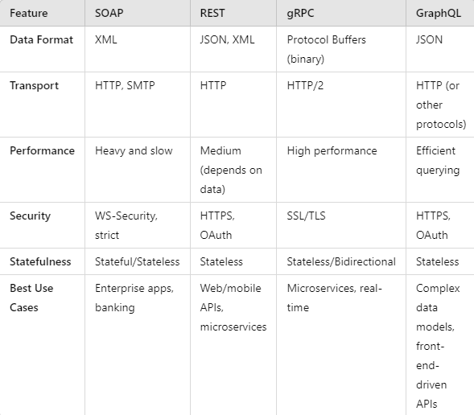

# Short Questions
### 1. Compare Rest API methods ( Get , Post , Put , Patch , Delete ) in detail.

**POST** send data to a server and create a new resource  
**GET** retrieve data from a server  
**PUT** A complete update method that replaces an existing record with a new one.  
**DELETE** remove a resource  
**PATCH** partial update method that changes the values of one or more fields on a record.

### 2. Compare Soap vs Rest API vs gRPC vs GraphQL in detail.



### 3. Explain components in http requests (header, body, uri etc...), and what do they do?
1. Request line
Method:  Indicates the action to be performed. The most common HTTP methods are: GET, POST, PUT, DELETE  
URI (Uniform Resource Identifier): Specifies the resource being requested, such as `/home` or `/api/v1/users`.   
It typically includes:   
    Path: Specifies the resource (e.g., /products/123).  
    Query String (optional): Additional data sent in key-value pairs (e.g., ?id=123&sort=asc).  
HTTP version
```http request
GET /index.html HTTP/1.1
```
2. Headers
Common HTTP request headers include Host, Authorization, Content-Type, User-Agent, Accept, Cache-Control, and Cookie.  
```http request
Host: www.example.com
User-Agent: Mozilla/5.0
Accept: text/html
```
3. Body  
The actual data being sent to the server, typically in POST, PUT, and PATCH requests.  
Example (JSON Body in a POST request):
```json
{
"username": "john",
"password": "12345"
}
```

### 4. Explain components in http responses (header, body etc...), and what do they do?
1. Status line:  Status Code. 
2. Headers:  
   Common HTTP response headers include Content-Type, Content-Length, Set-Cookie, Cache-Control, Server, and Location.  
```http request
Content-Type: application/json
Content-Length: 123
Cache-Control: no-cache
Set-Cookie: sessionId=abcd1234; Path=/; Secure; HttpOnly
```
4. Body:  The actual data being sent from the server to the client. It can be HTML, JSON, XML, an image, or any other file type.  

```html
<html>
  <body>
    <h1>Welcome to Example!</h1>
  </body>
</html>
```
```json
{
  "status": "success",
  "data": {
    "id": 123,
    "name": "Product A"
  }
}
```
### 5. Compare SQL DB vs NoSQL DB in detail

SQL DB is structured as tables, has very clear schema; NoSQL is not structured and does not have universal schema. 

### 6. Explain types of SQL language, and their purpose?

DDL – Data Definition Language eg. create drop  
DQL – Data Query Language eg. select  
DML – Data Manipulation Language eg. insert  
DCL – Data Control Language (privileges) eg. grant revoke  
TCL – Transaction Control Language eg. begin commit rollback  

### 7. Explain 2xx, 4xx, 5xx http status codes in detail, name some common and important codes, explain 1xx, 3xx http status code in general.

1xx: Informational responses  
    100 continue  
    101 switching protocols  
    102 processing  
    103 early hints  
2xx: successful responses  
    200 ok  
    201 created  
    202 accepted  
    203 non-authoritative info
    204 no content
    205 reset content
    206 partial content
    207 multi-status
    208 already reported
    226 im used
3xx: redirection messages
    300 multiple choices
    201 moved permanently
    302 found
    303 see other
    304 not modified
    307 temporary redirect
    308 permanent redirect
4xx: client error
    400 bad request
    401 unauthorized
    402 payment required
    403 forbidden
    404 not found
    405 method not allowed
    406 not acceptable
    407 proxy authentication required
    408 request timeout
    409 conflict

5xx: server error
    500 internal server error
    501 not implemented
    502 bad gateway
    503 service unavailable
    504 gateway timeout
    505 http version not supported
    506 variant also negotiates 


#  API Design. Design REST APIs for following scenairos:
[interview questions](https://meganslo.medium.com/interview-edition-design-a-rest-api-as-a-junior-engineer-450b7586c64f)
### 1. find the customer's payments, like credit card 1, credit card 2, paypal, Apple Pay.

1. Request
Request line
header
body

```http request
GET /customers/{customerID}/payments
```
```http request
GET /customers/12345/payments?type=credit-card HTTP/1.1
Host: api.example.com
Authorization: Bearer <JWT_Token>
```
2. Response
status line
header
body

```
200 OK: Successful request.
201 Created: New resource created successfully.
204 No Content: Resource deleted successfully.
400 Bad Request: Invalid input.
401 Unauthorized: Missing or invalid authentication.
404 Not Found: Resource not found (e.g., customer or payment method).
500 Internal Server Error: Server-side error.
```

```json
{
  "customerId": "12345",
  "payments": [
    {
      "paymentId": "cc-1",
      "type": "credit-card",
      "provider": "Visa",
      "lastFourDigits": "4242",
      "expiry": "12/25",
      "isDefault": true
    },
    {
      "paymentId": "paypal-1",
      "type": "paypal",
      "email": "customer@example.com",
      "isDefault": false
    }
  ]
}
```

### 2. Find the customer's history orders from 10/10/2022 to 10/24/2022

1. HTTP request

```http request
GET /customers/{customerID}/orders
GET /customers/12345/orders?startDate=2022-10-10&endData=2022-10-24 HTTP/1.1
Host: api.example.com
Authorization: Bearer <JWT_Token>
```
2. HTTP response

```json
{
  "customerId": "12345",
  "orders": [
    {
      "orderId": "ord-001",
      "orderDate": "2022-10-12",
      "status": "delivered",
      "items": [
        {
          "itemId": "prod-001",
          "productName": "Smartphone",
          "quantity": 1,
          "price": 799.99
        }
      ],
      "totalPrice": 799.99,
      "shippingAddress": {
        "street": "123 Main St",
        "city": "New York",
        "state": "NY",
        "zipCode": "10001",
        "country": "USA"
      }
    },
    {
      "orderId": "ord-002",
      "orderDate": "2022-10-20",
      "status": "shipped",
      "items": [
        {
          "itemId": "prod-002",
          "productName": "Laptop",
          "quantity": 1,
          "price": 1299.99
        }
      ],
      "totalPrice": 1299.99,
      "shippingAddress": {
        "street": "123 Main St",
        "city": "New York",
        "state": "NY",
        "zipCode": "10001",
        "country": "USA"
      }
    }
  ],
  "pagination": {
    "totalOrders": 2,
    "limit": 10,
    "offset": 0
  }
}
```

### 3. find the customer's delievery addresses

1. HTTP request

```http request
GET /customers/{customerID}/addresses
Host: api.example.com
Authorization: Bearer <JWT_Token>
```
2. HTTP response

```json
{
  "customerId": "12345",
  "addresses": [
    {
      "addressId": "addr-001",
      "label": "Home",
      "street": "123 Main St",
      "city": "New York",
      "state": "NY",
      "zipCode": "10001",
      "country": "USA",
      "isDefault": true
    },
    {
      "addressId": "addr-002",
      "label": "Work",
      "street": "456 Office Park",
      "city": "New York",
      "state": "NY",
      "zipCode": "10002",
      "country": "USA",
      "isDefault": false
    }
  ]
}
```

### 4. If I also want to get customer's default payment and default delievery address, what kind of the API (URL) should be?

```http request
GET /customers/{customerID}/defaults
```

```json
{
  "customerId": "12345",
  "addresses": [
    {
      "addressId": "addr-001",
      "label": "Home",
      "street": "123 Main St",
      "city": "New York",
      "state": "NY",
      "zipCode": "10001",
      "country": "USA",
      "isDefault": true
    }
  ],
  "payment": [
    {
      "paymentId": "cc-1",
      "type": "credit-card",
      "provider": "Visa",
      "lastFourDigits": "4242",
      "expiry": "12/25",
      "isDefault": true
    }
  ]
}
```

### 5. Find 2 collection of APIs example. ie. Twitter, Paypal, Youtube etc. -- 命名规范

```http request
https://www.youtube.com/watch?v=lsMQRaeKNDk
https://www.reddit.com/r/cscareerquestions/comments/1fjwydp/i_want_to_take_a_6_month_break_from_swe_to_train/
```
1. Youtube  
Search for videos
```http request
GET https://www.googleapis.com/youtube/v3/search
```
```json
{
  "items": [
    {
      "id": { "videoId": "abc123" },
      "snippet": {
        "title": "Awesome Music Video",
        "description": "The latest music video by...",
        "thumbnails": {
          "default": { "url": "https://img.youtube.com/abc123/default.jpg" }
        }
      }
    }
  ]
}
```
Retrieve Video Details
```http request
GET https://www.googleapis.com/youtube/v3/videos
```
```json
{
  "items": [
    {
      "id": "abc123",
      "snippet": {
        "title": "Awesome Music Video",
        "description": "The latest music video by..."
      },
      "statistics": {
        "viewCount": "123456",
        "likeCount": "7890",
        "dislikeCount": "123",
        "commentCount": "456"
      }
    }
  ]
}
```

2. Reddit  
search for post 
```http request
GET https://www.reddit.com/search.json
```  
```json
{
  "data": {
    "children": [
      {
        "data": {
          "title": "Amazing Space Facts",
          "selftext": "Here are some interesting facts about space...",
          "url": "https://www.reddit.com/r/space/comments/abc123/amazing_space_facts/",
          "subreddit": "space",
          "score": 5000,
          "num_comments": 150
        }
      }
    ]
  }
}
```
Retrieve Subreddit Information
```http request
GET https://www.reddit.com/r/space/about.json
```
```json
{
  "data": {
    "display_name": "space",
    "title": "Space",
    "public_description": "A subreddit for space enthusiasts.",
    "subscribers": 2000000,
    "created_utc": 1201234567
  }
}
```
### 6. Design a collection of APIs for a Blog Website, please specify GET POST PUT DELETE Design APIs for the following features (思考：path variable 怎么⽤？有sub resources, 哪些地⽅该⽤复数)
API Structure Principles  
Use path variables to represent specific resources.  
Use sub-resources to represent relationships (e.g., comments under a post).  
Use plural nouns for collections of resources (e.g., /posts, /users).  
HTTP methods (GET, POST, PUT, DELETE) should correspond to the standard CRUD operations.  
```
GET /posts
[
  {
    "postId": 1,
    "title": "Introduction to REST APIs",
    "author": "John Doe",
    "category": "Tech",
    "content": "API design for RESTful web services...",
    "createdAt": "2024-09-17T12:34:56Z"
  }
]

GET /posts/{postId}
{
  "postId": 1,
  "title": "Introduction to REST APIs",
  "author": "John Doe",
  "category": "Tech",
  "content": "API design for RESTful web services...",
  "createdAt": "2024-09-17T12:34:56Z"
}
POST /posts
{
  "title": "My New Post",
  "authorId": 123,
  "categoryId": 4,
  "content": "This is my new blog post!"
}
PUT /posts/{postId}
{
  "title": "Updated Title",
  "content": "Updated content"
}
DELETE /posts/{postId}
```