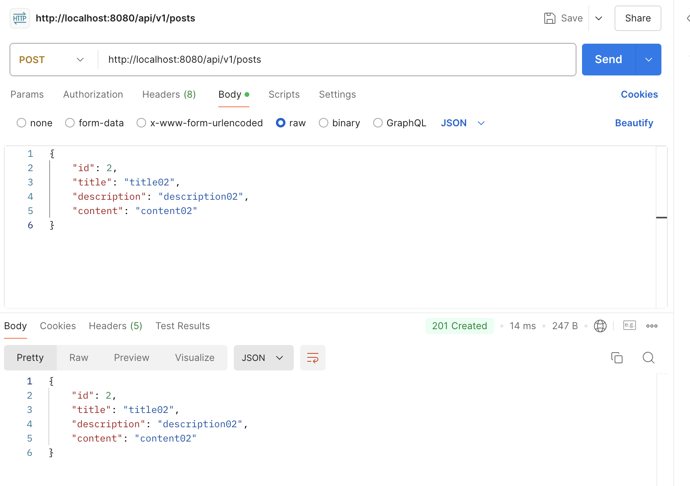
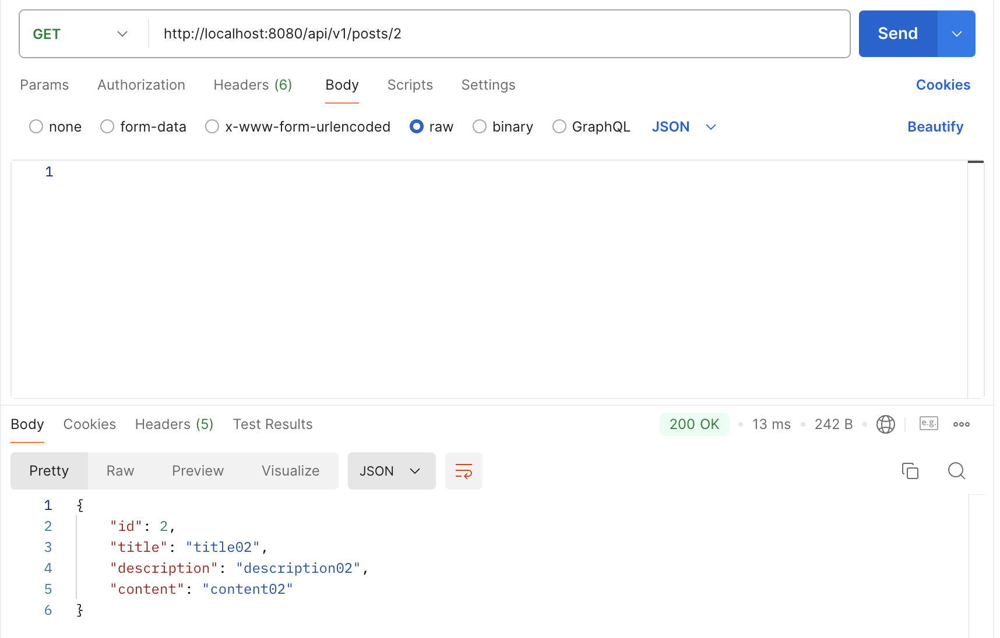
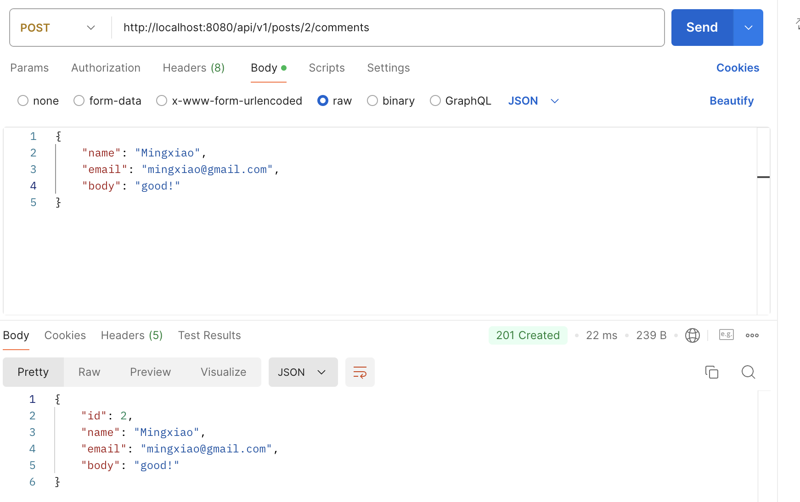
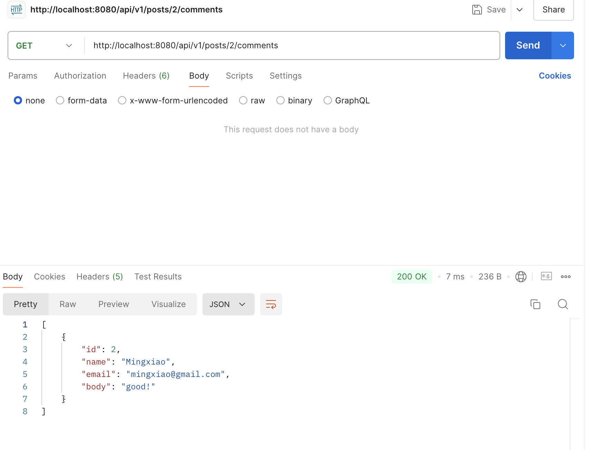
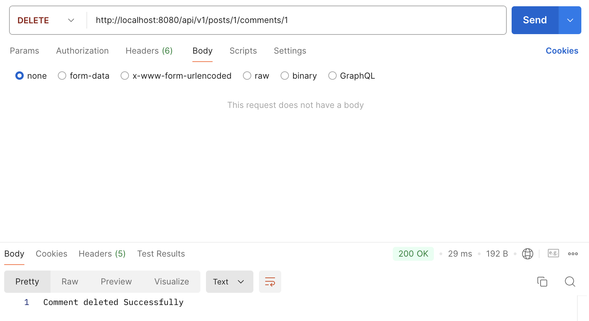
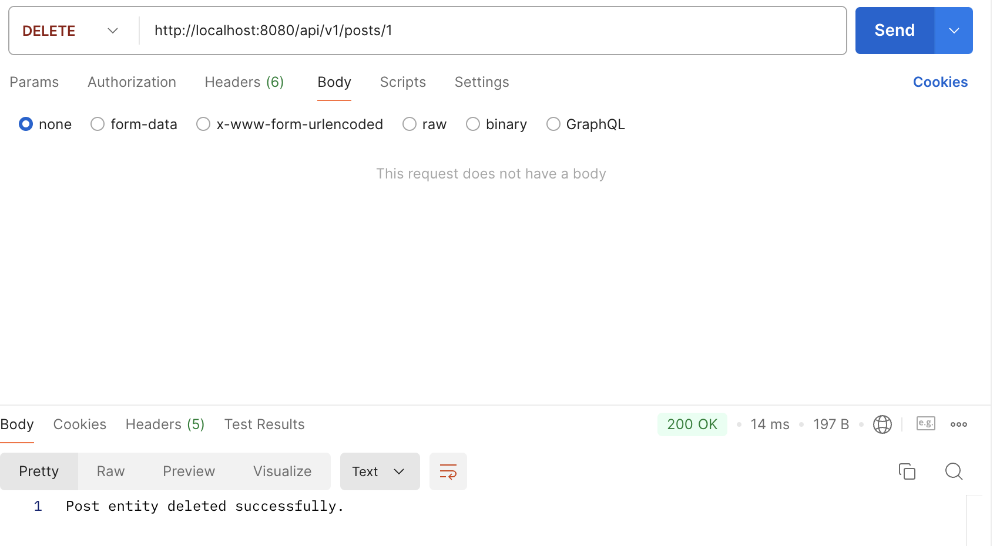

# hw8 Spring Data

## 1. List all of the annotations you learned from class and homework

1. `@Entity`: Defines the class as an entity (a table in the database).
2. `@Table`: Specifies the table name in the database. Optional, but useful if the table name differs from the class name.
3. `@Id`: Marks a field as the primary key.
4. `@GeneratedValue`: Specifies how primary key should be generated.
5. `@Column`: Customizes the column name, length, nullable property, uniqueness, etc.
6. `@Lob`: Defines a field as a large object (e.g., BLOB for binary data, CLOB for large character data).
7. `@OneToOne`: Defines a one-to-one relationship between two entities.
8. `@OneToMany`: Defines a one-to-many relationship (e.g., one parent entity related to many child entities).
9. `@ManyToOne`: Defines a many-to-one relationship (e.g., many child entities are related to one parent).
10. `@ManyToMany`: Defines a many-to-many relationship. Often involves a join table to represent the relationship.
11. `@Fetch`: Defines the fetch strategy (e.g., FetchType.LAZY for lazy loading, FetchType.EAGER for immediate loading).
12. `@Cascade`: Specifies cascading operations (e.g., CascadeType.ALL, CascadeType.PERSIST, CascadeType.REMOVE).

## 2. Type out the code for the Comment feature of the class project.

## 3. In postman, call all of the APIs in PostController and CommentController.

POST method of Post Entity


GET method of Post Entity


POST method of Comment Entity


GET method of Comment Entity


DELETE method of Comment Entity


DELETE method of Post Entity


## 4. What is JPA? and what is Hibernate?

1. JPA provides a standardized way to interact with databases using Java objects, but it doesn't provide its own implementation. You need a JPA-compliant provider (like Hibernate) to actually perform the operations.
2. Hibernate is a popular ORM (Object-Relational Mapping) framework and a JPA implementation. It allows Java developers to interact with databases using Java objects and abstracts away the details of SQL. 

## 5. What is Hiraki? what is the benefits of connection pool?

1. HikariCP is a fast, lightweight, and reliable JDBC connection pool library used in Java applications to manage database connections efficiently. It is known for its performance and simplicity, making it a popular choice for connection pooling in production environments.
2. Performance: Reuses database connections, reducing the overhead of creating new connections each time.
Resource Management: Controls the number of open connections, preventing resource exhaustion.
Faster Response Time: Reduces the latency in obtaining connections, leading to quicker database interactions.
Scalability: Efficiently handles a large number of concurrent database requests.

## 6. What is the @OneToMany, @ManyToOne, @ManyToMany ? write some examples.

1. `@OneToOne`: Defines a one-to-one relationship between two entities.
    ```Java
    @OneToOne
    @JoinColumn(name = "profile_id")
    private Profile profile;
    ```
2. `@OneToMany`: Defines a one-to-many relationship (e.g., one parent entity related to many child entities).
    ```Java
    @OneToMany(mappedBy = "user")
    private List<Order> orders;
    ```
3. `@ManyToOne`: Defines a many-to-one relationship (e.g., many child entities are related to one parent).
    ```Java
    @OneToMany(mappedBy = "user")
    private List<Order> orders;
    ```

## 7. What is the cascade = CascadeType.ALL, orphanRemoval = true ? and what are the other CascadeType and their features? In which situation we choose which one?

1. `cascade = CascadeType.ALL` means that all the operations performed on the parent entity (like persisting, removing, updating) will be automatically cascaded to the related child entities. This means when you perform an action on the parent, the same action will be applied to the child entities.
`orphanRemoval = true` ensures that when a child entity is removed from the relationship (e.g., removed from a collection like List or Set), the child entity is also automatically deleted from the database. This is particularly useful for handling parent-child relationships where the child entities should not exist without their parent.
2. Other CascadeType:

| **Cascade Type** | **Description** | **Use Case** |
|------------------|-----------------|--------------|
| `CascadeType.PERSIST`  | Cascades the `persist` operation from parent to child. Ensures that when the parent is persisted, the children are too. | Use when saving a parent should automatically save new children. Example: Saving an `Order` with `Items`.|
| `CascadeType.MERGE`    | Cascades the `merge` (update) operation from parent to child. Ensures updates to the parent reflect in children.        | Use when updating the parent should automatically update the children. Example: Updating `Project` tasks.|
| `CascadeType.REMOVE`   | Cascades the `remove` operation from parent to child. When the parent is deleted, the children are also deleted.        | Use when deleting the parent should also delete the children. Example: Deleting a `Customer` and their `Orders`. |
| `CascadeType.REFRESH`  | Cascades the `refresh` operation from parent to child. Refreshes child entities when the parent is refreshed.           | Use when you need to reload the parent and children from the database to ensure they are up-to-date.     |
| `CascadeType.DETACH`   | Cascades the `detach` operation from parent to child. Detaches child entities when the parent is detached.              | Use when detaching a parent entity should also detach its child entities from the persistence context.    |

## 8. What is the fetch = FetchType.LAZY, fetch = FetchType.EAGER ? what is the difference? In which situation you choose which one?

1. `fetch = FetchType.LAZY` Lazy Loading: The related entities are not loaded immediately when the parent entity is fetched. Instead, they are loaded on-demand when you explicitly access them for the first time. Hibernate loads only the parent entity, and when you access the related entities, it fires additional SQL queries to fetch them. `fetch = FetchType.EAGER` Eager Loading: The related entities are loaded immediately when the parent entity is fetched. The associated entities are retrieved in the same query that loads the parent entity (usually using a JOIN).
2. Differences between `FetchType.LAZY` and `FetchType.EAGER`:

    | **Feature** | **FetchType.LAZY** | **FetchType.EAGER** |
    |------------------|-----------------|--------------|
    | **Loading Strategy** | Loads related entities only when accessed (on-demand). | Loads related entities immediately with the parent. |
    | **Number of Queries** | Fires multiple queries (parent + additional for child). | Fires a single query (with JOIN) for parent and child. |
    | **Performance** | Better initial performance; only loads needed data. | Can slow down the initial query due to loading all data.
    |
    | **Memory Usage** | Uses less memory since data is fetched only when needed. | Uses more memory as related entities are always fetched. |
    | **Default For** | `@OneToMany`, `@ManyToMany` | `@ManyToOne`, `@OneToOne` |

## 9. What is the rule of JPA naming convention? Shall we implement the method by ourselves? Could you list some examples?

1. JPA naming convention: 

    Entity naming: The class name is used as the table name. Uppercase.

    Field naming: Column names, camel_case.

    Primary key naming: `id` with `@Id`.

2. No. JPA and Spring Data JPA provide several default methods for querying, saving, deleting, etc., by convention. However, if you want custom methods or specific queries, you can use JPQL (Java Persistence Query Language) or native SQL queries with the @Query annotation. Define custom methods in a repository interface that extend Spring Data JPA's default repositories (e.g., JpaRepository).

3. Example:

    | **Method Name** | **SQL Query Generated** |
    |-----------------|-------------------------|
    | `findByFirstName(String firstName)` | SELECT * FROM USER_ACCOUNT WHERE FIRST_NAME = ? |

    ```Java
    public interface UserRepository extends JpaRepository<UserAccount, Long> {
        // JPA will automatically provide implementations for standard CRUD methods

        // Custom method by convention: JPA will automatically implement this by matching the property name
        List<UserAccount> findByFirstName(String firstName);

        // Custom query using @Query annotation
        @Query("SELECT u FROM UserAccount u WHERE u.email = ?1")
        UserAccount findByEmail(String email);
    }
    ```

## 13. What is JPQL?

Java Persistence Query Language (JPQL) is a query language defined by the Java Persistence API (JPA) that allows developers to write database queries using Java object-oriented syntax rather than SQL. JPQL operates on the entity object model instead of directly on database tables.

## 14. What is @NamedQuery and @NamedQueries?

@NamedQuery and @NamedQueries are annotations used in JPA to define named queries at the entity level. These annotations allow developers to create pre-defined queries that can be reused throughout the application, enhancing code readability and maintainability. @NamedQuery is used to define a single named query. @NamedQueries is used to define multiple named queries in a single declaration.

## 15. What is @Query? In which Interface we write the sql or JPQL?

1. The @Query annotation is used in Spring Data JPA to define custom queries directly in repository interfaces. It allows developers to specify JPQL (Java Persistence Query Language) or native SQL queries for executing database operations that may not be easily expressed using method naming conventions.

2. In methods within repository interfaces that extend Spring Data JPA's JpaRepository or other relevant interfaces.

## 16. What is HQL and Criteria Queries?

HQL is a powerful, database-independent query language used in Hibernate (and JPA) for querying and manipulating persistent objects. HQL is similar to SQL but operates on Hibernate's object model rather than directly on database tables. 

Criteria Queries provide a programmatic way to create dynamic, type-safe queries using the Criteria API. This approach is particularly useful when building complex queries that may depend on user input or conditions that are determined at runtime.

## 17. What is EnityManager?

EntityManager is a key interface in the Java Persistence API (JPA) that provides an API for managing the persistence of entities (Java objects) in a relational database. It acts as a bridge between your Java application and the underlying database, handling the CRUD (Create, Read, Update, Delete) operations and the lifecycle of entity instances.

## 18. What is SessionFactory and Session?

SessionFactory is a core interface in Hibernate, responsible for creating Session instances. It is a heavyweight object that is designed to be instantiated once per application (typically at startup) and reused throughout the application's lifecycle.

Session is a lightweight, non-thread-safe interface in Hibernate that provides methods to perform CRUD operations on the database. Each Session represents a single unit of work with the database and is used to interact with the persistence context.

## 19. What is Transaction? how to manage your transaction?

1. A transaction is a sequence of operations performed as a single logical unit of work. It ensures that either all operations within the transaction are completed successfully (committed), or none are applied (rolled back). Transactions provide data integrity and consistency, especially in the context of database operations.

2. Using JPA EntityManager: 
    - Begin a transaction using entityManager.getTransaction().begin().
    - Perform your operations (persist, merge, remove).
    - Commit the transaction with entityManager.getTransaction().commit().
    - Rollback if an error occurs using entityManager.getTransaction().rollback().

    ```Java
    EntityManager entityManager = entityManagerFactory.createEntityManager();
    entityManager.getTransaction().begin();
    try {
        // Perform operations
        entityManager.persist(newEntity);
        entityManager.getTransaction().commit(); // Commit if successful
    } catch (Exception e) {
        entityManager.getTransaction().rollback(); // Rollback if an error occurs
    } finally {
        entityManager.close();
    }
    ```

## 20. What is hibernate Caching? Explain Hibernate caching mechanism in detail.

Hibernate caching is a mechanism that improves the performance of Hibernate applications by reducing the number of database hits. It stores frequently accessed data in memory, allowing Hibernate to serve repeated queries faster by retrieving data from the cache instead of querying the database every time.

## 21. What is the difference between first-level cache and second-level cache?

First-Level Cache:
- Scoped to a single session.
- Automatically enabled and cannot be disabled.
- Useful for reducing database hits within the same session.

Second-Level Cache:
- Scoped to the entire application, shared across sessions.
- Optional and requires explicit configuration.
- Ideal for reducing database load and improving performance across multiple sessions and transactions.

## 22. How do you understand @Transactional?

`@Transactional` is an annotation in Spring that is used to manage database transactions declaratively. It simplifies transaction management by allowing developers to define transactional behavior at the method or class level, without manually managing transaction boundaries (begin, commit, rollback).


