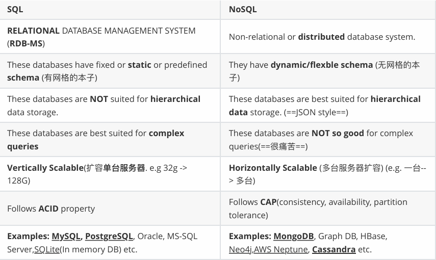

# HW6 DB_RestAPI

# Short Questions

## 1. Compare Rest API methods ( Get , Post , Put , Patch , Delete ) in detail.

GET: Retrieves(fetches) data from the server without modifying it.  
POST: Sends data to the server to create a new resource.  
PUT: Used to create or replace a resource at a specific URI. If the resource exists, PUT replaces it; if it does not, PUT creates it.  
PATCH: Partially updates a resource. Unlike PUT, PATCH is used when you want to modify only certain fields of a resource.  
DELETE: Deletes a resource from the server.

## 2. Compare Soap vs Rest API vs gRPC vs GraphQL in detail

| Feature                 | **SOAP**                         | **REST**                  | **gRPC**                         | **GraphQL**                       |
| ----------------------- | -------------------------------- | ------------------------- | -------------------------------- | --------------------------------- |
| **Type**                | Protocol                         | Architectural style       | Framework (RPC)                  | Query language + runtime          |
| **Transport**           | HTTP, SMTP, etc.                 | HTTP                      | HTTP/2                           | HTTP                              |
| **Message Format**      | XML                              | JSON, XML, etc.           | Protobuf (binary)                | JSON                              |
| **Schema**              | WSDL (strict)                    | No formal schema          | Protobuf (strict)                | GraphQL schema (strong typing)    |
| **Communication Style** | Request/Response, One-Way, etc.  | Request/Response          | Request/Response + Streaming     | Request/Response                  |
| **Performance**         | Moderate to Slow                 | Fast (but can over-fetch) | Extremely Fast                   | Efficient, but query complexity   |
| **Security**            | Built-in WS-Security             | Depends on implementation | Built-in support via HTTP/2      | Depends on implementation         |
| **Error Handling**      | SOAP Fault                       | HTTP Status Codes         | Rich error handling in protobuf  | JSON-based error responses        |
| **Use Cases**           | Enterprise-level, legacy systems | Public APIs, web apps     | Microservices, real-time systems | Mobile apps, front-end heavy apps |

## 3. Explain components in http requests (header, body, uri etc...), and what do they do?

1. HTTP Method: The HTTP method defines the type of action the client wants to perform on the resource.
2. URI: The URI specifies the resource that the client wants to interact with.
3. HTTP Version: The HTTP version specifies which version of the HTTP protocol is being used.
4. HTTP Headers: HTTP headers provide additional information about the request or the client.
5. Body: The body contains the actual data being sent in the request.
6. Query Parameters: Query parameters are part of the URI and are used to pass additional data to the server in a key-value format. They are appended to the URL after a question mark (?) and multiple parameters are separated by ampersands (&).

| **Component**        | **Description**                                                                                        |
| -------------------- | ------------------------------------------------------------------------------------------------------ |
| **HTTP Method**      | Defines the action to be performed (e.g., GET, POST, PUT, DELETE).                                     |
| **URI**              | Identifies the resource being requested (includes path, query parameters, etc.).                       |
| **HTTP Version**     | Specifies the version of the HTTP protocol (e.g., HTTP/1.1, HTTP/2).                                   |
| **HTTP Headers**     | Provide metadata about the request (e.g., content type, authorization, user agent).                    |
| **Body**             | Contains data being sent to the server (only for methods like POST, PUT, PATCH).                       |
| **Query Parameters** | Optional parameters appended to the URI to refine the request (key-value pairs in the URL).            |
| **Cookies**          | Small pieces of data sent by the client to the server, often used for sessions or user identification. |

## 4. Explain components in http responses (header, body etc...), and what do they do?

1. Status Line: The status line is the first line of the HTTP response and provides crucial information about the result of the request.
2. HTTP Headers: HTTP headers in the response provide additional metadata about the response, such as content type, length, caching policies, and more. Like in requests, headers are key-value pairs and can significantly affect how the client processes the response.
3. Body: The body of the HTTP response contains the actual data returned by the server, if applicable. It is typically used in responses to GET or POST requests. The body content varies depending on the type of data being returned, and its format is specified by the Content-Type header.
4. Status Code: Status codes provide insight into the outcome of the request.

| **Component**    | **Description**                                                                           |
| ---------------- | ----------------------------------------------------------------------------------------- |
| **Status Line**  | Contains the HTTP version, status code, and status message (e.g., `HTTP/1.1 200 OK`).     |
| **Headers**      | Metadata about the response (e.g., content type, length, cache control, cookies).         |
| **Body**         | The actual data being returned (HTML, JSON, XML, etc.).                                   |
| **Set-Cookie**   | Instructs the client to store cookies for session management or tracking.                 |
| **Location**     | Used in redirection responses to point to the new location of the requested resource.     |
| **Status Codes** | Three-digit codes indicating the result of the request (e.g., `200 OK`, `404 Not Found`). |

## 5. Compare SQL DB vs NoSQL DB in detail



## 6. Explain types of SQL language, and their purpose?

DDL: Defines the database schema. [CREATE, ALTER, DROP]  
DML: Manages data within schema objects [SELECT, INSERT, UPDATE, DELETE]  
DCL: Controls access to data [GRANT, REVOKE]  
TCL: Manages transactions [COMMIT, ROLLBACK, SAVEPOINT]

## 7. Explain 2xx, 4xx, 5xx http status codes in detail, name some common and important codes, explain 1xx, 3xx http status code in general.

| **Status Code** | **Category**  | **Meaning**                                                    |
| --------------- | ------------- | -------------------------------------------------------------- |
| **100**         | Informational | Continue                                                       |
| **200**         | Success       | OK (Request was successful)                                    |
| **201**         | Success       | Created (New resource created)                                 |
| **204**         | Success       | No Content (Successful but no body to return)                  |
| **301**         | Redirection   | Moved Permanently (Resource has a new URL)                     |
| **302**         | Redirection   | Found (Temporary redirect)                                     |
| **304**         | Redirection   | Not Modified (Cached version can be used)                      |
| **400**         | Client Error  | Bad Request (Invalid syntax)                                   |
| **401**         | Client Error  | Unauthorized (Authentication required)                         |
| **403**         | Client Error  | Forbidden (Permission denied)                                  |
| **404**         | Client Error  | Not Found (Resource does not exist)                            |
| **405**         | Client Error  | Method Not Allowed (HTTP method not allowed for this resource) |
| **500**         | Server Error  | Internal Server Error (Generic server failure)                 |
| **502**         | Server Error  | Bad Gateway (Invalid response from an upstream server)         |
| **503**         | Server Error  | Service Unavailable (Server is temporarily overloaded or down) |
| **504**         | Server Error  | Gateway Timeout (No timely response from upstream server)      |

# API Design

## 1. find the customer's payments, like credit card 1, credit card 2, paypal, Apple Pay.

```
//API Endpoint:
GET /customers/{customerId}/payments

//Example Request:
GET /customers/12345/payments
```

## 2. Find the customer's history orders from 10/10/2022 to 10/24/2022

```
//API Endpoint:
GET /customers/{customerId}/orders?start_date={start}&end_date={end}

//Example Request:
GET /customers/12345/orders?start_date=2022-10-10&end_date=2022-10-24
```

## 3. find the customer's delievery addresses

```
//API Endpoint:
GET /customers/{customerId}/addresses

//Example Request:
GET /customers/12345/addresses
```

## 4. If I also want to get customer's default payment and default delievery address, what kind of the API (URL) should be?

```
//API Endpoint:
GET /customers/{customerId}/defaults

//Example Request:
GET /customers/12345/defaults
```

Resource: defaults would return a combination of the default payment method and delivery address.  
Response: A response could contain both default_payment and default_address.

## 5. Find 2 collection of APIs example. ie. Twitter, Paypal, Youtube etc.

Twitter API

```
//Retrieve a user's timeline:
GET /users/{userId}/timeline

//POST a tweet:
POST /tweets

//Follow a user:
POST /users/{userId}/follow
```

Paypal API:

```
//Create a payment:
POST /v1/payments/payment

//Execute a payment:
POST /v1/payments/payment/{paymentId}/execute

//Get payment details:
GET /v1/payments/payment/{paymentId}
```

Youtube:

```
//Retrieve video details:
GET /youtube/v3/videos?id={videoId}&part=snippet,contentDetails,statistics

//Upload a video:
POST /youtube/v3/videos?part=snippet,status

//Update a video:
PUT /youtube/v3/videos?part=snippet,status

//Delete a video:
DELETE /youtube/v3/videos?id={videoId}
```

## 6. Design a collection of APIs for a Blog Website, please specify GET POST PUT DELETE

```
//Create a blog post:
POST /posts

//Get all blog posts:
GET /posts

//Get specific blog post:
GET /posts/{postId}

//Update a blog post:
PUT /posts/{postId}

//Delete a blog post:
DELETE /posts/{postId}
```
