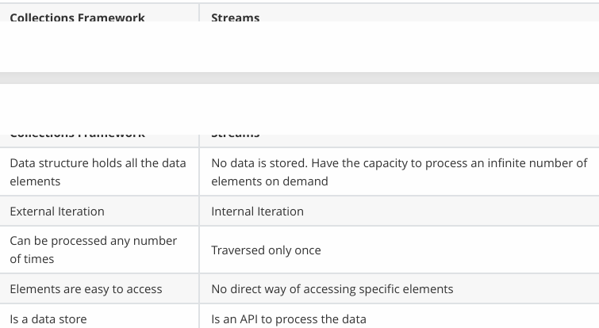

# HW3 Java & OOP homework

## 1. Learn Java generics by reading and practicing following code:

[Java Generics](https://github.com/CTYue/chuwa-eij-tutorial/tree/main/02-java-core/src/main/java/com/chuwa/tutorial/t01_basic/generic)

## 2. Read the follwoing code repo and type it one by one by yourself.

[Java Core](https://github.com/CTYue/chuwa-eij-tutorial/tree/main/02-java-core/src/main/java/com/chuwa/tutorial/t06_java8/features)

## 3. Practice following stream API exercises at least 3 times

[Java Stream API exercises](https://github.com/gavinklfong/stream-api-exercises/blob/main/src/test/java/space/gavinklfong/demo/streamapi/StreamApiTest.java)

## 4. Practice Optional methods at least 2 times

[Optional Methods](https://github.com/CTYue/chuwa-eij-tutorial/blob/main/02-java-core/src/main/java/com/chuwa/tutorial/t06_java8/exercise/ShoppingCartUtil.java)

## 5. Discuss best practices on nullptr exception prevention, provide code snippet for each practice that you mentioned.

1. Use `Optional` methods for Optional values.
2. Check `null` before using object.
3. Use default value instead of `null` in initialization.

## 6. Discuss Java 8 new features with code snippet

1. Lambda Expression

```
// Using lambda expression for Comparator
Collections.sort(names, (String s1, String s2) -> s1.length() - s2.length());
```

2. Functional Interfaces

```
@FunctionalInterface
public interface MyFunction {
    void apply(String s);
}

MyFunction print = s -> System.out.println(s);
print.apply("Hello, World!");
```

3. Stream API

```
List<String> cities = Array.asList("Beijing", "Houston", "Shanghai", "San jose", "Seattle", "New York");

List<String> filteredCities = cities.strea().filter(name->name.startWith("A")).collect(Collectors.toList());
```

4. Optional

```
Optional<String> nonEmptyOptional = Optional.of("Hello");
if (nonEmptyOptional.isPresent()) {
            System.out.println("Non-Empty Optional contains: " + nonEmptyOptional.get());
        }
```

5. Method References

```
List<String> cities = Array.asList("Beijing", "Houston", "Shanghai", "San jose", "Seattle", "New York");

// Method reference
cities.forEach(System.out::println)
```

6. Default methods and static methods in Interfaces

```
public interface DIMLearn {
    static final String BLOG = "is Chuwa a";
    int add(int a, int b);
    default int substract(int a, int b) {
        return a - b;
    }
    static String blogName() {
        return BLOG;
    }
}
```

## 7. `What are the advantages of the Optional class?

1. Prevents NullPointerException
2. Improves Code Readability
3. Encourages Functional Programming
4. Supports Safe Default Values
5. Facilitates Better API Design

## 8. Explain Functional Interface and Lambda with code samples

Functional Interface is an interface with a single abstract method. If can have multiple default or static methods but only one abstract method.

```
@FunctionalInterface
public interface MyFunction {
    void helloworld(String s);
}
```

Lambda Expressions is the implementation of the abstract method, work with functional interface.

```
MyFunction print = s -> System.out.print(s);

print.helloworld("Lambda Expresssion");
```

## 9. Explain Method Reference with code samples?

`Method References` provide a shorthand, more readable syntax for writing lambda expressions when a method already exists to perform the operation. Method references allow you to reference existing methods by their name instead of writing a lambda to invoke the method.

1. Static Method Reference  
   `ClassName::staticMethod` references a static method of a class.

```
// Static method
public class Utils {
    public static void print(String s) {
        System.out.println(s);
    }
}

// Method reference
List<String> names = Arrays.asList("John", "Jane", "Doe");
names.forEach(Utils::print);

```

2. Instance Method  
   `instance::instanceMethod` references an instance method of a particular object.

```
public class Printer {
    public void print(String s) {
        System.out.println(s);
    }
}

// Instance method reference
Printer printer = new Printer();
List<String> names = Arrays.asList("John", "Jane", "Doe");
names.forEach(printer::print);
```

3. Instance Method of an Arbitrary Object  
   `ClassName::instanceMethod` references an instance method of an object that is provided by the stream.

```
List<String> names = Arrays.asList("Alice", "Bob", "Charlie");
names.forEach(System.out::println);
```

4. Constructor Reference  
   `ClassName::new` references a constructor to create new instances.

```
Supplier<List<String>> listSupplier = ArrayList::new;
List<String> names = listSupplier.get();
```

## 10. Explain "Lambda can use unchanged variable outside of lambda", with code snippet

```
final int num = 10;
Consumer<Integer> consumer = (x) -> x + num;

consumer.accept(5); //Output will be 15
```

## 11. Can a functional interface extend/inherit another interface?

Yes, a functional interface in Java can extend or inherit from another interface, as long as it still satisfies the condition of being a functional interface. Specifically, this means that after extending another interface, the derived functional interface must still have only one abstract method.

## 12. What are Intermediate and Terminal operations?

1. Intermidiate Operatons: Operations that transform a stream into another stream and are lazy, they are not executed until a terminal operation is invoked. Examples: filter, map, sorted, distinct.
2. Terminal Operations: Operations that produce a result or a side-effect and trigger the processing of the stream pipeline. Examples: collect, forEach, reduce, count.

## 13. Demontrate the most commonly used Intermediate operations in Stream API, with code snippet

```
Stream<String> cities = Stream.of("Beijing", "Houston", "Shanghai", "San jose", "Seattle", "New York", "Beijing");
```

1. filer

```
Stream<String> filtered = cities.filter(s -> s.startsWith("b"));
```

2. map

```
Stream<Integer> lengths = cities.map(String::length);
```

3. sorted

```
Stream<String> sorted = cities.sorted();
```

4. distinct

```
Stream<String> distinct = cities.distinct();
```

5. limit

```
Stream<String> limited = cities.limit(3);
```

## 14. How are Collections different from Stream?



## 15. Implement Stream API's filter and map methods by your self.

```
import java.util.ArrayList;
import java.util.List;
import java.util.function.Function;
import java.util.function.Predicate;

public class CustomStream<T> {
    private List<T> list;

    // Constructor to create a stream from a list
    public CustomStream(List<T> list) {
        this.list = list;
    }

    // Custom filter method: Filters elements based on a given predicate
    public CustomStream<T> filter(Predicate<T> predicate) {
        List<T> filteredList = new ArrayList<>();
        for (T element : list) {
            if (predicate.test(element)) {  // Apply the predicate
                filteredList.add(element);  // Add to filtered list if predicate returns true
            }
        }
        return new CustomStream<>(filteredList);  // Return a new CustomStream with filtered elements
    }

    // Custom map method: Applies a function to each element and returns a new stream with transformed elements
    public <R> CustomStream<R> map(Function<T, R> mapper) {
        List<R> mappedList = new ArrayList<>();
        for (T element : list) {
            mappedList.add(mapper.apply(element));  // Apply the function and add to mapped list
        }
        return new CustomStream<>(mappedList);  // Return a new CustomStream with mapped elements
    }

    // Terminal operation to collect the elements into a list
    public List<T> collect() {
        return list;
    }

    public static void main(String[] args) {
        List<Integer> numbers = List.of(1, 2, 3, 4, 5, 6);

        // Creating a custom stream, filtering even numbers, then mapping to their squares
        List<Integer> result = new CustomStream<>(numbers)
                .filter(n -> n % 2 == 0)  // Keep only even numbers
                .map(n -> n * n)  // Square the numbers
                .collect();  // Collect results into a list

        System.out.println(result);  // Output: [4, 16, 36]
    }
}
```
