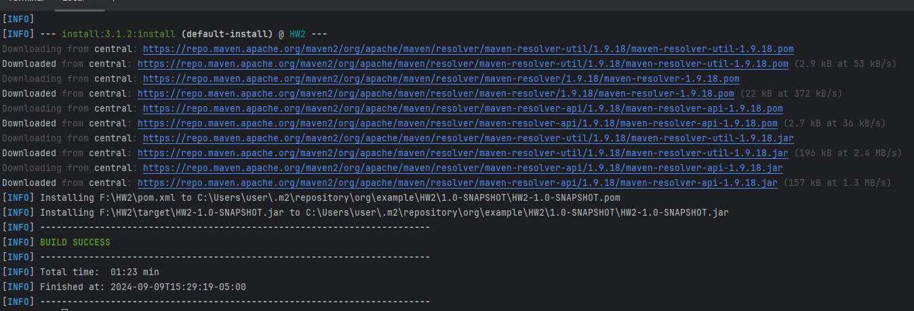
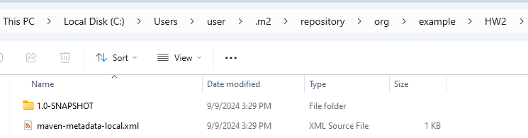
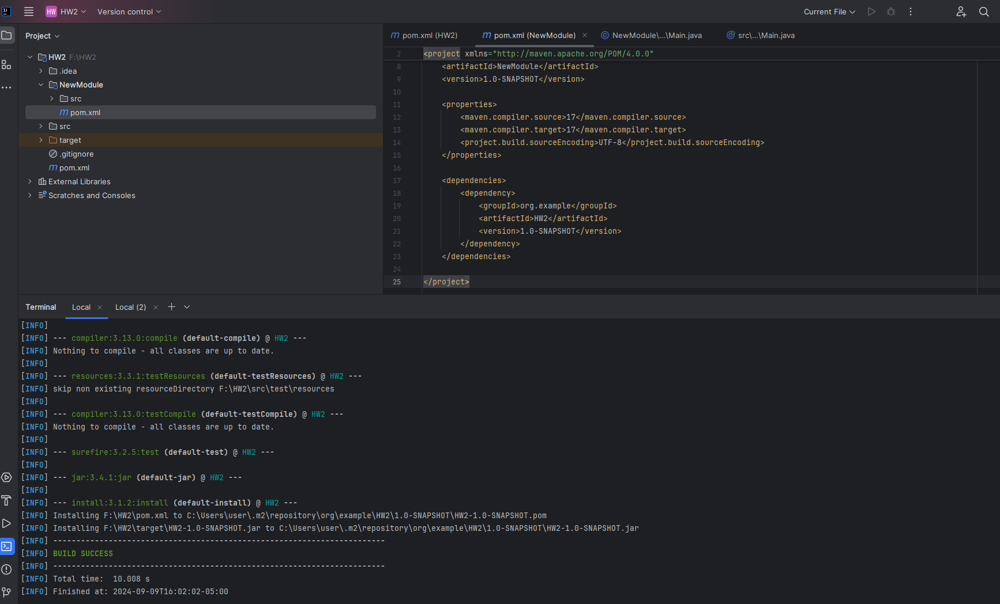

# HW2 Maven & Git

## 1. Find at least one dependency for each packing type

### 1.1 Packaging type is `war`

```
<dependency>
  <groupId>jakarta.servlet</groupId>
  <artifactId>jakarta.servlet-api</artifactId>
  <version>5.0.0</version>
  <scope>provided</scope>
</dependency>
```

### 1.2 Packaging type is `jar`

```
<dependency>
    <groupId>com.adobe.aem</groupId>
    <artifactId>uber-jar</artifactId>
    <version>6.5.21</version>
</dependency>
```

### 1.3 Packaging type is `POM`

```
<dependency>
    <groupId>fish.focus.uvms.maven</groupId>
    <artifactId>uvms-pom-arquillian-deps</artifactId>
    <version>3.24</version>
    <type>pom</type>
</dependency>
```

### 1.4 Packaging type is other than all above.

```
<dependency>
    <groupId>org.zeroturnaround</groupId>
    <artifactId>zt-zip</artifactId>
    <version>1.17</version>
</dependency>
```

## 2. Explain the difference between `war`, `jar`, and `POM`

1. They have difference extension: .war, .jar, and .pom
2. They have difference using case: .war is common in web application packaging and deployment; .jar is used for Java library or standlone applications; .pom is used for configuration, dependencies and plugins for maven.

## 3. Create a maven managed project in IntelliJ Idea

### 3.1 Create a maven managed project in IntelliJ Idea


### 3.2 Explain how to resolve dependency-related errors

I checked error message and find the conflict package. Then I used \<exclusions> tag to exclude the transitive dependency. If possible, I will use \<scope> tag when resolving the dependency in a complexed or industrial project.

## 4. Build the project

4.1 Build the project


4.2 The executable is installed into the local maven repository


## 5. Create a new module and add 4.2\) as dependency


Created a new module called NewModule in HW2 project. Added 4.2\) as a dependency in HW2 project pom file. Then use `mvn install` to compile and install the new project. No dependency-related issure came up.

## 6. List Maven life cycles in order

validate->compile->test->package->integration->verify->install->deploy  
To be honest, I don't know how to make the comparison. They are different part of maven life cycles, also in software life cycles, but they are not in the same scope, which means they share little things in common, so many differences that make comparison go difficult.

## 7. `git merge` vs `git rebase`

Merge creates a merge commit, while rebase re-applies commits from one branch onto another

## 8. Explain `Trunk-based development` git branching strategy.

Trunk-based development is a Git branching model that focuses on keeping a single, central branch (called the "trunk" or "mainline") as the primary development branch. In this model, all developers commit their changes directly to the trunk or merge their feature branches into the trunk in a short period of time. The goal is to maintain a highly active trunk that is always stable, with minimal use of long-lived feature branches. In `Trunk-based development`, the main or master branch is always in a production-ready state.

## 9. Explain `git reset` options

1. git reset --soft: Moves the HEAD pointer to a previous commit but keeps changes staged for commit.
2. git reset --mixed: Moves the HEAD pointer to a previous commit and unstages changes, but keeps them in the working directory.
3. git reset --hard: Moves the HEAD pointer to a previous commit and discards all changes in the working directory and the index.
