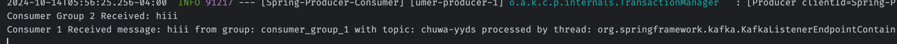

#### Explain following concepts, and how they coordinate with each other:

- Topic: Producers send messages to topics, and consumers read messages from them
- Partition: A partition is a division of a topic for parallel processing
- Broker: A broker is a Kafka server that stores topic data (partitions) and serves requests from producers and consumers.
- Consumer group: A consumer group consists of one or more consumers that work together to consume messages from a topic.
- Producer: A producer is an application or service that sends (produces) messages to Kafka topics.
- Offset: An offset is a unique identifier for each message in a partition. Consumers use offsets to track which messages they have already processed.
- Zookeeper: a coordination service for Kafka, used to manage brokers, handle leader election, and keep metadata about Kafka topics and consumer groups.


#### Answer the following questions:

- Given N (number of partitions) and M (number of consumers), what will happen when N >= M and N < M respectively?
    - When N >= M (partitions >= consumers): Each consumer will be assigned one or more partitions.
    - When N < M (partitions < consumers): Some consumers will remain idle because Kafka assigns each partition to only one consumer per group.

- Explain how brokers work with topics?
```angular2html
When a producer sends a message, the broker writes the message to the appropriate partition of the topic. Consumers then pull messages from brokers. 
  In the setup, the topic chuwa-yyds is managed by brokers and divided into partitions.
```
  

- Are messages pushed to consumers or consumers pull messages from topics?
```angular2html
Consumers pull messages from topics in Kafka. Consumers regularly request (poll) the broker for new messages
```
  

- How to avoid duplicate consumption of messages?
 ``` 
Kafka tracks offsets (the position of the last consumed message). Each consumer group tracks its own offsets. so each partition has offset number to track
  Each partition in Kafka has its own offsets to track the position of messages, and each consumer group keeps track of the offsets for each partition it is consuming from.
```

- What will happen if some consumers are down in a consumer group? Will data loss occur? Why?
  ```
  If some consumers in a group go down, Kafka will rebalance the partitions across the remaining consumers. The downed consumers' partitions will be reassigned to the remaining active consumers, ensuring no data loss.
   ```
- What will happen if an entire consumer group is down? Will data loss occur? Why?
```
  If an entire consumer group goes down, no data loss will occur because Kafka retains the messages in the topic. When the consumer group is back up, it will continue consuming from the last committed offsets.
`````
- Explain consumer lag and how to resolve it?
  ```Lag indicates how far behind the consumer is in processing messages```
  -  how to resolve: 1. Scale the number of consumers (if partitions are under heavy load) 2.improve consumer processing speed (optimize logic)

- Explain how Kafka tracks message delivery?
```
Kafka tracks message delivery using offsets. Each message in a partition has a unique offset, and consumers commit their last processed offset
```

- Compare Kafka vs RabbitMQ, compare messaging frameworks vs MySQL (Why Kafka)?

### Kafka vs RabbitMQ, Kafka vs MySQL (Why Kafka?)

#### Kafka vs RabbitMQ:

| Feature             | Kafka                          | RabbitMQ                          |
|---------------------|--------------------------------|-----------------------------------|
| **Type**            | Distributed streaming platform | Message broker                    |
| **Throughput**      | High throughput for large-scale data streams | Lower throughput, better for smaller message volumes |
| **Message Retention**| Retains messages for a configurable amount of time (disk-based) | Messages are typically deleted once consumed (queue-based) |
| **Scalability**      | Highly scalable with partitions and consumer groups | Scales with queues but has more overhead managing routing |
| **Use Case**        | Best for event streaming, logging, data pipelines, real-time data | Best for complex routing, task queues, guaranteed delivery |

- **Kafka**: Kafka is a distributed streaming platform designed for **high-throughput** applications, where real-time event streaming and processing are essential. It provides **durable storage**, allowing consumers to read messages at their own pace and replay them as needed. Kafka is well-suited for large-scale data pipelines and event-driven architectures.

- **RabbitMQ**: RabbitMQ is a message broker that is good for **complex routing** scenarios and task queues. It supports multiple message exchange patterns, like direct, fanout, and topic exchanges. However, RabbitMQ has lower throughput compared to Kafka and is better suited for smaller-scale message exchanges or task distribution.

### Kafka vs MySQL (Why Kafka?):

- **Kafka**: Kafka is optimized for **real-time, high-throughput, and fault-tolerant message streaming**. It handles massive amounts of event-driven data in a scalable way and ensures that data can be processed in parallel across consumers. Kafka is ideal for real-time data pipelines and systems where data needs to be shared among multiple services.

- **MySQL**: MySQL is a **relational database** designed to store structured data with complex queries. While MySQL is great for handling CRUD operations and transactions, it is **not built for real-time event streaming** or message passing. Kafka, on the other hand, is designed to move high volumes of data efficiently and can handle data that MySQL might not handle as effectively in terms of throughput or event processing.

### Why Choose Kafka?
- **Scalability**: Kafka can handle large volumes of data by distributing partitions across multiple brokers.
- **Real-time Streaming**: Kafka is designed for real-time event streaming, while MySQL is for traditional CRUD-based applications.
- **Durability**: Kafka retains messages for a configurable amount of time, allowing consumers to process messages later, which is not possible in MySQL.


#### Write your consumer application with Spring Kafka dependency, set up 3 consumers in a single consumer group.

- Prove message consumption with screenshots.

```angular2html
chuwa-yyds is the name of your Kafka topic
0 is the partition number within the topic
```


```angular2html
log indicates that 3 consumers in the consumer group consumer_group_1 
have been successfully assigned to 3 partitions of the chuwa-yyds topic.
Topic chuwa-yyds-2 is assigned to one consumer.
Topic chuwa-yyds-0 is assigned to another consumer.
Topic chuwa-yyds-1 is assigned to the third consumer
```


#### Increase number of consumers in a single consumer group, observe what happens, explain your observation.


```angular2html
there is a 1:1 mapping between the consumers and the partitions. 
Since there are 3 partitions in the topic, 
all partitions are evenly distributed among the consumers.
```

```angular2html
 logs indicate that 4 different consumer clients 
are subscribed to the chuwa-yyds topic within the same group (consumer_group_1)
```

**What Happens When You Increase to 4 Consumers**
```angular2html
Kafka follows a rule where each partition can only be assigned to one consumer per consumer group at any time.
Since the topic chuwa-yyds only has 3 partitions, only 3 consumers can actively receive messages (each assigned to one partition).
The 4th consumer will remain idle, as it has no partition to consume from.
```

#### Create multiple consumer groups using Spring Kafka, set up different numbers of consumers within each group, observe consumer offset

- Prove that each consumer group is consuming messages on topics as expected, take screenshots of offset records

- **2Groups 3 Partitions**




**2Groups 6 Partitions**


- Demo different message delivery guarantees in Kafka, with necessary code or configuration changes.


