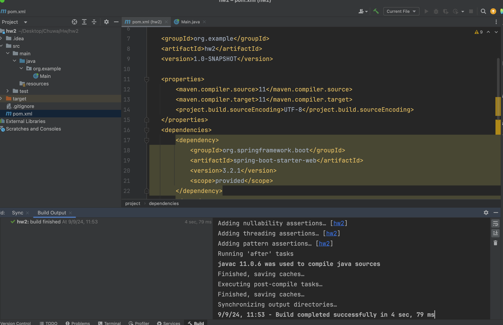
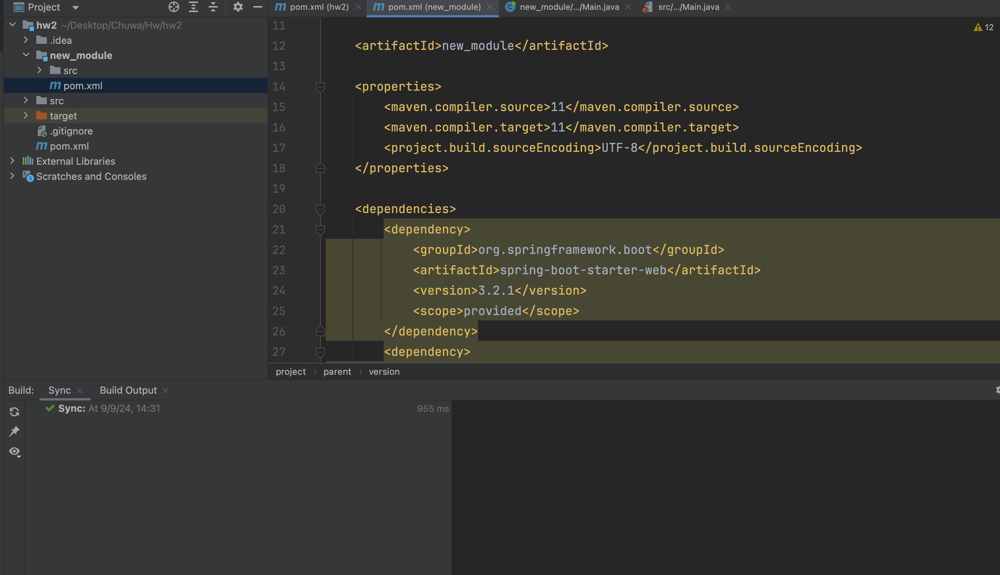

#### 1.
**war:**
```
<dependency>
    <groupId>org.springframework.boot</groupId>
    <artifactId>spring-boot-starter-web</artifactId>
    <version>2.7.0</version>
    <scope>provided</scope>
</dependency>
```
**jar:**
```
<dependency>
    <groupId>org.springframework.boot</groupId>
    <artifactId>spring-boot-starter</artifactId>
    <version>2.7.0</version>
</dependency>
```
**pom:**
```
<dependency>
    <groupId>org.springframework.boot</groupId>
    <artifactId>spring-boot-dependencies</artifactId>
    <version>2.7.0</version>
    <type>pom</type>
    <scope>import</scope>
</dependency>
```
**zip:**
```
<dependency>
    <groupId>org.springframework.cloud</groupId>
    <artifactId>spring-cloud-dependencies</artifactId>
    <version>2021.0.0</version>
    <type>zip</type>
    <scope>import</scope>
</dependency>
```

#### 2. War, Jar and Pom
**JAR**: Packages Java classes and resources; used for distributing Java libraries or standalone applications.
**WAR**: Packages web applications; used for deploying web applications to a servlet container.
**POM**: A configuration file for Maven that manages dependencies, builds, and project settings; not a deployable artifact.

#### 3 4.  

#### 5.

#### 6. Maven cycles
**validate** - validate the project is correct and all necessary information is available
**compile** - compile the source code of the project
**test** - test the compiled source code using a suitable unit testing framework. These tests should NOT
**require** the code be packaged or deployed
**package** - take the compiled code and package it in its distributable format, such as a JAR.
**verify** - run any checks on results of integration tests to ensure quality criteria are met
**install** - install the package into the local repository, for use as a dependency in other projects locally
**deploy** - done in the build environment, copies the final package to the remote repository for sharing with
other developers and projects.

#### 7. Git merge vs Git rebase
**Merge**: Preserves the history of both branches and creates a merge commit. Best for maintaining the full history and working in a team.
**Rebase**: Rewrites commit history to create a linear history. Best for keeping a clean and concise history but should be used with caution on shared branches.

#### 8.Trunk-based development git branching strategy
Trunk-based development (TBD) is a Git branching strategy where all developers work on a single branch, typically called "trunk," "main," or "master," and commit their changes directly to this branch. It emphasizes continuous integration and frequent collaboration, aiming to reduce the complexity and overhead associated with long-lived feature branches and extensive merging.

#### 9.Git reset
git reset is a versatile command used to move the HEAD pointer and optionally modify the staging area and working directory.
**soft**: Resets the HEAD but keeps changes staged.
**mixed** (default): Resets the HEAD and unstages changes.
**hard**: Resets the HEAD, staging area, and working directory, discarding all changes.