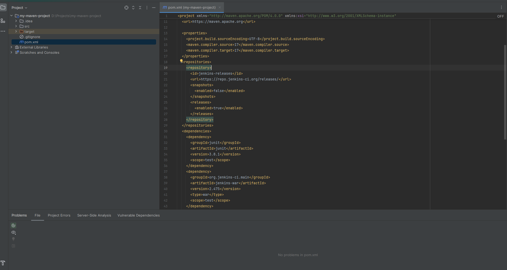
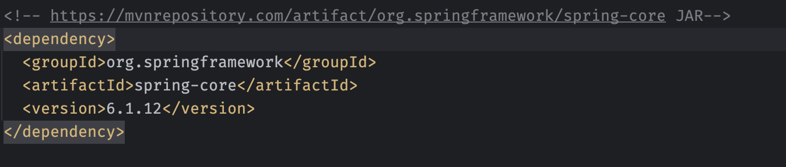
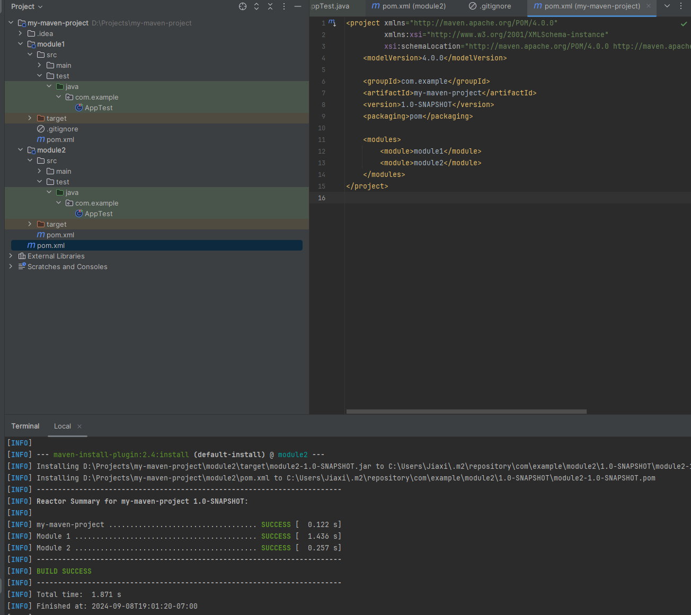
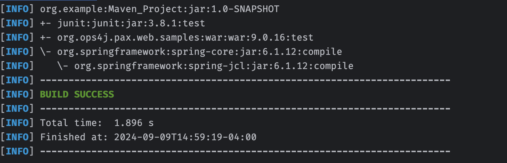

## 1. Find at least one dependency for each packaging type on mvnrepo






## 2. Explain the diff between jar, war and pom

**JAR**: Java archive  
Used to package standalone Java applications or libraries.  
Example: A library like log4j-core or a desktop Java app.

**WAR**: Web application archive  
Used to package web applications that are deployed on web servers.  
Example: A web application like an online shopping site, or a REST API packaged as a WAR and deployed to a Tomcat server.

**POM**: Project object model  
Used to manage project configurations and dependencies in Maven. A project with POM packaging is not an executable or deployable unit itself but is used to define dependencies or project relationships.  
Example: spring-boot-dependencies, which manages versions for Spring Boot dependencies.

## 3. Resolve all issues and how you solve them.

**Issue**: Could not find artifact org.ops4j.pax.web.samples:war:jar:9.0.16 in central (https://repo.maven.apache.org/maven2)  
**Solution**: Add `<type>war</type>`

**Issue**: Dependency 'org.springframework:spring-core:6.1.12' not found  
**Solution**: Click Maven change 

## 4. Install your executable to local Maven repository

```bash
mvn install
```

```bash
mvn dependency:tree
```

## 5. Resolve duplicate dependency:

1. Define a `<dependencyManagement>` section in the parent POM (Maven_Project).
   - This section does not actually include the dependencies in the build of the parent POM but manages the versions. This way, child modules can include the dependencies without specifying the version or worrying about duplicates.
2. Remove duplicate dependencies from Module-A's `pom.xml` (so it will inherit from the parent).
   - `<parent>` section: This specifies that Module-A inherits from Maven_Project (the parent POM). This ensures that any dependencies declared in the parent POM are accessible in the module.
   - Dependencies without versions: Since the parent POM manages the versions, you don’t need to repeat them in the child module.
3. If needed, include only module-specific dependencies in Module-A's `pom.xml`.

## 6. List Maven lifecycle and compare them

- **clean**: Removes files generated by the previous build (`target/`).
- **validate**: Validates the project’s `pom.xml` and ensures everything is correct before proceeding.
- **compile**: Compiles the source code of the project.
- **test**: Runs unit tests using a testing framework like JUnit or TestNG.
- **package**: Packages the compiled code into a distributable format (JAR, WAR, etc.).
- **verify**: Runs checks to verify the package is valid and meets quality criteria.
- **install**: Installs the package into the local Maven repository (`~/.m2/repository`) for use as a dependency in other projects.
- **deploy**: Copies the package to a remote repository for sharing with other developers or projects. This usually happens in a Continuous Integration/Delivery environment.

## 7. Explain git merge and git rebase:

- **git merge**: Creates a merge commit that ties the branches together, safer to use on shared branches.
- **git rebase**: Rewrites the commit history to make it linear and reapplies commits on top.

## 8. Explain Trunk-based development Git branching strategy:

- It uses a single branch (trunk) with minimal branching, frequently merging into the trunk. It’s best for Continuous Integration (CI), and releases are made from the trunk.

## 9. Explain git reset options:

- **git reset --soft**: Undo commit but keep changes staged for further commits.
- **git reset --mixed**: Undo commit and unstage changes.
- **git reset --hard**: Completely discard all changes, reset everything.
